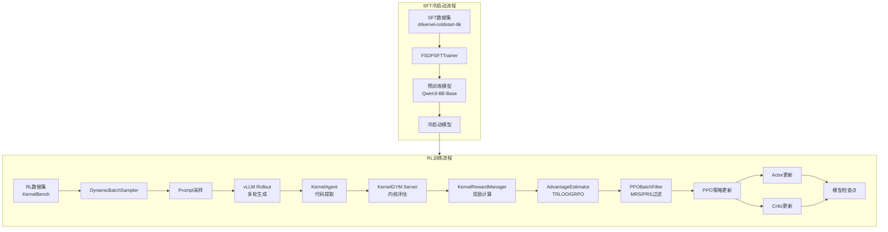
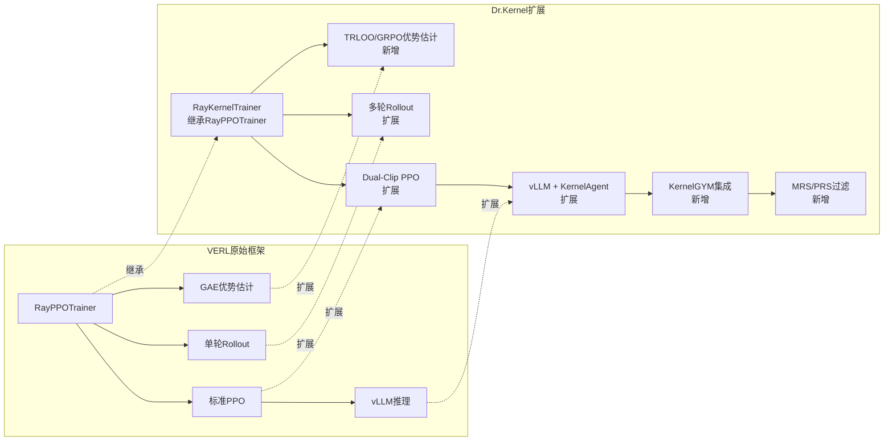
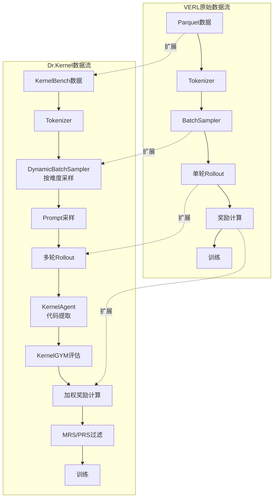
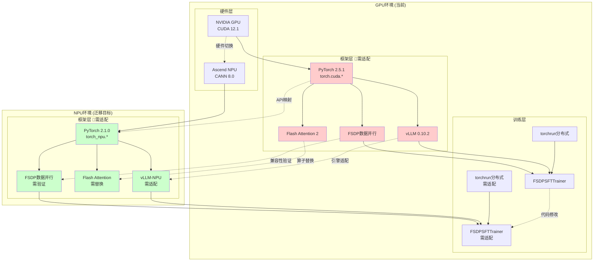
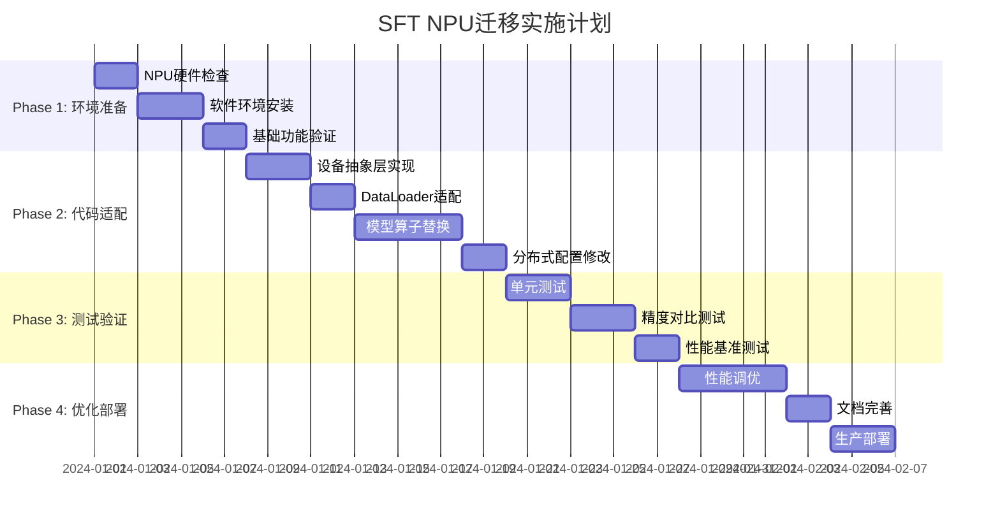

# Dr.Kernel 技术详解与 SFT NPU 迁移方案

## 目录
1. [Dr.Kernel 目录结构详解](#1-drkernel-目录结构详解)
2. [核心功能模块分析](#2-核心功能模块分析)
3. [与VERL框架的技术对比](#3-与verl框架的技术对比)
4. [SFT流程NPU迁移方案](#4-sft流程npu迁移方案)

---

## 1. Dr.Kernel 目录结构详解

### 1.1 整体目录架构 (Mermaid)

```mermaid
graph TB
    subgraph "drkernel/"
        ROOT[drkernel/]
        
        subgraph "kernel/ - 核心训练模块"
            KERNEL_MAIN[main_kernel.py<br/>RL训练入口]
            KERNEL_TRAINER[kernel_trainer.py<br/>RayKernelTrainer]
            KERNEL_SFT[fsdp_sft_trainer.py<br/>SFT训练器]
            KERNEL_GRADING[main_grading.py<br/>评估入口]
            
            subgraph "scripts/"
                SFT_SCRIPTS[scripts/sft/<br/>SFT冷启动脚本]
                RL_SCRIPTS[scripts/rl/<br/>RL训练脚本]
                EVAL_SCRIPTS[scripts/eval/<br/>评估脚本]
            end
            
            subgraph "rewards/"
                KERNEL_REWARD[kernel_reward.py<br/>内核奖励计算]
                REWARD_CLIENT[reward_client.py<br/>奖励服务器客户端]
                COVERAGE_HELPER[coverage_helper.py<br/>覆盖率辅助]
            end
            
            subgraph "workers/"
                KERNEL_AGENT[agent/kernel_agent.py<br/>内核生成Agent]
                REWARD_MGR[reward_manager/<br/>异步奖励管理]
                ROLLOUT[rollout/<br/>vLLM Rollout]
            end
            
            subgraph "metrics/"
                MULTI_TURN[kernel_multi_turn_metrics.py]
                MISMATCH[mismatch_quality_metrics.py]
            end
            
            subgraph "config/"
                KERNEL_CONFIG[kernel_trainer.yaml]
                PROMPT_CONFIG[prompt_config/]
            end
        end
        
        subgraph "verl_patch/ - VERL框架扩展"
            subgraph "trainer/code/"
                PPO_CORE[ppo/core_algos.py<br/>PPO核心算法]
                MISMATCH_HELPER[ppo/mismatch_helper.py]
                ADV_EST[ppo/advantage_estimator.py]
                VAR_RED[ppo/variance_reduction.py]
                
                subgraph "config/"
                    PPO_CONFIG[ppo_trainer.yaml]
                    SFT_CONFIG[sft_trainer.yaml]
                    ACTOR_CONFIG[actor/]
                    CRITIC_CONFIG[critic/]
                end
                
                subgraph "filters/"
                    TWO_GATE[two_gate_filter.py]
                    UNIFIED[unified_filter.py]
                end
                
                subgraph "metrics/"
                    ADV_METRICS[advantage_metrics.py]
                    MULTI_METRICS[multi_turn_metrics.py]
                end
            end
            
            subgraph "workers/code/"
                DP_ACTOR[actor/dp_actor.py<br/>数据并行Actor]
                subgraph "agent/"
                    BASE_AGENT[base_agent.py]
                    CODE_AGENT[code_agent.py]
                    KERNEL_AGENT_PATCH[kernel_agent.py]
                    MATH_AGENT[math_agent.py]
                end
                
                subgraph "agent_env/"
                    BASE_ENV[base_env.py]
                    CODE_SANDBOX[code_sandbox_env.py]
                    MATH_SANDBOX[math_sandbox_env.py]
                end
                
                subgraph "reward_manager/"
                    REWARD_BASE[base.py]
                    REWARD_CODE[code.py]
                    REWARD_KERNEL[kernel.py]
                    REWARD_HTTP[http_sandbox.py]
                end
                
                subgraph "rollout/"
                    VLLM_ROLLOUT[vllm_rollout/]
                    ROLLOUT_WORKER[rollout_worker.py]
                end
            end
            
            subgraph "utils/"
                DATASET_UTILS[dataset/<br/>数据集工具]
                SAMPLERS[samplers/<br/>采样器]
                REWARD_SCORE[reward_score/<br/>奖励评分]
            end
            
            subgraph "experimental/"
                AGENT_LOOP[agent_loop/<br/>Agent循环]
            end
            
            MONKEY_PATCH[monkey_patch/<br/>VERL补丁]
        end
        
        SETUP[setup.sh<br/>环境安装]
        README[README.md]
    end
    
    ROOT --> kernel/
    ROOT --> verl_patch/
    ROOT --> SETUP
    ROOT --> README
```



### 1.2 详细文件结构

```
drkernel/
├── kernel/                              # 核心训练模块
│   ├── main_kernel.py                   # RL训练主入口 (Hydra配置)
│   ├── kernel_trainer.py                # RayKernelTrainer实现
│   ├── fsdp_sft_trainer.py              # FSDP SFT训练器
│   ├── main_grading.py                  # 评估入口
│   │
│   ├── scripts/                         # 训练脚本
│   │   ├── sft/                         # SFT冷启动
│   │   │   ├── run.sh                   # 通用SFT运行脚本
│   │   │   ├── 8b-coldstart.sh          # 8B模型冷启动
│   │   │   └── 14b-coldstart.sh         # 14B模型冷启动
│   │   ├── rl/                          # RL训练
│   │   │   ├── train_rl_common.sh       # 公共RL训练逻辑
│   │   │   ├── 8b_trloo_mrs_pr_prs.sh   # 8B TRLOO训练
│   │   │   └── 14b_trloo_mrs_pr_prs.sh  # 14B TRLOO训练
│   │   └── eval/                        # 评估脚本
│   │       ├── grading_common.sh        # 公共评估逻辑
│   │       └── drkernel-14b-*.sh        # DR.Kernel评估
│   │
│   ├── rewards/                         # 奖励函数
│   │   ├── kernel_reward.py             # 内核奖励计算
│   │   ├── reward_client.py             # KernelGYM客户端
│   │   └── coverage_helper.py           # 覆盖率辅助
│   │
│   ├── workers/                         # 工作器
│   │   ├── agent/kernel_agent.py        # 内核生成Agent
│   │   ├── reward_manager/kernel_async.py
│   │   └── rollout/vllm_rollout/
│   │
│   ├── metrics/                         # 指标
│   │   ├── kernel_multi_turn_metrics.py
│   │   └── mismatch_quality_metrics.py
│   │
│   ├── config/                          # 配置
│   │   ├── kernel_trainer.yaml          # 主训练配置
│   │   └── prompt_config/
│   │
│   └── utils/                           # 工具
│       ├── batch_optimizer.py
│       ├── config_manager.py
│       └── metrics_tracker.py
│
├── verl_patch/                          # VERL框架扩展
│   ├── trainer/code/
│   │   ├── ppo/                         # PPO算法
│   │   │   ├── core_algos.py            # 核心算法实现
│   │   │   ├── advantage_estimator.py   # 优势估计器
│   │   │   ├── variance_reduction.py    # 方差减少
│   │   │   └── mismatch_helper.py       # 不匹配处理
│   │   │
│   │   ├── config/                      # 配置文件
│   │   │   ├── ppo_trainer.yaml         # PPO配置
│   │   │   ├── sft_trainer.yaml         # SFT配置
│   │   │   ├── actor/                   # Actor配置
│   │   │   ├── critic/                  # Critic配置
│   │   │   └── rollout/                 # Rollout配置
│   │   │
│   │   ├── filters/                     # 过滤器
│   │   │   ├── two_gate_filter.py       # 双门过滤
│   │   │   └── unified_filter.py        # 统一过滤
│   │   │
│   │   └── metrics/                     # 指标
│   │       ├── advantage_metrics.py
│   │       └── multi_turn_metrics.py
│   │
│   ├── workers/code/
│   │   ├── actor/dp_actor.py            # 数据并行Actor
│   │   │
│   │   ├── agent/                       # Agent实现
│   │   │   ├── base_agent.py
│   │   │   ├── code_agent.py
│   │   │   ├── kernel_agent.py
│   │   │   └── math_agent.py
│   │   │
│   │   ├── agent_env/                   # Agent环境
│   │   │   ├── base_env.py
│   │   │   ├── code_sandbox_env.py
│   │   │   └── math_sandbox_env.py
│   │   │
│   │   ├── reward_manager/              # 奖励管理器
│   │   │   ├── base.py
│   │   │   ├── code.py
│   │   │   ├── kernel.py
│   │   │   └── http_sandbox.py
│   │   │
│   │   └── rollout/                     # Rollout
│   │       ├── rollout_worker.py
│   │       └── vllm_rollout/
│   │
│   ├── utils/
│   │   ├── dataset/                     # 数据集
│   │   │   ├── rl_dataset.py
│   │   │   └── sft_dataset.py
│   │   ├── samplers/                    # 采样器
│   │   │   ├── batch_sampler.py
│   │   │   └── prioritized_batch_sampler.py
│   │   └── reward_score/                # 奖励评分
│   │
│   ├── experimental/
│   │   └── agent_loop/                  # Agent循环
│   │       ├── agent_loop.py
│   │       └── tool_agent_loop.py
│   │
│   └── monkey_patch/
│       └── monkey_patch.py              # VERL补丁
│
├── setup.sh                             # 环境安装脚本
└── README.md                            # 项目说明
```

---

## 2. 核心功能模块分析

### 2.1 训练流程架构 (Mermaid)



### 2.2 核心模块详解

#### 2.2.1 SFT训练器 (fsdp_sft_trainer.py)

```python
class FSDPSFTTrainer:
    """
    轻量级FSDP SFT训练器
    
    核心特性：
    1. FSDP数据并行 + Ulysses序列并行
    2. Flash Attention + Remove Padding优化
    3. 支持多轮对话数据格式
    4. 支持LoRA微调
    """
    
    def __init__(self, config, device_mesh, ulysses_device_mesh, tokenizer, train_dataset, val_dataset):
        self.device_mesh = device_mesh                    # FSDP设备网格
        self.ulysses_device_mesh = ulysses_device_mesh    # Ulysses SP设备网格
        self.sharding_manager = FSDPUlyssesShardingManager(ulysses_device_mesh)
        
        # 关键配置
        self.config.ulysses_sequence_parallel_size = SP_SIZE  # 序列并行大小
        self.use_remove_padding = True                          # 移除padding优化
```

**SFT训练关键参数：**

| 参数 | 默认值 | 说明 |
|------|--------|------|
| `train_batch_size` | 256 | 全局批次大小 |
| `micro_batch_size_per_gpu` | 2 | 每GPU微批次大小 |
| `max_length` | 18432 | 最大序列长度 |
| `learning_rate` | 2e-5 | 学习率 |
| `total_epochs` | 4 | 训练轮数 |
| `ulysses_sequence_parallel_size` | 4 | Ulysses序列并行大小 |
| `use_remove_padding` | True | 移除padding优化 |

#### 2.2.2 RL训练器 (kernel_trainer.py)

```python
class RayKernelTrainer(RayPPOTrainer):
    """
    内核RL训练器，继承自VERL的RayPPOTrainer
    
    核心扩展：
    1. 多轮对话支持 (Multi-turn Rollout)
    2. TRLOO优势估计
    3. MRS/PRS过滤机制
    4. KernelGYM集成
    """
    
    def _do_rollout(self, prompts: DataProto):
        """多轮Rollout生成"""
        # 1. vLLM生成多轮对话
        rollout_output = self.actor_rollout_wg.generate_sequences(prompts)
        
        # 2. KernelAgent提取代码
        extracted = self.kernel_agent.extract_code(rollout_output)
        
        # 3. KernelGYM评估
        rewards = self.reward_manager.compute_rewards(extracted)
        
        return rewards
    
    def _compute_advantage(self, data: DataProto):
        """计算优势值"""
        if self.config.algorithm.adv_estimator == "grpo":
            advantages = core_algos.compute_multi_turn_returns(...)
        elif self.config.algorithm.adv_estimator == "trloo":
            advantages = core_algos.compute_multi_turn_rloo_outcome_advantage(...)
```

#### 2.2.3 奖励计算模块 (kernel_reward.py)

```python
def compute_kernel_reward_batch(samples, reward_manager_config):
    """
    内核奖励批量计算
    
    奖励组成：
    1. 编译奖励 (compilation_reward): 代码能否编译
    2. 正确性奖励 (correctness_reward): 输出是否正确
    3. 性能奖励 (performance_reward): 加速比
    4. 覆盖率奖励 (coverage_reward): Triton kernel覆盖率
    
    总奖励 = w1*compilation + w2*correctness + w3*performance + w4*coverage
    """
    
    # 权重配置
    reward_weights = {
        "compilation": 0.3,
        "correctness": 0.4,
        "performance": 0.3
    }
    
    # 惩罚配置
    reward_policy = {
        "penalties": {
            "compilation_fail": -0.5,
            "correctness_fail": -0.3,
            "perf_degrade": -0.1
        }
    }
    
    # 调用KernelGYM评估
    results = await kernel_gym_client.evaluate_batch(samples)
    
    # 计算加权奖励
    for result in results:
        reward = 0.0
        if result.compiled:
            reward += reward_weights["compilation"]
            if result.correctness:
                reward += reward_weights["correctness"]
                reward += compute_performance_reward(result.speedup)
            else:
                reward += reward_policy["penalties"]["correctness_fail"]
        else:
            reward += reward_policy["penalties"]["compilation_fail"]
    
    return rewards
```

#### 2.2.4 PPO核心算法 (core_algos.py)

```python
def compute_multi_turn_rloo_outcome_advantage(
    token_level_rewards,      # [B, T] token级奖励
    eos_mask,                 # [B, T] 响应mask
    loss_mask,                # [B] 损失mask
    turn_indices,             # [B] 轮次索引
    index,                    # [B] 样本ID
    max_turns,                # 最大轮次
):
    """
    TRLOO (Turn-level REINFORCE Leave-One-Out) 优势估计
    
    核心思想：
    - 在每个turn级别计算Leave-One-Out基线
    - 避免GRPO中的自包含偏差问题
    - 支持多轮对话的无偏优势估计
    
    公式：
    A_i = R_i - (1/(N-1)) * sum(R_j for j != i)
    
    其中：
    - R_i: 第i个轨迹的回报
    - N: 同一prompt的轨迹数量
    """
    
    # 1. 计算turn级奖励
    turn_rewards = token_level_rewards.sum(dim=-1)  # [B]
    
    # 2. 按prompt分组
    prompt_groups = group_by_prompt(index, turn_indices)
    
    # 3. 计算LOO基线
    for prompt_id, indices in prompt_groups.items():
        N = len(indices)
        if N == 1:
            baseline = 0  # 单轨迹无基线
        else:
            # LOO基线：其他轨迹的平均奖励
            for i, idx in enumerate(indices):
                others = [indices[j] for j in range(N) if j != i]
                baseline[idx] = turn_rewards[others].mean()
    
    # 4. 计算优势
    advantages = turn_rewards - baseline
    
    # 5. 扩展到token级别
    advantages = advantages.unsqueeze(-1).expand_as(token_level_rewards)
    advantages = advantages * eos_mask
    
    return advantages
```

---

## 3. 与VERL框架的技术对比

### 3.1 架构对比 (Mermaid)



### 3.2 算法实现对比

#### 3.2.1 优势估计算法

| 算法 | VERL原始 | Dr.Kernel扩展 | 特点 |
|------|----------|---------------|------|
| **GAE** | ✅ 支持 | ✅ 支持 | 通用优势估计，需要Critic |
| **GRPO** | ❌ 不支持 | ✅ 新增 | 组相对策略优化，无Critic |
| **TRLOO** | ❌ 不支持 | ✅ 新增 | Turn级LOO，避免自包含偏差 |
| **RLOO** | ✅ 支持 | ✅ 支持 | REINFORCE Leave-One-Out |
| **ReMax** | ✅ 支持 | ✅ 支持 | 最大化奖励优化 |

**TRLOO vs GRPO对比：**

```python
# GRPO (Group Relative Policy Optimization)
# 问题：同一turn的轨迹可能相互包含，导致偏差
def grpo_advantage(rewards, group_size):
    baseline = rewards.mean()  # 组平均作为基线
    return rewards - baseline

# TRLOO (Turn-level REINFORCE Leave-One-Out)
# 解决方案：使用其他轨迹的平均作为基线
def trloo_advantage(rewards, group_size):
    advantages = []
    for i in range(group_size):
        # 排除自身，使用其他轨迹的平均
        others = [j for j in range(group_size) if j != i]
        baseline = rewards[others].mean()
        advantages.append(rewards[i] - baseline)
    return advantages
```

#### 3.2.2 PPO损失函数

| 特性 | VERL原始 | Dr.Kernel扩展 |
|------|----------|---------------|
| **Clip Ratio** | 单一值 (0.2) | 双值 (0.2, 0.28) |
| **损失聚合** | token-mean | seq-mean-token-sum |
| **KL惩罚** | 可选 | 可选 |
| **Rollout修正** | 无 | IS/RS修正 |

**Dual-Clip PPO实现：**

```python
# VERL原始：单一clip ratio
ratio = torch.exp(log_prob - old_log_prob)
clipped_ratio = torch.clamp(ratio, 1 - clip_ratio, 1 + clip_ratio)
loss = -torch.min(ratio * advantage, clipped_ratio * advantage).mean()

# Dr.Kernel扩展：双clip ratio
clip_ratio_low = 0.2   # 下界裁剪
clip_ratio_high = 0.28  # 上界裁剪

clipped_ratio = torch.clamp(ratio, 1 - clip_ratio_low, 1 + clip_ratio_high)
loss = -torch.min(ratio * advantage, clipped_ratio * advantage).mean()
```

#### 3.2.3 Rollout生成

| 特性 | VERL原始 | Dr.Kernel扩展 |
|------|----------|---------------|
| **轮次** | 单轮 | 多轮 (max_turns=3) |
| **工具调用** | 无 | KernelAgent代码提取 |
| **停止条件** | EOS token | stop_token_ids |
| **日志概率** | 可选 | 强制计算 |

**多轮Rollout配置：**

```yaml
# kernel/config/kernel_trainer.yaml
actor_rollout_ref:
  rollout:
    multi_turn:
      enable: True
      max_user_turns: 3
      max_assistant_turns: null
      agent_type: "KernelAgent"
      prompt_config_path: kernel/config/prompt_config/multi_turn_kernel.yaml
    stop_token_ids: [872, 77091, 151645, 151644]
    calculate_log_probs: True
```

### 3.3 数据处理流程对比

#### 3.3.1 数据流架构 (Mermaid)



#### 3.3.2 数据集格式对比

**VERL原始格式：**
```python
# 单轮对话
{
    "prompt": "请编写一个CUDA kernel...",
    "response": "```cuda\n__global__ void kernel() {...}\n```"
}
```

**Dr.Kernel多轮格式：**
```python
# 多轮对话
{
    "prompt": "请优化这个PyTorch操作...",
    "reference_code": "def original_func(x): ...",
    "uuid": "kernelbench_001",
    "difficulty": "medium"
}
```

### 3.4 配置参数变更对比

#### 3.4.1 算法配置

| 参数 | VERL默认值 | Dr.Kernel值 | 说明 |
|------|------------|-------------|------|
| `algorithm.gamma` | 1.0 | 1.0 | 折扣因子 |
| `algorithm.lam` | 0.95 | 1.0 | GAE参数 |
| `algorithm.adv_estimator` | gae | grpo | 优势估计器 |
| `algorithm.use_kl_in_reward` | False | False | KL惩罚 |
| `algorithm.batch_std` | False | False | 批标准化 |
| `algorithm.adv_by_last_turn` | - | True | 仅最后轮优势 |
| `algorithm.use_final_reward` | - | True | 仅最后轮奖励 |
| `algorithm.rollout_is` | - | null | Rollout IS修正 |
| `algorithm.rollout_rs` | - | null | Rollout RS修正 |

#### 3.4.2 奖励模型配置

```yaml
# Dr.Kernel新增配置
reward_model:
  reward_manager: kernel
  server_url: "http://[fdbd:dccd:cdd2:2001::19d]:10458"
  
  # 奖励权重
  reward_weights:
    compilation: 0.3
    correctness: 0.4
    performance: 0.3
  
  # 惩罚策略
  reward_policy:
    penalties:
      compilation_fail: -0.5
      correctness_fail: -0.3
      perf_degrade: -0.1
  
  # 性能参数
  timeout: 1800
  num_perf_trials: 100
  num_correct_trials: 5
  enable_profiling: true
  
  # 覆盖率奖励
  coverage_reward:
    enable: false
    weight: 0.25
```

### 3.5 新增模块清单

| 模块 | 路径 | 功能 |
|------|------|------|
| **TRLOO算法** | `verl_patch/trainer/code/ppo/core_algos.py` | Turn级LOO优势估计 |
| **Dual-Clip PPO** | `verl_patch/trainer/code/ppo/core_algos.py` | 双裁剪PPO |
| **Rollout修正** | `verl_patch/trainer/code/ppo/mismatch_helper.py` | IS/RS修正 |
| **方差减少** | `verl_patch/trainer/code/ppo/variance_reduction.py` | 最优基线方差减少 |
| **KernelAgent** | `kernel/workers/agent/kernel_agent.py` | 内核代码提取 |
| **KernelReward** | `kernel/rewards/kernel_reward.py` | 内核奖励计算 |
| **MRS过滤** | `verl_patch/trainer/code/filters/` | 多轮拒绝采样 |
| **动态采样器** | `verl_patch/utils/samplers/` | 按难度动态采样 |

---

## 4. SFT流程NPU迁移方案

### 4.1 NPU迁移整体架构 (Mermaid)



### 4.2 NPU硬件环境配置

#### 4.2.1 硬件要求

| 项目 | 最低要求 | 推荐配置 |
|------|----------|----------|
| **NPU型号** | Ascend 910B | Ascend 910B3/910C |
| **NPU数量** | 1卡 | 8卡/16卡 |
| **内存** | 64GB | 256GB+ |
| **存储** | 500GB SSD | 2TB NVMe SSD |
| **网络** | 10Gbps | 100Gbps RoCE |

#### 4.2.2 软件环境

| 组件 | 版本要求 | 说明 |
|------|----------|------|
| **操作系统** | Ubuntu 22.04 / CentOS 7.9 | Linux内核 4.19+ |
| **CANN** | 8.0.RC1+ | Ascend计算架构 |
| **PyTorch** | 2.1.0 | torch_npu适配版本 |
| **torch_npu** | 2.1.0+ | PyTorch NPU后端 |
| **apex** | 适配版本 | NPU混合精度 |
| **Python** | 3.9+ | 推荐3.10 |

#### 4.2.3 环境安装脚本

```bash
#!/bin/bash
# NPU环境安装脚本

# 1. 安装CANN驱动
# 参考: https://www.hiascend.com/document

# 2. 创建Python虚拟环境
conda create -n drkernel_npu python=3.10 -y
conda activate drkernel_npu

# 3. 安装PyTorch和torch_npu
pip install torch==2.1.0 torchvision torchaudio
pip install torch-npu==2.1.0

# 4. 验证NPU可用性
python -c "
import torch
import torch_npu

print(f'PyTorch version: {torch.__version__}')
print(f'torch_npu version: {torch_npu.__version__}')
print(f'NPU available: {torch.npu.is_available()}')
print(f'NPU count: {torch.npu.device_count()}')
if torch.npu.is_available():
    print(f'NPU name: {torch.npu.get_device_name(0)}')
"

# 5. 安装其他依赖
pip install transformers datasets accelerate
pip install flash-attn --no-build-isolation  # 如果支持
pip install wandb tqdm omegaconf hydra-core

# 6. 安装Dr.Kernel
cd drkernel
pip install -e .
```

### 4.3 深度学习框架适配

#### 4.3.1 CUDA → NPU API映射表

| CUDA API | NPU API | 适配难度 |
|----------|---------|----------|
| `torch.cuda.is_available()` | `torch.npu.is_available()` | 低 |
| `torch.cuda.device_count()` | `torch.npu.device_count()` | 低 |
| `torch.cuda.current_device()` | `torch.npu.current_device()` | 低 |
| `torch.cuda.set_device(id)` | `torch.npu.set_device(id)` | 低 |
| `torch.cuda.get_device_name(id)` | `torch.npu.get_device_name(id)` | 低 |
| `torch.cuda.synchronize()` | `torch.npu.synchronize()` | 低 |
| `torch.cuda.empty_cache()` | `torch.npu.empty_cache()` | 低 |
| `torch.cuda.memory_allocated()` | `torch.npu.memory_allocated()` | 低 |
| `torch.cuda.max_memory_allocated()` | `torch.npu.max_memory_allocated()` | 低 |
| `torch.cuda.Event` | `torch.npu.Event` | 中 |
| `torch.cuda.Stream` | `torch.npu.Stream` | 中 |
| `torch.cuda.amp.autocast` | `torch.npu.amp.autocast` | 中 |
| `torch.distributed.init_process_group(backend='nccl')` | `torch.distributed.init_process_group(backend='hccl')` | 中 |

#### 4.3.2 设备抽象层实现

```python
# kernel/utils/device_backend.py
from abc import ABC, abstractmethod
from typing import Optional
import torch

class DeviceBackend(ABC):
    """设备后端抽象基类"""
    
    @abstractmethod
    def is_available(self) -> bool:
        """检查设备是否可用"""
        pass
    
    @abstractmethod
    def device_count(self) -> int:
        """获取设备数量"""
        pass
    
    @abstractmethod
    def set_device(self, device_id: int):
        """设置当前设备"""
        pass
    
    @abstractmethod
    def synchronize(self, device_id: Optional[int] = None):
        """同步设备"""
        pass
    
    @abstractmethod
    def empty_cache(self):
        """清空缓存"""
        pass
    
    @abstractmethod
    def get_device_name(self, device_id: int) -> str:
        """获取设备名称"""
        pass
    
    @abstractmethod
    def get_device_capability(self, device_id: int) -> tuple:
        """获取设备能力"""
        pass
    
    @property
    @abstractmethod
    def device_type(self) -> str:
        """设备类型: 'cuda' or 'npu'"""
        pass


class CUDABackend(DeviceBackend):
    """CUDA设备后端"""
    
    def is_available(self) -> bool:
        return torch.cuda.is_available()
    
    def device_count(self) -> int:
        return torch.cuda.device_count()
    
    def set_device(self, device_id: int):
        torch.cuda.set_device(device_id)
    
    def synchronize(self, device_id: Optional[int] = None):
        if device_id is not None:
            with torch.cuda.device(device_id):
                torch.cuda.synchronize()
        else:
            torch.cuda.synchronize()
    
    def empty_cache(self):
        torch.cuda.empty_cache()
    
    def get_device_name(self, device_id: int) -> str:
        return torch.cuda.get_device_name(device_id)
    
    def get_device_capability(self, device_id: int) -> tuple:
        return torch.cuda.get_device_capability(device_id)
    
    @property
    def device_type(self) -> str:
        return "cuda"


class NPUBackend(DeviceBackend):
    """NPU设备后端"""
    
    def __init__(self):
        try:
            import torch_npu
            self._torch_npu = torch_npu
        except ImportError:
            raise ImportError("torch_npu is not installed. Please install it first.")
    
    def is_available(self) -> bool:
        return self._torch_npu.npu.is_available()
    
    def device_count(self) -> int:
        return self._torch_npu.npu.device_count()
    
    def set_device(self, device_id: int):
        self._torch_npu.npu.set_device(device_id)
    
    def synchronize(self, device_id: Optional[int] = None):
        if device_id is not None:
            with self._torch_npu.npu.device(device_id):
                self._torch_npu.npu.synchronize()
        else:
            self._torch_npu.npu.synchronize()
    
    def empty_cache(self):
        self._torch_npu.npu.empty_cache()
    
    def get_device_name(self, device_id: int) -> str:
        return self._torch_npu.npu.get_device_name(device_id)
    
    def get_device_capability(self, device_id: int) -> tuple:
        return (8, 0)  # Ascend 910 capability
    
    @property
    def device_type(self) -> str:
        return "npu"


def get_device_backend(device_type: str = "auto") -> DeviceBackend:
    """获取设备后端
    
    Args:
        device_type: "auto", "cuda", or "npu"
    
    Returns:
        DeviceBackend实例
    """
    if device_type == "auto":
        try:
            import torch_npu
            if torch_npu.npu.is_available():
                return NPUBackend()
        except ImportError:
            pass
        
        if torch.cuda.is_available():
            return CUDABackend()
        
        raise RuntimeError("No accelerator available")
    
    elif device_type == "npu":
        return NPUBackend()
    elif device_type == "cuda":
        return CUDABackend()
    else:
        raise ValueError(f"Unknown device type: {device_type}")
```

### 4.4 数据加载与预处理适配

#### 4.4.1 DataLoader NPU优化

```python
# kernel/utils/npu_dataloader.py
import torch
from torch.utils.data import DataLoader, DistributedSampler

class NPUDataLoader:
    """NPU优化的DataLoader"""
    
    @staticmethod
    def create_dataloader(
        dataset,
        batch_size: int,
        num_workers: int = 8,
        pin_memory: bool = True,
        drop_last: bool = True,
        device_type: str = "npu"
    ):
        """
        创建NPU优化的DataLoader
        
        NPU特定优化：
        1. 使用pin_memory加速数据传输
        2. 优化num_workers数量
        3. 使用DistributedSampler
        """
        
        # NPU推荐使用较少的worker
        if device_type == "npu":
            num_workers = min(num_workers, 4)
        
        sampler = DistributedSampler(
            dataset,
            shuffle=True,
            drop_last=drop_last
        )
        
        dataloader = DataLoader(
            dataset,
            batch_size=batch_size,
            sampler=sampler,
            num_workers=num_workers,
            pin_memory=pin_memory,
            drop_last=drop_last,
            # NPU特定：prefetch_factor
            prefetch_factor=2 if num_workers > 0 else None,
        )
        
        return dataloader
```

#### 4.4.2 数据预处理适配

```python
# kernel/utils/npu_preprocessing.py
import torch

def prepare_inputs_for_npu(input_ids, attention_mask, position_ids, device_type="npu"):
    """
    为NPU准备输入数据
    
    NPU特定处理：
    1. 数据类型转换
    2. 设备转移
    3. 内存格式优化
    """
    
    device = torch.device(f"{device_type}:0")
    
    # 转移到设备
    input_ids = input_ids.to(device)
    attention_mask = attention_mask.to(device)
    position_ids = position_ids.to(device)
    
    # NPU推荐使用int64
    if device_type == "npu":
        input_ids = input_ids.long()
        attention_mask = attention_mask.long()
        position_ids = position_ids.long()
    
    return {
        "input_ids": input_ids,
        "attention_mask": attention_mask,
        "position_ids": position_ids,
    }
```

### 4.5 模型结构适配

#### 4.5.1 不兼容操作识别与替换

```python
# kernel/utils/npu_model_adapter.py
import torch
import torch.nn as nn

class NPUModelAdapter:
    """NPU模型适配器"""
    
    # CUDA → NPU 算子映射
    OPERATOR_MAPPING = {
        # Flash Attention
        "flash_attn_func": "npu_fusion_attention",
        "flash_attn_varlen_func": "npu_fusion_attention_varlen",
        
        # 其他算子
        "torch.nn.functional.scaled_dot_product_attention": "torch_npu.npu_fusion_attention",
    }
    
    @staticmethod
    def check_compatibility(model: nn.Module, device_type: str = "npu") -> list:
        """
        检查模型与NPU的兼容性
        
        Returns:
            不兼容的操作列表
        """
        incompatible_ops = []
        
        for name, module in model.named_modules():
            module_type = type(module).__name__
            
            # 检查Flash Attention
            if "FlashAttention" in module_type:
                incompatible_ops.append({
                    "name": name,
                    "type": module_type,
                    "issue": "Flash Attention需要替换为NPU版本",
                    "solution": "使用torch_npu.npu_fusion_attention"
                })
            
            # 检查其他不兼容操作
            # ...
        
        return incompatible_ops
    
    @staticmethod
    def replace_flash_attention(model: nn.Module, device_type: str = "npu"):
        """
        替换Flash Attention为NPU版本
        """
        if device_type != "npu":
            return model
        
        try:
            import torch_npu
        except ImportError:
            raise ImportError("torch_npu is required for NPU")
        
        # 替换逻辑
        for name, module in model.named_modules():
            if "FlashAttention" in type(module).__name__:
                # 替换为NPU版本
                # 具体实现取决于模型结构
                pass
        
        return model
    
    @staticmethod
    def enable_npu_optimizations(model: nn.Module, device_type: str = "npu"):
        """
        启用NPU特定优化
        """
        if device_type != "npu":
            return model
        
        try:
            import torch_npu
            from torch_npu.contrib import transfer_to_npu
        except ImportError:
            return model
        
        # 自动将CUDA操作转换为NPU
        model = transfer_to_npu(model)
        
        return model
```

#### 4.5.2 Flash Attention替换方案

```python
# kernel/utils/npu_attention.py
import torch
import torch.nn as nn

class NPUFlashAttention(nn.Module):
    """NPU Flash Attention实现"""
    
    def __init__(
        self,
        hidden_size: int,
        num_attention_heads: int,
        attention_dropout: float = 0.0,
        device_type: str = "npu"
    ):
        super().__init__()
        self.hidden_size = hidden_size
        self.num_attention_heads = num_attention_heads
        self.head_dim = hidden_size // num_attention_heads
        self.attention_dropout = attention_dropout
        self.device_type = device_type
        
        if device_type == "npu":
            try:
                import torch_npu
                self._torch_npu = torch_npu
            except ImportError:
                raise ImportError("torch_npu is required for NPU Flash Attention")
    
    def forward(
        self,
        hidden_states: torch.Tensor,
        attention_mask: torch.Tensor = None,
        position_ids: torch.Tensor = None,
    ):
        batch_size, seq_len = hidden_states.shape[:2]
        
        # Reshape for multi-head attention
        query = hidden_states.view(batch_size, seq_len, self.num_attention_heads, self.head_dim)
        key = hidden_states.view(batch_size, seq_len, self.num_attention_heads, self.head_dim)
        value = hidden_states.view(batch_size, seq_len, self.num_attention_heads, self.head_dim)
        
        if self.device_type == "npu":
            # 使用NPU融合注意力
            import torch_npu
            attn_output = torch_npu.npu_fusion_attention(
                query, key, value,
                self.num_attention_heads,
                self.head_dim,
                input_layout="BSND",
                pse=None,
                padding_mask=attention_mask,
                atten_mask=None,
                scale=1.0 / (self.head_dim ** 0.5),
                pre_tockens=seq_len,
                next_tockens=seq_len,
                keep_prob=1.0 - self.attention_dropout,
            )[0]
        else:
            # 使用标准注意力
            attn_weights = torch.matmul(query, key.transpose(-2, -1)) / (self.head_dim ** 0.5)
            if attention_mask is not None:
                attn_weights = attn_weights + attention_mask
            attn_weights = torch.softmax(attn_weights, dim=-1)
            attn_weights = torch.dropout(attn_weights, self.attention_dropout, self.training)
            attn_output = torch.matmul(attn_weights, value)
        
        # Reshape back
        attn_output = attn_output.view(batch_size, seq_len, self.hidden_size)
        
        return attn_output
```

### 4.6 训练脚本适配

#### 4.6.1 设备选择修改

```python
# kernel/fsdp_sft_trainer_npu.py (修改版)

import os
os.environ["HCCL_DEBUG"] = "WARN"  # NPU使用HCCL
os.environ["TOKENIZERS_PARALLELISM"] = "true"

import torch
from kernel.utils.device_backend import get_device_backend

class FSDPSFTTrainer:
    def __init__(self, config, ...):
        self.config = config
        
        # 自动检测设备类型
        self.device_backend = get_device_backend(
            config.get("device_type", "auto")
        )
        self.device_type = self.device_backend.device_type
        
        # 设置设备
        if self.device_backend.is_available():
            device_count = self.device_backend.device_count()
            if self.device_mesh.get_rank() == 0:
                print(f"Using {self.device_type.upper()} devices: {device_count}")
        else:
            raise RuntimeError(f"{self.device_type.upper()} is not available")
        
        # 初始化分布式
        self._init_distributed()
    
    def _init_distributed(self):
        """初始化分布式训练"""
        if self.device_type == "npu":
            # NPU使用HCCL后端
            import torch.distributed as dist
            dist.init_process_group(backend="hccl")
        else:
            # CUDA使用NCCL后端
            import torch.distributed as dist
            dist.init_process_group(backend="nccl")
    
    def _build_model_optimizer(self):
        """构建模型和优化器"""
        # ... 模型加载代码 ...
        
        # 将模型移动到设备
        device = torch.device(f"{self.device_type}:{self.device_backend.current_device()}")
        self.model = self.model.to(device)
        
        # NPU特定优化
        if self.device_type == "npu":
            self.model = self._apply_npu_optimizations(self.model)
        
        # ... 优化器设置 ...
    
    def _apply_npu_optimizations(self, model):
        """应用NPU特定优化"""
        try:
            import torch_npu
            from torch_npu.contrib import transfer_to_npu
            
            # 自动转换CUDA操作
            model = transfer_to_npu(model)
            
            # 编译优化
            if self.config.get("use_torch_compile", False):
                model = torch.compile(model, backend="npu")
            
        except ImportError:
            pass
        
        return model
    
    def _forward_step(self, batch):
        """前向传播步骤"""
        # 准备输入
        input_ids = batch["input_ids"].to(f"{self.device_type}")
        attention_mask = batch["attention_mask"].to(f"{self.device_type}")
        position_ids = batch["position_ids"].to(f"{self.device_type}")
        
        # 使用自动混合精度
        with torch.autocast(
            device_type=self.device_type,
            dtype=torch.bfloat16
        ):
            outputs = self.model(
                input_ids=input_ids,
                attention_mask=attention_mask,
                position_ids=position_ids,
            )
        
        return outputs
```

#### 4.6.2 分布式训练配置修改

```bash
# kernel/scripts/sft/8b-coldstart-npu.sh (NPU版本)

#!/bin/bash

# NPU环境变量
export HCCL_CONNECT_TIMEOUT=7200
export HCCL_EXEC_TIMEOUT=1800
export ASCEND_GLOBAL_LOG_LEVEL=3
export ASCEND_SLOG_PRINT_TO_STDOUT=0
export ENABLE_LAZY_INIT=true

# 分布式配置
NNODES=${NNODES:-1}
GPUS_PER_NODE=${GPUS_PER_NODE:-8}
MASTER_ADDR=${MASTER_ADDR:-127.0.0.1}
MASTER_PORT=${MASTER_PORT:-29500}
NODE_RANK=${NODE_RANK:-0}

# NPU使用torchrun
torchrun --nproc_per_node=$GPUS_PER_NODE \
    --nnodes=$NNODES \
    --node_rank=$NODE_RANK \
    --master_addr=$MASTER_ADDR \
    --master_port=$MASTER_PORT \
    -m kernel.fsdp_sft_trainer_npu \
    data.train_files=$TRAIN_DATA_PATH \
    data.train_batch_size=$TRAIN_BATCH_SIZE \
    data.micro_batch_size_per_gpu=$MICRO_BATCH_SIZE_PER_GPU \
    model.partial_pretrain=$MODEL_PATH \
    model.enable_gradient_checkpointing=True \
    model.fsdp_config.model_dtype=bf16 \
    device_type=npu \
    trainer.total_epochs=$TOTAL_EPOCHS \
    trainer.save_freq=$SAVE_FREQ
```

### 4.7 损失函数与优化器适配

#### 4.7.1 损失函数适配

```python
# kernel/utils/npu_loss.py
import torch
import torch.nn as nn

class NPUCrossEntropyLoss(nn.Module):
    """NPU优化的交叉熵损失"""
    
    def __init__(
        self,
        ignore_index: int = -100,
        label_smoothing: float = 0.0,
        device_type: str = "npu"
    ):
        super().__init__()
        self.ignore_index = ignore_index
        self.label_smoothing = label_smoothing
        self.device_type = device_type
    
    def forward(self, logits: torch.Tensor, labels: torch.Tensor):
        """
        计算交叉熵损失
        
        NPU优化：
        1. 使用NPU融合算子
        2. 避免不稳定的数值操作
        """
        if self.device_type == "npu":
            try:
                import torch_npu
                
                # 使用NPU融合交叉熵
                loss = torch_npu.npu_cross_entropy(
                    logits,
                    labels,
                    ignore_index=self.ignore_index,
                    label_smoothing=self.label_smoothing,
                )
                return loss
            except (ImportError, AttributeError):
                pass
        
        # 标准实现
        loss = nn.functional.cross_entropy(
            logits.view(-1, logits.size(-1)),
            labels.view(-1),
            ignore_index=self.ignore_index,
            label_smoothing=self.label_smoothing,
        )
        
        return loss
```

#### 4.7.2 优化器适配

```python
# kernel/utils/npu_optimizer.py
import torch
from torch.optim import AdamW

def create_optimizer(model, config, device_type: str = "npu"):
    """
    创建NPU优化的优化器
    
    NPU优化：
    1. 使用融合优化器
    2. 调整学习率和权重衰减
    """
    
    lr = config.optim.lr
    weight_decay = config.optim.get("weight_decay", 0.0)
    betas = config.optim.get("betas", (0.9, 0.999))
    eps = config.optim.get("eps", 1e-8)
    
    if device_type == "npu":
        try:
            import torch_npu
            
            # NPU推荐使用更大的eps值
            eps = max(eps, 1e-6)
            
            # 创建优化器
            optimizer = AdamW(
                model.parameters(),
                lr=lr,
                weight_decay=weight_decay,
                betas=betas,
                eps=eps,
            )
            
            # 启用NPU融合优化
            if hasattr(torch_npu, 'npu_fused_optimizer'):
                optimizer = torch_npu.npu_fused_optimizer(optimizer)
            
            return optimizer
            
        except ImportError:
            pass
    
    # 标准优化器
    return AdamW(
        model.parameters(),
        lr=lr,
        weight_decay=weight_decay,
        betas=betas,
        eps=eps,
    )
```

### 4.8 性能监控与调试工具

#### 4.8.1 NPU Profiler配置

```python
# kernel/utils/npu_profiler.py
import torch
from contextlib import contextmanager

class NPUProfiler:
    """NPU性能分析工具"""
    
    def __init__(self, config, device_type: str = "npu"):
        self.config = config
        self.device_type = device_type
        self.profiler = None
    
    def start(self):
        """启动性能分析"""
        if self.device_type != "npu":
            return
        
        try:
            import torch_npu
            
            # 配置profiler
            self.profiler = torch_npu.profiler.profile(
                activities=[
                    torch_npu.profiler.ProfilerActivity.CPU,
                    torch_npu.profiler.ProfilerActivity.NPU,
                ],
                schedule=torch_npu.profiler.schedule(
                    wait=1,
                    warmup=1,
                    active=3,
                    repeat=1,
                ),
                on_trace_ready=torch_npu.profiler.tensorboard_trace_handler(
                    self.config.get("profiler_save_path", "./profiler_logs")
                ),
                record_shapes=True,
                profile_memory=True,
                with_stack=True,
            )
            self.profiler.__enter__()
            
        except (ImportError, AttributeError):
            print("NPU Profiler not available, using torch profiler")
            self.profiler = torch.profiler.profile(
                activities=[
                    torch.profiler.ProfilerActivity.CPU,
                    torch.profiler.ProfilerActivity.CUDA,
                ],
                schedule=torch.profiler.schedule(
                    wait=1, warmup=1, active=3, repeat=1
                ),
                on_trace_ready=torch.profiler.tensorboard_trace_handler(
                    self.config.get("profiler_save_path", "./profiler_logs")
                ),
            )
            self.profiler.__enter__()
    
    def step(self):
        """记录一个step"""
        if self.profiler is not None:
            self.profiler.step()
    
    def stop(self):
        """停止性能分析"""
        if self.profiler is not None:
            self.profiler.__exit__(None, None, None)
            self.profiler = None


@contextmanager
def npu_profiler_context(config, device_type: str = "npu"):
    """NPU Profiler上下文管理器"""
    profiler = NPUProfiler(config, device_type)
    try:
        profiler.start()
        yield profiler
    finally:
        profiler.stop()
```

#### 4.8.2 内存监控

```python
# kernel/utils/npu_memory_monitor.py
import torch
from typing import Dict, Optional

class NPUMemoryMonitor:
    """NPU内存监控"""
    
    def __init__(self, device_type: str = "npu"):
        self.device_type = device_type
        self.peak_memory = 0
    
    def get_memory_stats(self, device_id: int = 0) -> Dict[str, float]:
        """获取内存统计"""
        stats = {}
        
        if self.device_type == "npu":
            try:
                import torch_npu
                
                stats["allocated"] = torch_npu.npu.memory_allocated(device_id) / 1024**3
                stats["reserved"] = torch_npu.npu.memory_reserved(device_id) / 1024**3
                stats["max_allocated"] = torch_npu.npu.max_memory_allocated(device_id) / 1024**3
                
            except (ImportError, AttributeError):
                pass
        else:
            stats["allocated"] = torch.cuda.memory_allocated(device_id) / 1024**3
            stats["reserved"] = torch.cuda.memory_reserved(device_id) / 1024**3
            stats["max_allocated"] = torch.cuda.max_memory_allocated(device_id) / 1024**3
        
        self.peak_memory = max(self.peak_memory, stats.get("max_allocated", 0))
        stats["peak_memory"] = self.peak_memory
        
        return stats
    
    def reset_peak_memory(self, device_id: int = 0):
        """重置峰值内存"""
        if self.device_type == "npu":
            try:
                import torch_npu
                torch_npu.npu.reset_peak_memory_stats(device_id)
            except (ImportError, AttributeError):
                pass
        else:
            torch.cuda.reset_peak_memory_stats(device_id)
    
    def print_memory_summary(self, device_id: int = 0, prefix: str = ""):
        """打印内存摘要"""
        stats = self.get_memory_stats(device_id)
        print(f"{prefix} Memory: Allocated={stats.get('allocated', 0):.2f}GB, "
              f"Reserved={stats.get('reserved', 0):.2f}GB, "
              f"Peak={stats.get('peak_memory', 0):.2f}GB")
```

### 4.9 精度验证方案

#### 4.9.1 精度对比测试

```python
# kernel/utils/precision_verification.py
import torch
import numpy as np
from typing import Dict, List, Optional

class PrecisionVerifier:
    """精度验证器"""
    
    def __init__(
        self,
        rtol: float = 1e-3,
        atol: float = 1e-5,
        device_type: str = "npu"
    ):
        self.rtol = rtol
        self.atol = atol
        self.device_type = device_type
    
    def compare_tensors(
        self,
        tensor1: torch.Tensor,
        tensor2: torch.Tensor,
        name: str = "tensor"
    ) -> Dict:
        """
        比较两个张量的精度
        
        Returns:
            包含比较结果的字典
        """
        # 确保在CPU上比较
        t1 = tensor1.detach().cpu().float()
        t2 = tensor2.detach().cpu().float()
        
        # 计算差异
        diff = (t1 - t2).abs()
        rel_diff = diff / (t2.abs() + 1e-8)
        
        # 统计信息
        max_abs_diff = diff.max().item()
        max_rel_diff = rel_diff.max().item()
        mean_abs_diff = diff.mean().item()
        mean_rel_diff = rel_diff.mean().item()
        
        # 检查是否通过
        passed = torch.allclose(t1, t2, rtol=self.rtol, atol=self.atol)
        
        return {
            "name": name,
            "passed": passed,
            "max_abs_diff": max_abs_diff,
            "max_rel_diff": max_rel_diff,
            "mean_abs_diff": mean_abs_diff,
            "mean_rel_diff": mean_rel_diff,
            "shape": tuple(t1.shape),
        }
    
    def verify_model_outputs(
        self,
        model_gpu: torch.nn.Module,
        model_npu: torch.nn.Module,
        inputs: Dict[str, torch.Tensor],
        num_samples: int = 10
    ) -> List[Dict]:
        """
        验证GPU和NPU模型输出的一致性
        """
        results = []
        
        for i in range(num_samples):
            # GPU前向传播
            with torch.no_grad():
                outputs_gpu = model_gpu(**inputs)
            
            # NPU前向传播
            inputs_npu = {k: v.to("npu") for k, v in inputs.items()}
            with torch.no_grad():
                outputs_npu = model_npu(**inputs_npu)
            
            # 比较输出
            for key in outputs_gpu.keys():
                if isinstance(outputs_gpu[key], torch.Tensor):
                    result = self.compare_tensors(
                        outputs_gpu[key],
                        outputs_npu[key].cpu(),
                        f"sample_{i}_{key}"
                    )
                    results.append(result)
        
        return results
    
    def generate_report(self, results: List[Dict]) -> str:
        """生成精度验证报告"""
        report = []
        report.append("=" * 60)
        report.append("精度验证报告")
        report.append("=" * 60)
        
        passed_count = sum(1 for r in results if r["passed"])
        total_count = len(results)
        
        report.append(f"\n总体结果: {passed_count}/{total_count} 通过")
        report.append(f"通过率: {passed_count/total_count*100:.1f}%")
        
        report.append("\n详细结果:")
        report.append("-" * 60)
        
        for r in results:
            status = "✓ PASS" if r["passed"] else "✗ FAIL"
            report.append(f"{r['name']}: {status}")
            report.append(f"  Shape: {r['shape']}")
            report.append(f"  Max Abs Diff: {r['max_abs_diff']:.6e}")
            report.append(f"  Max Rel Diff: {r['max_rel_diff']:.6e}")
            report.append(f"  Mean Abs Diff: {r['mean_abs_diff']:.6e}")
            report.append(f"  Mean Rel Diff: {r['mean_rel_diff']:.6e}")
        
        return "\n".join(report)
```

#### 4.9.2 训练过程对比

```python
# kernel/utils/training_comparison.py
import torch
from typing import Dict, List
import json

class TrainingComparator:
    """训练过程对比器"""
    
    def __init__(self, save_path: str = "./comparison_logs"):
        self.save_path = save_path
        self.gpu_logs = []
        self.npu_logs = []
    
    def log_step(
        self,
        step: int,
        loss: float,
        lr: float,
        grad_norm: float,
        device_type: str = "gpu"
    ):
        """记录训练步骤"""
        log_entry = {
            "step": step,
            "loss": loss,
            "lr": lr,
            "grad_norm": grad_norm,
        }
        
        if device_type == "gpu":
            self.gpu_logs.append(log_entry)
        else:
            self.npu_logs.append(log_entry)
    
    def compare_training_curves(self) -> Dict:
        """比较训练曲线"""
        if not self.gpu_logs or not self.npu_logs:
            return {"error": "Insufficient data for comparison"}
        
        # 提取损失值
        gpu_losses = [log["loss"] for log in self.gpu_logs]
        npu_losses = [log["loss"] for log in self.npu_logs]
        
        # 计算差异
        min_len = min(len(gpu_losses), len(npu_losses))
        loss_diff = [
            abs(gpu_losses[i] - npu_losses[i])
            for i in range(min_len)
        ]
        
        return {
            "mean_loss_diff": sum(loss_diff) / len(loss_diff),
            "max_loss_diff": max(loss_diff),
            "gpu_final_loss": gpu_losses[-1] if gpu_losses else None,
            "npu_final_loss": npu_losses[-1] if npu_losses else None,
            "loss_convergence": abs(gpu_losses[-1] - npu_losses[-1]) < 0.01 if gpu_losses and npu_losses else False,
        }
    
    def save_logs(self):
        """保存日志"""
        import os
        os.makedirs(self.save_path, exist_ok=True)
        
        with open(f"{self.save_path}/gpu_logs.json", "w") as f:
            json.dump(self.gpu_logs, f, indent=2)
        
        with open(f"{self.save_path}/npu_logs.json", "w") as f:
            json.dump(self.npu_logs, f, indent=2)
```

### 4.10 NPU性能优化建议

#### 4.10.1 算子优化

| 优化项 | 说明 | 预期收益 |
|--------|------|----------|
| **融合算子** | 使用NPU融合算子替代分离操作 | 20-30%加速 |
| **Flash Attention** | 使用NPU Flash Attention | 15-25%加速 |
| **梯度累积** | 减少通信频率 | 10-15%加速 |
| **混合精度** | 使用BF16混合精度 | 30-40%加速 |
| **算子编译** | 使用torch.compile优化 | 5-10%加速 |

#### 4.10.2 内存管理优化

```python
# kernel/utils/npu_memory_optimization.py
import torch
import gc

def optimize_npu_memory(model, device_type: str = "npu"):
    """NPU内存优化"""
    
    if device_type != "npu":
        return model
    
    try:
        import torch_npu
    except ImportError:
        return model
    
    # 1. 启用梯度检查点
    if hasattr(model, "gradient_checkpointing_enable"):
        model.gradient_checkpointing_enable()
    
    # 2. 清空缓存
    torch_npu.npu.empty_cache()
    gc.collect()
    
    # 3. 设置内存增长策略
    torch_npu.npu.set_per_process_memory_fraction(0.9)
    
    return model

def aggressive_memory_cleanup(device_id: int = 0, device_type: str = "npu"):
    """激进内存清理"""
    
    if device_type == "npu":
        try:
            import torch_npu
            torch_npu.npu.synchronize(device_id)
            torch_npu.npu.empty_cache()
            torch_npu.npu.reset_peak_memory_stats(device_id)
        except (ImportError, AttributeError):
            pass
    else:
        torch.cuda.synchronize(device_id)
        torch.cuda.empty_cache()
        torch.cuda.reset_peak_memory_stats(device_id)
    
    gc.collect()
```

#### 4.10.3 性能优化配置

```yaml
# kernel/config/npu_optimization.yaml

# NPU特定优化配置
npu_optimization:
  # 混合精度
  mixed_precision:
    enable: true
    dtype: bf16  # NPU推荐使用BF16
  
  # 梯度累积
  gradient_accumulation:
    enable: true
    steps: 4  # 减少通信频率
  
  # 内存优化
  memory:
    gradient_checkpointing: true
    activation_offload: false  # NPU可能不支持
    empty_cache_interval: 100  # 每100步清空缓存
  
  # 通信优化
  communication:
    overlap_communication: true
    bucket_size_mb: 25
  
  # 编译优化
  compilation:
    enable: false  # 根据需要启用
    mode: "reduce-overhead"
```

### 4.11 兼容性问题及解决方案

#### 4.11.1 常见问题清单

| 问题 | 原因 | 解决方案 |
|------|------|----------|
| **Flash Attention不可用** | NPU不支持CUDA Flash Attention | 使用NPU Flash Attention或标准注意力 |
| **NCCL通信失败** | NPU使用HCCL | 将backend从nccl改为hccl |
| **精度差异** | 硬件浮点实现不同 | 调整容差，使用BF16 |
| **内存不足** | NPU内存管理差异 | 减小batch size，启用gradient checkpointing |
| **算子不支持** | 部分CUDA算子无NPU版本 | 实现自定义算子或替代方案 |
| **分布式初始化失败** | 环境变量差异 | 检查HCCL配置 |

#### 4.11.2 问题诊断脚本

```python
# kernel/utils/npu_diagnostics.py
import torch
from typing import Dict, List

class NPUDiagnostics:
    """NPU诊断工具"""
    
    @staticmethod
    def run_all_checks(device_type: str = "npu") -> Dict:
        """运行所有诊断检查"""
        results = {}
        
        results["device_availability"] = NPUDiagnostics.check_device_availability(device_type)
        results["memory_status"] = NPUDiagnostics.check_memory_status(device_type)
        results["distributed_status"] = NPUDiagnostics.check_distributed_status(device_type)
        results["operator_compatibility"] = NPUDiagnostics.check_operator_compatibility(device_type)
        
        return results
    
    @staticmethod
    def check_device_availability(device_type: str) -> Dict:
        """检查设备可用性"""
        result = {"available": False, "count": 0, "devices": []}
        
        if device_type == "npu":
            try:
                import torch_npu
                result["available"] = torch_npu.npu.is_available()
                result["count"] = torch_npu.npu.device_count()
                for i in range(result["count"]):
                    result["devices"].append(torch_npu.npu.get_device_name(i))
            except ImportError:
                result["error"] = "torch_npu not installed"
        else:
            result["available"] = torch.cuda.is_available()
            result["count"] = torch.cuda.device_count()
            for i in range(result["count"]):
                result["devices"].append(torch.cuda.get_device_name(i))
        
        return result
    
    @staticmethod
    def check_memory_status(device_type: str, device_id: int = 0) -> Dict:
        """检查内存状态"""
        result = {}
        
        if device_type == "npu":
            try:
                import torch_npu
                result["total_memory"] = torch_npu.npu.get_device_properties(device_id).total_memory
                result["allocated"] = torch_npu.npu.memory_allocated(device_id)
                result["reserved"] = torch_npu.npu.memory_reserved(device_id)
            except (ImportError, AttributeError):
                result["error"] = "Cannot get NPU memory info"
        else:
            result["total_memory"] = torch.cuda.get_device_properties(device_id).total_memory
            result["allocated"] = torch.cuda.memory_allocated(device_id)
            result["reserved"] = torch.cuda.memory_reserved(device_id)
        
        return result
    
    @staticmethod
    def check_distributed_status(device_type: str) -> Dict:
        """检查分布式状态"""
        result = {
            "initialized": torch.distributed.is_initialized(),
            "backend": None,
            "world_size": None,
            "rank": None,
        }
        
        if torch.distributed.is_initialized():
            result["backend"] = torch.distributed.get_backend()
            result["world_size"] = torch.distributed.get_world_size()
            result["rank"] = torch.distributed.get_rank()
            
            # 检查backend是否正确
            expected_backend = "hccl" if device_type == "npu" else "nccl"
            result["backend_correct"] = result["backend"] == expected_backend
        
        return result
    
    @staticmethod
    def check_operator_compatibility(device_type: str) -> Dict:
        """检查算子兼容性"""
        result = {"compatible": [], "incompatible": []}
        
        # 检查Flash Attention
        if device_type == "npu":
            try:
                import torch_npu
                if hasattr(torch_npu, 'npu_fusion_attention'):
                    result["compatible"].append("flash_attention")
                else:
                    result["incompatible"].append("flash_attention")
            except ImportError:
                result["incompatible"].append("flash_attention")
        
        # 添加更多算子检查...
        
        return result
    
    @staticmethod
    def print_diagnostic_report(results: Dict):
        """打印诊断报告"""
        print("=" * 60)
        print("NPU 诊断报告")
        print("=" * 60)
        
        for category, info in results.items():
            print(f"\n{category}:")
            print("-" * 40)
            for key, value in info.items():
                print(f"  {key}: {value}")
```

### 4.12 迁移实施路线图



---

## 总结

本文档详细介绍了Dr.Kernel项目的技术架构，包括：

1. **目录结构**：完整的文件组织和模块划分
2. **核心模块**：SFT训练器、RL训练器、奖励计算、PPO算法等
3. **VERL对比**：算法扩展、数据处理、配置变更等详细对比
4. **NPU迁移方案**：涵盖环境配置、代码适配、性能优化、精度验证等10个方面的完整方案

通过本文档，开发者可以：
- 理解Dr.Kernel的技术架构和设计理念
- 了解与VERL框架的差异和扩展点
- 按照迁移方案将SFT流程迁移至NPU环境
