# KernelGYM 详细技术介绍与NPU迁移分析

## 目录
1. [整体架构设计](#1-整体架构设计)
2. [核心功能特性](#2-核心功能特性)
3. [各组成模块详细实现](#3-各组成模块详细实现)
4. [在RL训练中的必要性分析](#4-在rl训练中的必要性分析)
5. [NPU迁移适配分析](#5-npu迁移适配分析)

---

## 1. 整体架构设计

### 1.1 架构概览

KernelGYM是一个专门用于GPU Kernel评估的服务框架，采用**分布式微服务架构**，支持多节点、多GPU的并行评估任务。其核心设计理念是**子进程隔离**，确保CUDA错误不会影响主进程稳定性。

#### 1.1.1 整体架构图 (Mermaid)

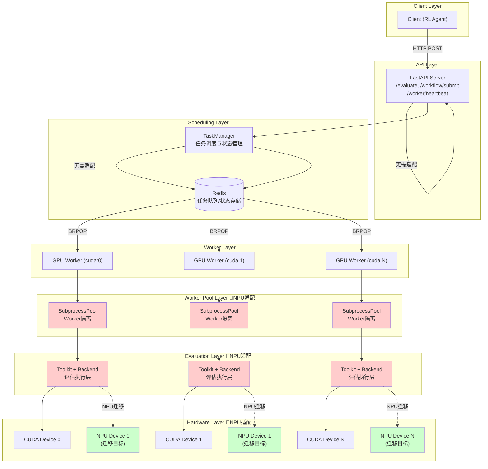

> **图例说明**：
> - 🔴 **红色背景**：需要NPU适配的模块
> - 🟢 **绿色背景**：NPU迁移目标
> - 无标记：无需适配或平台无关

### 1.2 核心设计原则

#### 1.2.1 子进程隔离架构

KernelGYM最核心的设计是**SubprocessWorkerPool**，它解决了GPU Kernel评估中的关键问题：

##### 子进程隔离架构流程图 (Mermaid)

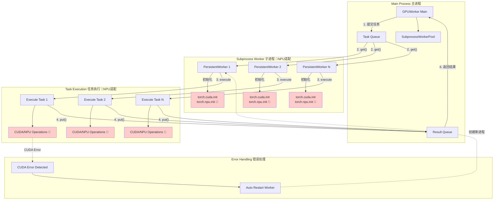

##### 子进程隔离核心优势

```python
# 子进程隔离的核心优势
class SubprocessWorkerPool:
    """
    核心特性：
    1. 预先启动一组 worker 进程，复用处理多个任务
    2. torch 和 CUDA 只在启动时初始化一次
    3. 第一次遇到 CUDA error 时立即关闭 worker 进程
    4. 主进程自动重启新的 worker 进程
    5. 大幅降低 spawn 开销（从每任务 2.5s 降至几乎为 0）
    """
```

**为什么需要子进程隔离？**

| 问题 | 传统方案 | KernelGYM方案 |
|------|----------|---------------|
| CUDA错误传播 | 单个kernel错误导致整个进程崩溃 | 错误被隔离在子进程，主进程自动重启worker |
| 显存泄漏 | 长时间运行后显存累积 | 每个worker处理N个任务后自动重启 |
| 初始化开销 | 每次评估都要加载torch/CUDA | 一次性初始化，复用worker |
| 并发安全 | 多线程CUDA操作不安全 | 每个worker独立进程，完全隔离 |

#### 1.2.2 分层架构设计

```
┌─────────────────────────────────────────────────────────────┐
│                    Layer 4: API Layer                        │
│         FastAPI Server (HTTP接口、路由、中间件)               │
├─────────────────────────────────────────────────────────────┤
│                    Layer 3: Workflow Layer                   │
│         WorkflowController (业务流程编排)                     │
├─────────────────────────────────────────────────────────────┤
│                    Layer 2: Worker Layer                     │
│         GPUWorker + SubprocessWorkerPool (任务执行)          │
├─────────────────────────────────────────────────────────────┤
│                    Layer 1: Toolkit Layer                    │
│         KernelBenchToolkit + Backend (评估逻辑)              │
└─────────────────────────────────────────────────────────────┘
```

### 1.3 数据流架构

#### 1.3.1 数据流架构图 (Mermaid)

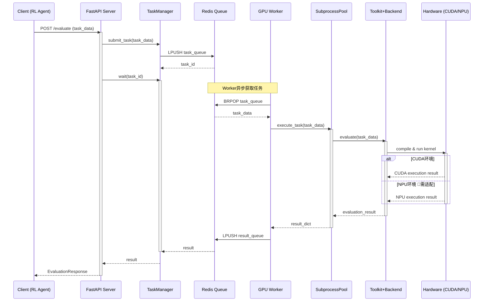

#### 1.3.2 NPU适配关键点

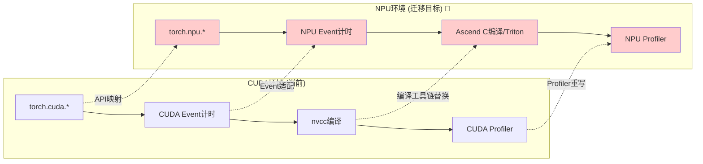

---

## 2. 核心功能特性

### 2.1 Kernel评估功能

#### 2.1.1 Kernel评估完整流程图 (Mermaid)

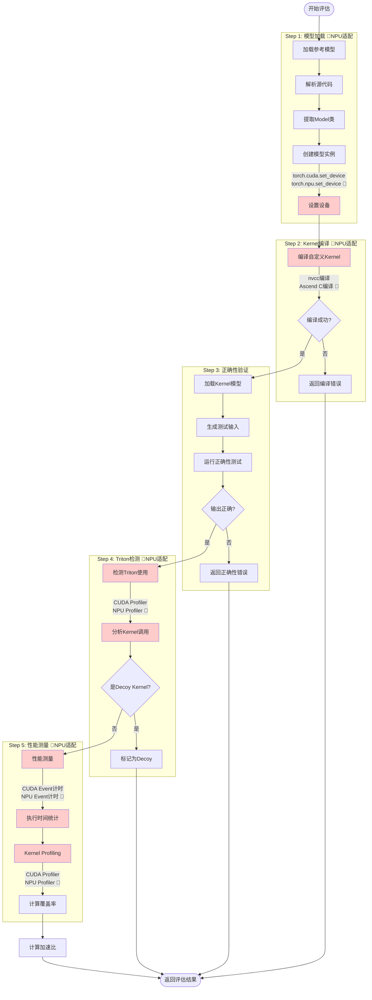

#### 2.1.2 编译验证
```python
def compile(self, source: str, device, backend, entry_point, build_dir):
    """
    验证CUDA/Triton kernel能否成功编译
    - CUDA kernel: nvcc编译
    - Triton kernel: JIT编译
    """
```

#### 2.1.2 正确性验证
```python
def run_and_check_correctness(
    original_model,    # 参考模型
    custom_model,      # 自定义kernel模型
    get_inputs,        # 输入生成函数
    num_correct_trials=1,
):
    """
    对比自定义kernel与参考模型的输出
    - 多次运行确保稳定性
    - 支持浮点数容差比较
    """
```

#### 2.1.3 性能测量
```python
def time_execution_with_cuda_event(
    model, *inputs,
    num_trials=10,
    enable_profiling=True,
):
    """
    使用CUDA Event精确测量执行时间
    - 多次试验取平均值
    - 支持profiling获取详细kernel信息
    """
```

### 2.2 Profiling功能

#### 2.2.1 Profiling流程图 (Mermaid)

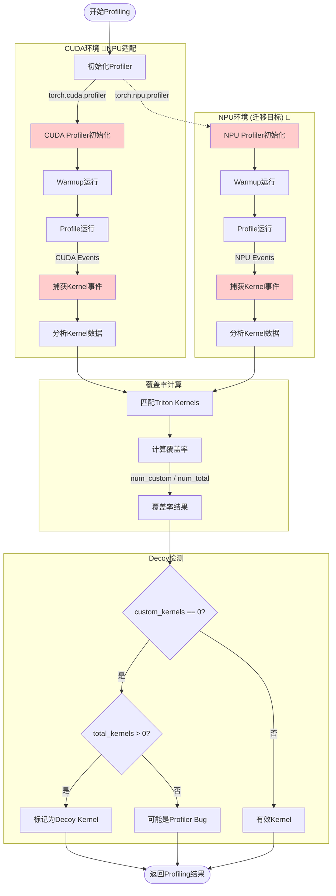

#### 2.2.2 Triton Kernel覆盖率分析
```python
def compute_triton_kernel_coverage(triton_matches, profiling_metrics):
    """
    计算自定义Triton kernel的覆盖率
    
    返回指标：
    - num_custom_kernels: 自定义kernel数量
    - num_total_kernels: 总kernel数量
    - triton_kernel_coverage: 覆盖率百分比
    - custom_kernel_cuda_time_coverage: 时间覆盖率
    """
```

#### 2.2.2 Decoy Kernel检测
```python
# 检测"虚假"kernel - 声称使用Triton但实际没有
if num_custom_kernels == 0 and num_total_kernels > 0:
    kernel_exec_result.decoy_kernel = True  # 标记为虚假kernel
```

### 2.3 分布式任务调度

#### 2.3.1 任务调度流程图 (Mermaid)

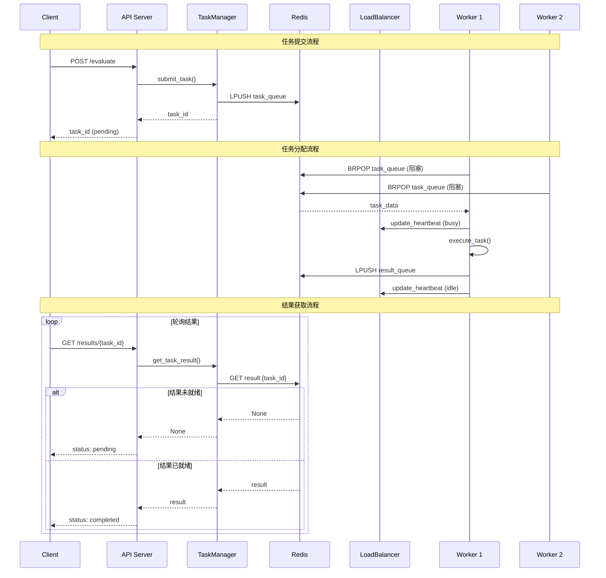

#### 2.3.2 Worker生命周期图 (Mermaid)

```mermaid
stateDiagram-v2
    [*] --> Initializing: Worker启动
    
    state Initializing {
        [*] --> RegisterAPI
        RegisterAPI --> InitGPU: 注册到API Server
        InitGPU --> InitPool: GPU验证 🔴NPU适配
        InitPool --> [*]: 创建SubprocessPool
    }
    
    Initializing --> Idle: 初始化完成
    
    state Idle {
        [*] --> WaitingTask
        WaitingTask --> Heartbeat: 定时心跳
        Heartbeat --> WaitingTask
    }
    
    Idle --> Busy: 获取任务
    
    state Busy {
        [*] --> Executing
        Executing --> CheckResult
        CheckResult --> Success: 成功
        CheckResult --> Error: 失败
        Error --> CheckCUDA{CUDA错误? 🔴}
        CheckCUDA --> Restart: 是
        CheckCUDA --> ReportError: 否
        Success --> [*]
        ReportError --> [*]
        Restart --> [*]
    }
    
    Busy --> Idle: 任务完成
    Busy --> Restarting: 需要重启
    
    state Restarting {
        [*] --> Cleanup
        Cleanup --> Recreate: 清理资源 🔴NPU适配
        Recreate --> [*]: 重建Worker Pool
    }
    
    Restarting --> Idle: 重启完成
    Idle --> [*]: 收到SHUTDOWN信号
    Busy --> [*]: 收到SHUTDOWN信号
    
    note right of InitGPU : torch.cuda.set_device<br/>torch.npu.set_device 🔴
    note right of Cleanup : torch.cuda.empty_cache<br/>torch.npu.empty_cache 🔴
```

#### 2.3.3 任务队列管理
```python
class TaskManager:
    async def submit_task(self, task_data):
        """提交任务到Redis队列"""
        
    async def get_next_task(self, worker_id):
        """Worker从队列获取任务（BRPOP阻塞读取）"""
        
    async def complete_task(self, task_id, result):
        """任务完成，存储结果"""
```

#### 2.3.2 Worker负载均衡
```python
class WorkerLoadBalancer:
    """
    基于心跳的负载均衡
    - 自动检测Worker在线状态
    - 支持多节点部署
    - 故障自动剔除
    """
```

### 2.4 错误处理与重试机制

```python
class CodeRetryManager:
    """
    智能错误分类与重试
    
    错误类型：
    - CUDA_ERROR: GPU相关错误
    - MEMORY_ERROR: 显存不足
    - COMPILATION_ERROR: 编译失败
    - TIMEOUT_ERROR: 执行超时
    """
    
    def _is_memory_error(self, error_message: str) -> bool:
        memory_error_patterns = [
            "CUDA out of memory",
            "illegal memory access",
            "device-side assert",
        ]
        return any(p in error_message for p in memory_error_patterns)
```

---

## 3. 各组成模块详细实现

### 3.1 核心数据模型 (kernelgym/core/types.py)

```python
@dataclass(frozen=True)
class Artifact:
    """编译产物"""
    name: str
    uri: Optional[str] = None      # 文件路径
    data: Optional[Dict[str, Any]] = None  # 元数据

@dataclass(frozen=True)
class Metric:
    """评估指标"""
    name: str
    value: float
    unit: Optional[str] = None
    metadata: Dict[str, Any] = field(default_factory=dict)

@dataclass
class Result:
    """评估结果"""
    task_id: str
    status: str                    # completed/failed
    payload: Dict[str, Any]        # 结果数据
    metrics: List[Metric]          # 指标列表
    artifacts: List[Artifact]      # 产物列表
    error_message: Optional[str] = None

@dataclass
class TaskSpec:
    """任务规格"""
    kind: str                      # 任务类型
    payload: Dict[str, Any]        # 任务数据
    resources: Optional[Dict[str, Any]] = None  # 资源需求
    metadata: Dict[str, Any] = field(default_factory=dict)
```

### 3.2 调度器抽象 (kernelgym/core/scheduler.py)

```python
class SchedulerAPI(ABC):
    """调度器抽象接口"""
    
    @abstractmethod
    async def submit(self, task: TaskSpec) -> str:
        """提交任务，返回task_id"""
        
    @abstractmethod
    async def wait(self, task_id: str, timeout: Optional[float] = None) -> Dict[str, Any]:
        """等待任务完成，返回结果"""
        
    @abstractmethod
    async def get_status(self, task_id: str) -> Dict[str, Any]:
        """获取任务状态"""
        
    @abstractmethod
    async def cancel(self, task_id: str) -> bool:
        """取消任务"""
```

### 3.3 工作流控制器 (kernelgym/core/workflow.py)

```python
class WorkflowController(ABC):
    """工作流控制器基类"""
    
    @abstractmethod
    async def handle_request(self, input_data: Dict[str, Any], scheduler: SchedulerAPI) -> Dict[str, Any]:
        """处理请求，返回最终结果"""
        
    async def validate_request(self, input_data: Dict[str, Any]) -> Dict[str, Any]:
        """请求验证（可选实现）"""
        return {"valid": True}
        
    async def on_task_finished(self, state, task_id, result, scheduler):
        """任务完成回调（可选实现）"""
        return None
```

### 3.4 KernelBench工作流实现 (kernelgym/workflow/kernelbench.py)

```python
class KernelBenchWorkflowController(WorkflowController):
    """KernelBench评估工作流"""
    
    async def handle_request(self, input_data, scheduler):
        """
        完整评估流程：
        
        1. 验证输入
           ├── 参考代码验证
           └── Kernel代码验证
        
        2. 创建配对任务
           ├── kernel_task: kernel评估
           └── ref_task: 参考实现计时
        
        3. 提交kernel评估任务
           └── 等待结果
        
        4. 如果kernel正确，提交参考计时任务
           └── 计算加速比
        
        5. 合并结果并返回
        """
        
    def _validate_inputs(self, eval_task):
        """验证输入参数"""
        errors = []
        
        # GPU资源验证
        if resources.get("gpus", 1) < 1:
            errors.append("resources.gpus must be >= 1")
        
        # 代码验证
        ref_valid, ref_error = validate_code(reference_code, entry_point)
        kernel_valid, kernel_error = validate_code(kernel_code, f"{entry_point}New")
        
        return {"valid": len(errors) == 0, "errors": errors}
```

### 3.5 GPU Worker实现 (kernelgym/worker/gpu_worker.py)

```python
class GPUWorker:
    """GPU Worker - 任务执行节点"""
    
    def __init__(self, worker_id: str, device: str, redis_client):
        self.worker_id = worker_id
        self.device = device                    # "cuda:N"
        self.worker_pool: SubprocessWorkerPool  # 子进程池
        
        # 统计信息
        self.stats = {
            "tasks_completed": 0,
            "tasks_failed": 0,
            "total_processing_time": 0.0,
        }
        
    async def start(self):
        """启动Worker"""
        # 1. 注册到API Server
        await self._register_with_api()
        
        # 2. 初始化GPU（验证可用性）
        await self._initialize_gpu()
        
        # 3. 初始化子进程池
        self.worker_pool = SubprocessWorkerPool(
            device_id=self.device_id,
            pool_size=self.pool_size,
            max_tasks_per_worker=self.max_tasks_per_worker
        )
        
        # 4. 启动心跳循环
        asyncio.create_task(self._heartbeat_loop())
        
        # 5. 启动任务处理循环
        await self._processing_loop()
        
    async def _processing_loop(self):
        """任务处理主循环"""
        while self.running:
            # 从Redis获取任务
            task_data = await self.task_manager.get_next_task(self.worker_id)
            
            if task_data:
                await self._process_task(task_data)
            else:
                await asyncio.sleep(0.1)
                
    async def _run_toolkit_task(self, task_data):
        """通过子进程池执行任务"""
        result = await self.worker_pool.execute_task(
            task_data,
            timeout=self.per_task_timeout_sec,
            max_retries=2,
        )
        return result["result"]
```

### 3.6 子进程Worker池 (kernelgym/worker/subprocess_pool.py)

```python
class PersistentWorker:
    """持久化Worker进程"""
    
    def __init__(self, worker_id, device_id, max_tasks_per_worker=100):
        self.device_id = device_id
        self.max_tasks_per_worker = max_tasks_per_worker
        
        # 使用spawn确保完全隔离
        self.ctx = mp.get_context('spawn')
        self.task_queue = self.ctx.Queue(maxsize=10)
        self.result_queue = self.ctx.Queue(maxsize=10)
        
        # 启动子进程
        self._start_worker()
        
    def execute_task(self, task_data, timeout=60):
        """执行任务"""
        # 发送任务到队列
        self.task_queue.put(task_data, timeout=5)
        
        # 等待结果
        result = self.result_queue.get(timeout=timeout)
        
        # 检查是否需要重启
        if result.get("worker_exiting"):
            self.is_alive_flag = False
            
        return result


def _persistent_worker_loop(worker_id, device_id, task_queue, result_queue):
    """子进程主循环（在子进程中运行）"""
    
    # 1. 一次性初始化
    import torch
    torch.cuda.init()
    device = torch.device(f"cuda:{device_id}")
    torch.cuda.set_device(device)
    
    # 预热
    _ = torch.zeros(1, device=device)
    torch.cuda.synchronize()
    
    # 通知主进程初始化完成
    result_queue.put({"status": "READY"})
    
    # 2. 任务循环
    while True:
        task_data = task_queue.get()
        
        if task_data.get("command") == "SHUTDOWN":
            break
            
        try:
            # 执行任务
            result = _execute_task_in_worker(task_data, device, ...)
            result_queue.put(result)
            
            # GPU清理
            _aggressive_gpu_cleanup(device_id)
            
        except Exception as e:
            # CUDA错误检测
            if "CUDA" in str(e):
                result_queue.put({
                    "success": False,
                    "error": str(e),
                    "worker_exiting": True,  # 标记需要退出
                })
                break
```

### 3.7 Toolkit评估层 (kernelgym/toolkit/kernelbench/toolkit.py)

```python
class KernelBenchToolkit(Toolkit):
    """KernelBench评估工具"""
    
    def evaluate(self, task: Dict[str, Any], backend=None) -> Dict[str, Any]:
        """评估入口"""
        task_type = task.get("task_type", "evaluation")
        
        if task_type == "evaluation":
            return self.evaluate_kernel(EvaluationTask.from_dict(task))
        elif task_type == "reference_timing":
            return self.evaluate_reference_timing(ReferenceTimingTask.from_dict(task))
        elif task_type == "kernel_evaluation":
            return self.evaluate_kernel_only(KernelEvaluationTask.from_dict(task))
            
    def evaluate_kernel(self, task: EvaluationTask) -> EvaluationResult:
        """完整kernel评估"""
        
        # 1. 代码验证
        ref_valid, _ = validate_code(task.reference_code, task.entry_point)
        kernel_valid, _ = validate_code(task.kernel_code, f"{task.entry_point}New")
        
        # 2. 执行评估
        result = kernelbench_pipeline.eval_kernel_against_ref(
            original_model_src=task.reference_code,
            custom_model_src=task.kernel_code,
            num_correct_trials=task.num_correct_trials,
            num_perf_trials=task.num_perf_trials,
            measure_performance=task.measure_performance,
            enable_profiling=task.enable_profiling,
        )
        
        # 3. 获取参考运行时间
        reference_runtime = kernelbench_pipeline.eval_reference_only(
            original_model_src=task.reference_code,
            num_perf_trials=task.num_perf_trials,
        ).runtime
        
        # 4. 构建结果
        return EvaluationResult.from_kernel_exec_result(
            task.task_id, result, reference_runtime
        )
```

### 3.8 评估Pipeline (kernelgym/toolkit/kernelbench/pipeline.py)

```python
def eval_kernel_against_ref(
    original_model_src: str,
    custom_model_src: str,
    num_correct_trials: int = 1,
    num_perf_trials: int = 10,
    measure_performance: bool = True,
    enable_profiling: bool = True,
    enable_triton_detection: bool = True,
) -> KernelExecResult:
    """
    核心评估流程：
    
    1. 加载参考模型
       ├── 解析源代码
       ├── 提取Model类
       └── 创建模型实例
    
    2. 编译自定义Kernel
       ├── CUDA: nvcc编译
       └── Triton: JIT编译
    
    3. 正确性验证
       ├── 生成测试输入
       ├── 对比输出结果
       └── 支持容差比较
    
    4. Triton检测（可选）
       ├── 检测Triton kernel使用
       └── 识别decoy kernel
    
    5. 性能测量
       ├── CUDA Event计时
       ├── Profiling分析
       └── 覆盖率计算
    """
    
    # Step 1: 加载参考模型
    Model, get_init_inputs, get_inputs = load_original_model_and_inputs(
        original_model_src, context, entry_point
    )
    original_model = Model(*get_init_inputs())
    
    # Step 2: 编译自定义kernel
    artifact = backend_adapter.compile(custom_model_src, ...)
    backend_handle = backend_adapter.load(artifact, ...)
    
    # Step 3: 正确性验证
    kernel_exec_result = run_and_check_correctness(
        original_model, custom_model, get_inputs, ...
    )
    
    # Step 4: Triton检测
    if enable_triton_detection:
        used, matches = detect_triton_usage_for_module(custom_model, ...)
        metadata["triton_profiler_matches"] = matches
    
    # Step 5: 性能测量
    if measure_performance and kernel_exec_result.correctness:
        elapsed_times, profiling_metrics = time_execution_with_cuda_event(
            custom_model, *inputs, enable_profiling=enable_profiling
        )
        
        # 计算覆盖率
        coverage = compute_triton_kernel_coverage(matches, profiling_metrics)
        
    return kernel_exec_result
```

### 3.9 FastAPI Server (kernelgym/server/api/server.py)

```python
app = FastAPI(title="KernelGym", description="GPU Kernel Evaluation Service")

# 核心端点

@app.post("/evaluate")
async def evaluate_kernel(request: EvaluationRequest):
    """提交kernel评估任务"""
    result = await _execute_workflow(
        workflow_name=request.workflow or "kernelbench",
        payload=request.dict(),
    )
    return EvaluationResponse(status=status_value, **result)

@app.post("/workflow/submit")
async def submit_workflow(request: WorkflowRequest):
    """提交工作流任务（通用接口）"""
    
@app.get("/results/{task_id}")
async def get_task_results(task_id: str):
    """获取任务结果"""

@app.post("/worker/register")
async def register_worker(worker_id: str, device: str):
    """Worker注册"""

@app.post("/worker/heartbeat")
async def worker_heartbeat(worker_id: str):
    """Worker心跳"""

# 节点管理
@app.post("/node/allocate")
async def allocate_node_id(hostname: str, node_name: Optional[str] = None):
    """分配节点ID（支持多节点部署）"""
```

---

## 4. 在RL训练中的必要性分析

### 4.1 KernelGYM在RL训练中的角色

#### 4.1.1 RL训练流程图 (Mermaid)

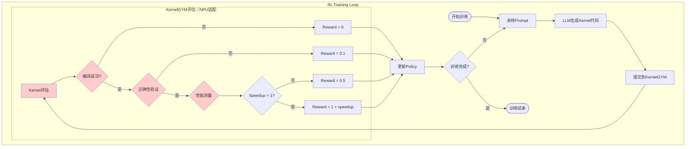

#### 4.1.2 Reward信号生成流程图 (Mermaid)

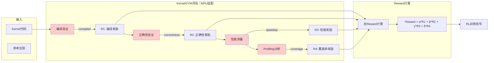

### 4.2 为什么RL训练需要KernelGYM？

#### 4.2.1 提供可靠的Reward信号

| Reward类型 | 来源 | 重要性 |
|------------|------|--------|
| `compiled` | 编译成功 | 基础奖励，确保代码可编译 |
| `correctness` | 输出正确 | 核心奖励，确保功能正确 |
| `speedup` | 性能提升 | 目标奖励，衡量优化效果 |
| `triton_kernel_coverage` | Kernel覆盖率 | 质量奖励，防止decoy |
| `profiling_metrics` | 详细性能数据 | 可选奖励，用于细粒度优化 |

#### 4.2.2 解决RL训练中的关键问题

**问题1：CUDA错误导致训练中断**
```
传统方案：单个CUDA错误导致整个训练进程崩溃
KernelGYM方案：子进程隔离，错误自动恢复，训练不中断
```

**问题2：评估延迟过高**
```
传统方案：每次评估都需要初始化CUDA（~2.5s）
KernelGYM方案：Worker池复用，评估延迟降至~0.1s
```

**问题3：分布式训练协调**
```
传统方案：单机评估，无法扩展
KernelGYM方案：多节点、多GPU并行评估，支持大规模训练
```

### 4.3 KernelGYM vs 直接评估对比

| 特性 | 直接调用PyTorch评估 | 使用KernelGYM |
|------|---------------------|---------------|
| 错误隔离 | ❌ 错误传播到主进程 | ✅ 子进程隔离 |
| 分布式支持 | ❌ 单机 | ✅ 多节点多GPU |
| 任务队列 | ❌ 同步阻塞 | ✅ 异步队列 |
| 负载均衡 | ❌ 手动管理 | ✅ 自动调度 |
| 监控告警 | ❌ 无 | ✅ 完善监控 |
| 失败重试 | ❌ 手动实现 | ✅ 自动重试 |
| Profiling | ⚠️ 需要额外实现 | ✅ 内置支持 |

### 4.4 何时可以不用KernelGYM？

以下场景可以考虑不使用KernelGYM：

1. **单机小规模实验**：GPU数量少，评估任务不频繁
2. **非CUDA环境**：CPU-only评估（但需要大量修改）
3. **简单评估逻辑**：只需要编译验证，不需要性能测量
4. **已有评估系统**：已有成熟的评估基础设施

**但即使在这些场景下，KernelGYM的子进程隔离机制仍然有价值。**

---

## 5. NPU迁移适配分析

### 5.0 NPU迁移整体架构图 (Mermaid)

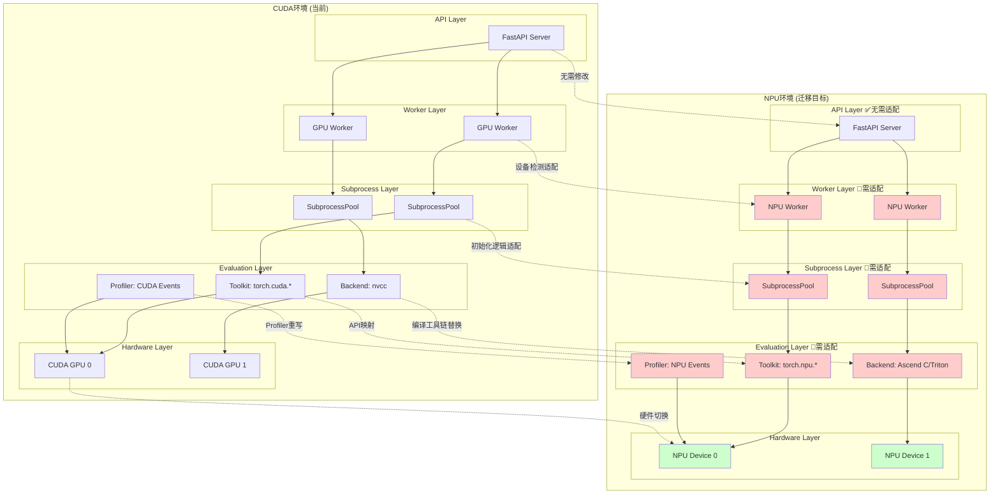

> **图例说明**：
> - 🔴 **红色背景**：需要NPU适配的模块
> - 🟢 **绿色背景**：NPU硬件目标
> - ✅ **无需适配**：平台无关的模块

### 5.0.1 NPU迁移模块依赖关系图 (Mermaid)

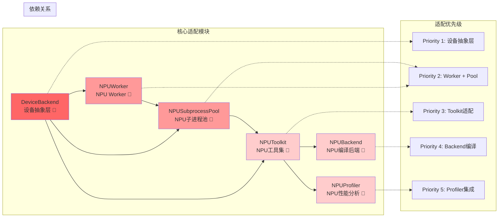

### 5.1 硬件接口适配

#### 5.1.1 CUDA API → NPU API映射

| CUDA API | NPU API (torch_npu) | 适配难度 |
|----------|---------------------|----------|
| `torch.cuda.is_available()` | `torch.npu.is_available()` | 低 |
| `torch.cuda.set_device()` | `torch.npu.set_device()` | 低 |
| `torch.cuda.synchronize()` | `torch.npu.synchronize()` | 低 |
| `torch.cuda.empty_cache()` | `torch.npu.empty_cache()` | 低 |
| `torch.cuda.get_device_name()` | `torch.npu.get_device_name()` | 低 |
| `torch.cuda.Event` | `torch.npu.Event` | 中 |
| CUDA Profiler | NPU Profiler | 高 |
| nvcc编译器 | NPU编译工具链 | 高 |

#### 5.1.2 需要修改的核心文件

```python
# 1. kernelgym/worker/gpu_worker.py
class GPUWorker:
    def __init__(self, worker_id: str, device: str, redis_client):
        # 修改：支持 "npu:N" 设备格式
        if device.startswith("npu:"):
            self.device_id = int(device.split(":")[1])
            self.device_type = "npu"
        elif device.startswith("cuda:"):
            self.device_id = int(device.split(":")[1])
            self.device_type = "cuda"
            
    async def _initialize_gpu(self):
        if self.device_type == "npu":
            import torch_npu
            # 使用nvidia-smi等效工具验证NPU
            health = NPUDiagnostics.test_npu_health(self.device_id)
        else:
            health = GPUDiagnostics.test_gpu_health_nvidia_smi(self.device_id)

# 2. kernelgym/worker/subprocess_pool.py
def _persistent_worker_loop(worker_id, device_id, device_type, task_queue, result_queue):
    if device_type == "npu":
        import torch_npu
        torch.npu.init()
        device = torch.device(f"npu:{device_id}")
        torch.npu.set_device(device)
    else:
        import torch.cuda
        torch.cuda.init()
        device = torch.device(f"cuda:{device_id}")

# 3. kernelgym/toolkit/kernelbench/pipeline.py
def eval_kernel_against_ref(..., device_type="cuda"):
    if device_type == "npu":
        assert torch.npu.is_available(), "NPU is not available"
        torch.npu.set_device(device)
    else:
        assert torch.cuda.is_available(), "CUDA is not available"
        torch.cuda.set_device(device)
```

### 5.2 计算逻辑调整

#### 5.2.1 Kernel编译适配

```python
# CUDA Kernel编译
class CUDABackend:
    def compile(self, source, device, ...):
        # 使用nvcc编译.cu文件
        subprocess.run(["nvcc", "-o", output, source])

# NPU Kernel编译（需要适配）
class NPUBackend:
    def compile(self, source, device, ...):
        # 方案1：使用Ascend C编译工具
        # 方案2：使用torch_npu的JIT编译
        # 方案3：转换为Triton kernel（如果支持）
        
        if source.endswith(".cu"):
            # 需要将CUDA kernel转换为Ascend C或Triton
            converted_source = self._convert_cuda_to_ascend(source)
        elif source.endswith(".py"):  # Triton
            # Triton可能需要适配层
            pass
```

#### 5.2.2 Triton适配

```python
# 当前Triton检测逻辑
def detect_triton_usage_for_module(model, *inputs):
    # 使用CUDA profiler检测Triton kernel
    with torch.cuda.profiler.profile():
        model(*inputs)
        
# NPU适配方案
def detect_triton_usage_for_module_npu(model, *inputs):
    # 方案1：使用NPU profiler
    with torch.npu.profiler.profile():
        model(*inputs)
        
    # 方案2：使用Ascend profiling工具
    # 方案3：代码静态分析
```

#### 5.2.3 性能测量适配

```python
# CUDA Event计时
def time_execution_with_cuda_event(model, *inputs, device_type="cuda"):
    if device_type == "npu":
        # NPU Event计时
        start_event = torch.npu.Event(enable_timing=True)
        end_event = torch.npu.Event(enable_timing=True)
        
        start_event.record()
        model(*inputs)
        end_event.record()
        torch.npu.synchronize()
        
        elapsed = start_event.elapsed_time(end_event)
    else:
        # CUDA Event计时
        start_event = torch.cuda.Event(enable_timing=True)
        end_event = torch.cuda.Event(enable_timing=True)
        ...
```

### 5.3 性能优化策略

#### 5.3.1 NPU特定优化

```python
# 1. 内存管理优化
def _aggressive_npu_cleanup(device_id: int):
    """NPU显存清理"""
    import torch_npu
    import gc
    
    torch.npu.synchronize(device_id)
    torch.npu.empty_cache()
    gc.collect()
    torch.npu.reset_peak_memory_stats(device_id)

# 2. 编译缓存优化
class NPUCompileCache:
    """NPU编译结果缓存"""
    def __init__(self):
        self.cache_dir = "/tmp/npu_compile_cache"
        
    def get_or_compile(self, source_hash):
        cached = self._load_from_cache(source_hash)
        if cached:
            return cached
        return self._compile_and_cache(source_hash)

# 3. 批量评估优化
class NPUBatchEvaluator:
    """NPU批量评估"""
    def evaluate_batch(self, tasks):
        # 利用NPU的高并发能力
        # 合并小任务，减少kernel启动开销
        pass
```

#### 5.3.2 Worker Pool调优

```python
# NPU Worker Pool配置
class NPUWorkerPoolConfig:
    # NPU通常有更大的显存，可以支持更多并发
    pool_size = 4  # 比CUDA的2更大
    
    # NPU任务执行时间可能不同
    max_tasks_per_worker = 50  # 更频繁重启防止内存泄漏
    
    # NPU初始化时间
    init_timeout = 180  # 更长的初始化超时
```

### 5.4 兼容性处理

#### 5.4.1 抽象层设计

```python
# 创建设备抽象层
class DeviceBackend(ABC):
    @abstractmethod
    def is_available(self) -> bool:
        pass
        
    @abstractmethod
    def set_device(self, device_id: int):
        pass
        
    @abstractmethod
    def synchronize(self, device_id: int = None):
        pass
        
    @abstractmethod
    def get_device_name(self, device_id: int) -> str:
        pass
        
    @abstractmethod
    def create_event(self, enable_timing: bool = True):
        pass
        
    @abstractmethod
    def empty_cache(self):
        pass

class CUDABackend(DeviceBackend):
    def is_available(self):
        return torch.cuda.is_available()
        
    def set_device(self, device_id):
        torch.cuda.set_device(device_id)
    # ... 其他实现

class NPUBackend(DeviceBackend):
    def is_available(self):
        try:
            import torch_npu
            return torch.npu.is_available()
        except ImportError:
            return False
            
    def set_device(self, device_id):
        import torch_npu
        torch.npu.set_device(device_id)
    # ... 其他实现

# 工厂函数
def get_device_backend(device_type: str) -> DeviceBackend:
    if device_type == "npu":
        return NPUBackend()
    return CUDABackend()
```

#### 5.4.2 配置适配

```python
# kernelgym/config.py
class Settings(BaseSettings):
    # 设备类型配置
    device_type: str = "cuda"  # "cuda" or "npu"
    
    # NPU特定配置
    npu_devices: List[int] = [0]
    npu_compile_cache_dir: str = "/tmp/npu_cache"
    
    # 自动检测设备类型
    def detect_device_type(self) -> str:
        try:
            import torch_npu
            if torch.npu.is_available():
                return "npu"
        except ImportError:
            pass
        if torch.cuda.is_available():
            return "cuda"
        raise RuntimeError("No accelerator available")
```

#### 5.4.3 测试适配

```python
# 测试用例适配
import pytest

@pytest.fixture
def device_type():
    """自动检测可用设备类型"""
    try:
        import torch_npu
        if torch.npu.is_available():
            return "npu"
    except ImportError:
        pass
    if torch.cuda.is_available():
        return "cuda"
    pytest.skip("No accelerator available")

def test_kernel_evaluation(device_type):
    backend = get_device_backend(device_type)
    # 使用backend进行测试
```

### 5.5 迁移实施路线图

#### 5.5.1 迁移路线图 (Mermaid)

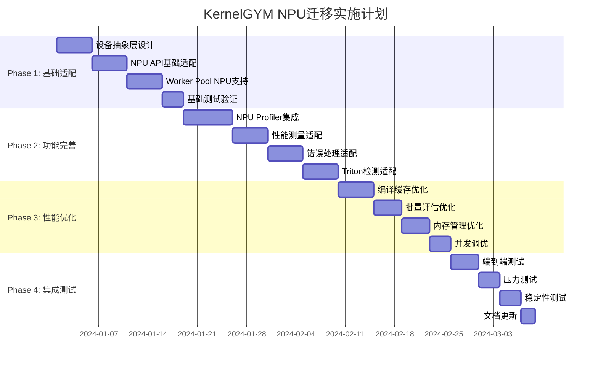

#### 5.5.2 迁移依赖关系图 (Mermaid)

```mermaid
flowchart LR
    subgraph "Phase 1: 基础适配"
        P1_1[设备抽象层] --> P1_2[NPU API适配]
        P1_2 --> P1_3[Worker Pool支持]
        P1_3 --> P1_4[基础测试]
    end
    
    subgraph "Phase 2: 功能完善"
        P1_4 --> P2_1[NPU Profiler]
        P2_1 --> P2_2[性能测量]
        P2_2 --> P2_3[错误处理]
        P2_3 --> P2_4[Triton检测]
    end
    
    subgraph "Phase 3: 性能优化"
        P2_4 --> P3_1[编译缓存]
        P3_1 --> P3_2[批量评估]
        P3_2 --> P3_3[内存管理]
        P3_3 --> P3_4[并发调优]
    end
    
    subgraph "Phase 4: 集成测试"
        P3_4 --> P4_1[端到端测试]
        P4_1 --> P4_2[压力测试]
        P4_2 --> P4_3[稳定性测试]
        P4_3 --> P4_4[文档更新]
    end
    
    P4_4 --> Done([迁移完成])
    
    style P1_1 fill:#ffcccc
    style P2_1 fill:#ffcccc
    style P3_1 fill:#ffcccc
    style P4_1 fill:#ccffcc
```

```
Phase 1: 基础适配（2-3周）
├── 设备抽象层实现
├── 基本NPU API适配
├── Worker Pool NPU支持
└── 基础测试通过

Phase 2: 功能完善（3-4周）
├── NPU Profiler集成
├── 性能测量适配
├── 错误处理适配
└── Triton检测适配（如支持）

Phase 3: 性能优化（2-3周）
├── 编译缓存优化
├── 批量评估优化
├── 内存管理优化
└── 并发调优

Phase 4: 集成测试（1-2周）
├── 端到端测试
├── 压力测试
├── 稳定性测试
└── 文档更新
```

### 5.6 关键风险与缓解措施

#### 5.6.1 NPU迁移风险矩阵图 (Mermaid)

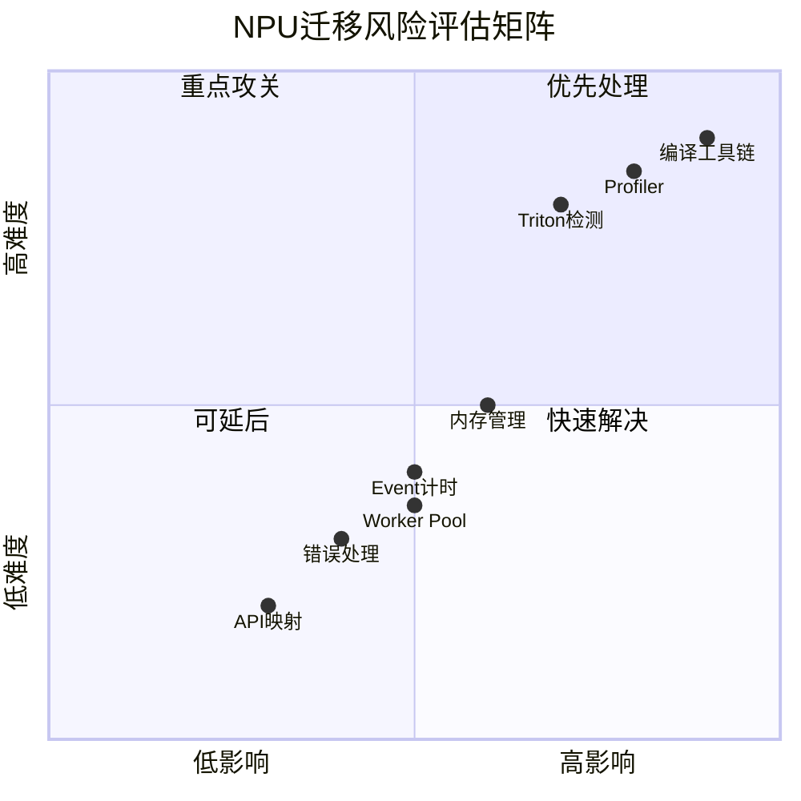

#### 5.6.2 风险与缓解措施表

| 风险 | 影响 | 缓解措施 |
|------|------|----------|
| NPU API不完整 | 部分功能无法实现 | 实现降级方案，使用替代方法 |
| Profiler差异 | 性能分析不准确 | 开发NPU专用profiling模块 |
| Kernel编译差异 | CUDA kernel无法直接运行 | 开发kernel转换工具 |
| 显存管理差异 | 内存泄漏或OOM | 针对NPU优化清理策略 |
| Triton支持有限 | Triton kernel无法运行 | 提供Ascend C替代方案 |

#### 5.6.3 NPU迁移代码修改清单 (Mermaid)

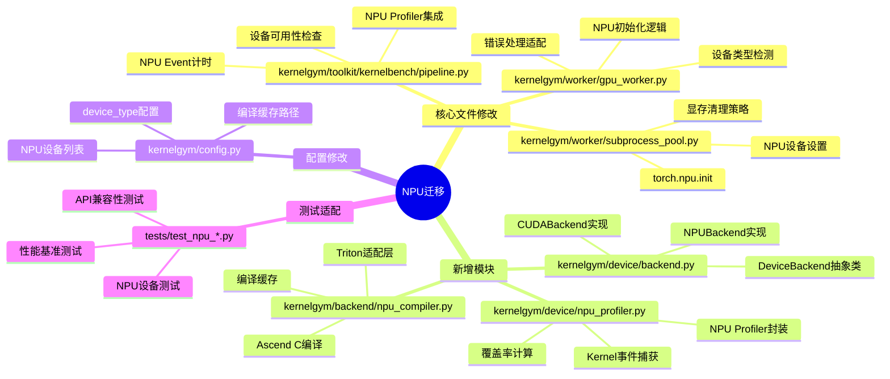

---

## 总结

KernelGYM是一个设计精良的GPU Kernel评估框架，其核心价值在于：

1. **子进程隔离架构**：解决了CUDA错误传播问题，确保评估稳定性
2. **分布式设计**：支持多节点多GPU，可扩展性强
3. **完善的评估流程**：编译、正确性、性能、Profiling一站式解决
4. **与RL训练深度集成**：提供可靠的Reward信号

对于NPU迁移，主要工作集中在：
- 硬件接口适配（CUDA → NPU API）
- 编译工具链适配（nvcc → NPU编译器）
- Profiling模块适配
- 性能优化调优

通过合理的抽象层设计和渐进式迁移策略，可以在NPU上实现与CUDA环境相当的功能和性能。
