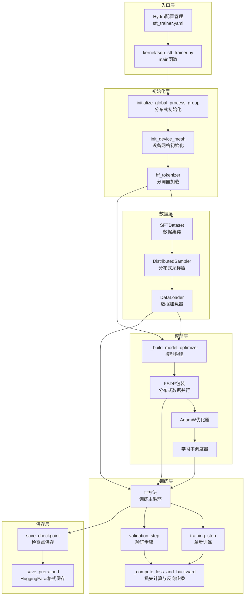
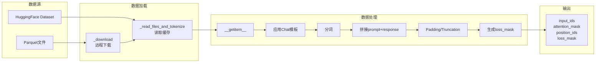
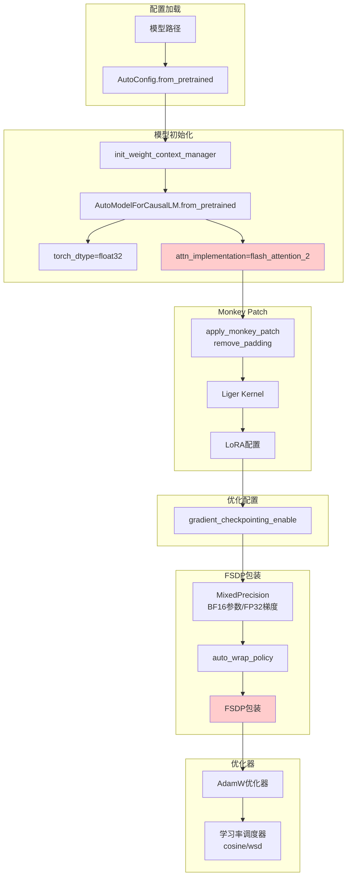
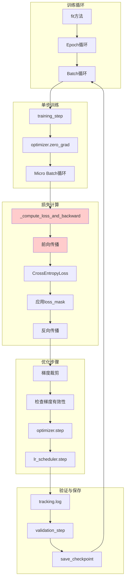
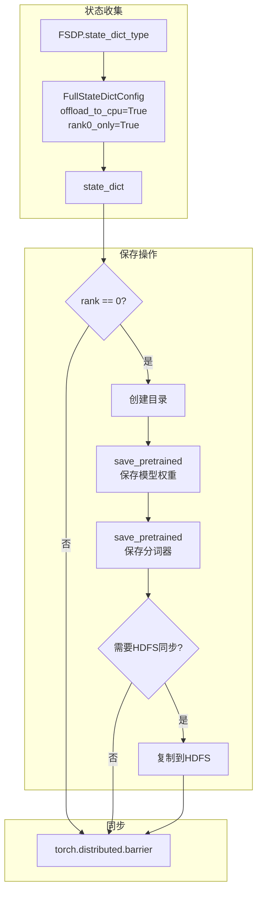

# SFT（监督微调）完整流程代码走读分析

## 目录
1. [整体架构概览](#1-整体架构概览)
2. [入口文件分析](#2-入口文件分析)
3. [数据预处理模块](#3-数据预处理模块)
4. [模型加载与配置](#4-模型加载与配置)
5. [训练循环实现](#5-训练循环实现)
6. [超参数设置](#6-超参数设置)
7. [评估指标计算](#7-评估指标计算)
8. [模型保存与加载](#8-模型保存与加载)
9. [NPU适配说明](#9-npu适配说明)

---

## 1. 整体架构概览

### 1.1 SFT流程架构图 (Mermaid)



### 1.2 核心文件清单

| 文件路径 | 功能定位 | 核心类/函数 |
|---------|----------|-------------|
| `kernel/fsdp_sft_trainer.py` | SFT训练入口 | `main()`, `FSDPSFTTrainer` |
| `verl_patch/utils/dataset/sft_dataset.py` | 数据集定义 | `SFTDataset` |
| `verl_patch/trainer/code/config/sft_trainer.yaml` | 配置文件 | Hydra配置 |
| `kernel/scripts/sft/8b-coldstart.sh` | 启动脚本 | Shell参数配置 |

---

## 2. 入口文件分析

### 2.1 主入口函数

**文件**: `kernel/fsdp_sft_trainer.py`

```python
@hydra.main(config_path="../verl_patch/trainer/code/config", config_name="sft_trainer", version_base=None)
def main(config):
    """
    SFT训练主入口函数
    
    设计思路：
    1. 使用Hydra进行配置管理，支持命令行参数覆盖
    2. 初始化分布式训练环境
    3. 创建设备网格用于FSDP和序列并行
    4. 加载分词器和数据集
    5. 创建训练器并启动训练
    
    参数:
        config: Hydra自动注入的配置对象
    """
    # Step 1: 初始化分布式进程组
    local_rank, rank, world_size = initialize_global_process_group()
    
    # Step 2: 创建FSDP设备网格
    device_mesh = init_device_mesh(
        device_type="cuda",           # 🔴 NPU需改为"npu"
        mesh_shape=(world_size,), 
        mesh_dim_names=("fsdp",)
    )
    
    # Step 3: 创建Ulysses序列并行设备网格
    dp_size = world_size // config.ulysses_sequence_parallel_size
    ulysses_device_mesh = init_device_mesh(
        device_type="cuda",           # 🔴 NPU需改为"npu"
        mesh_shape=(dp_size, config.ulysses_sequence_parallel_size), 
        mesh_dim_names=("dp", "sp")
    )
    
    # Step 4: 加载分词器
    local_model_path = copy_to_local(src=config.model.partial_pretrain, verbose=True)
    tokenizer = hf_tokenizer(local_model_path, trust_remote_code=config.model.trust_remote_code)
    
    # Step 5: 修复Qwen3聊天模板
    if "qwen3" in local_model_path.lower() or "qwen-3" in local_model_path.lower():
        if "coder" not in local_model_path.lower():
            tokenizer.chat_template = QWEN3CHATTEMPLATE
        elif "coder" in local_model_path.lower():
            tokenizer.chat_template = QWEN3CODERCHATTEMPLATE
    
    # Step 6: 创建数据集
    train_dataset = create_sft_dataset(config.data.train_files, config.data, tokenizer)
    val_dataset = create_sft_dataset(config.data.val_files, config.data, tokenizer)
    
    # Step 7: 创建训练器并启动训练
    trainer = FSDPSFTTrainer(
        config=config,
        device_mesh=device_mesh,
        ulysses_device_mesh=ulysses_device_mesh,
        tokenizer=tokenizer,
        train_dataset=train_dataset,
        val_dataset=val_dataset,
    )
    
    trainer.fit()
```

### 2.2 启动脚本分析

**文件**: `kernel/scripts/sft/8b-coldstart.sh`

```bash
#!/bin/bash

# ===========================================
# 环境变量配置
# ===========================================
HDFS_LOG_PATH=""          # 日志存储路径
HDFS_CHECKPOINT_PATH=""   # 检查点存储路径
HDFS_MODEL_PATH=""        # 模型存储路径

# ===========================================
# 默认超参数配置
# ===========================================
TRAIN_BATCH_SIZE=64              # 全局批次大小
MICRO_BATCH_SIZE_PER_GPU=2       # 每GPU微批次大小
MAX_LENGTH=18432                 # 最大序列长度
TOTAL_EPOCHS=4                   # 训练轮数
SAVE_FREQ=50                     # 保存频率
MODEL_NAME=qwen3-8b-base         # 模型名称
LEARNING_RATE=2e-5               # 学习率
SP_SIZE=4                        # Ulysses序列并行大小

# ===========================================
# 分布式配置
# ===========================================
export GPUS_PER_NODE="${GPUS_PER_NODE:-8}"
export NNODES="${NNODES:-1}"
export NODE_RANK="${NODE_RANK:-0}"
export MASTER_ADDR="${MASTER_ADDR:-127.0.0.1}"
export MASTER_PORT="${MASTER_PORT:-29500}"

# ===========================================
# 启动训练
# ===========================================
torchrun --nproc-per-node $GPUS_PER_NODE \
  --master-addr $MASTER_ADDR \
  --node-rank $NODE_RANK \
  --master-port $MASTER_PORT \
  --nnodes $NNODES -m kernel.fsdp_sft_trainer \
  data.train_files=$ACTUAL_DATA_PATH \
  data.train_batch_size=$TRAIN_BATCH_SIZE \
  data.micro_batch_size_per_gpu=$MICRO_BATCH_SIZE_PER_GPU \
  model.partial_pretrain=$HDFS_MODEL_PATH/$MODEL_NAME \
  model.enable_gradient_checkpointing=True \
  model.fsdp_config.model_dtype=bf16 \
  ulysses_sequence_parallel_size=$SP_SIZE \
  use_remove_padding=True \
  optim.lr=$LEARNING_RATE \
  trainer.total_epochs=$TOTAL_EPOCHS \
  trainer.save_freq=$SAVE_FREQ
```

**🔴 NPU适配说明**:
```bash
# NPU环境变量
export HCCL_CONNECT_TIMEOUT=7200
export HCCL_EXEC_TIMEOUT=1800
export ASCEND_GLOBAL_LOG_LEVEL=3

# NPU启动命令（使用torch_npu）
torchrun --nproc-per-node $GPUS_PER_NODE \
  --master-addr $MASTER_ADDR \
  --node-rank $NODE_RANK \
  --master-port $MASTER_PORT \
  --nnodes $NNODES -m kernel.fsdp_sft_trainer_npu \
  device_type=npu \
  ...
```

---

## 3. 数据预处理模块

### 3.1 数据集类实现

**文件**: `verl_patch/utils/dataset/sft_dataset.py`

```python
class SFTDataset(Dataset):
    """
    内存中的SFT数据集
    
    设计思路：
    1. 支持Parquet文件和HuggingFace数据集格式
    2. 在初始化时将所有数据加载到内存
    3. 动态应用Chat模板进行分词
    4. 支持多种截断策略
    
    数据格式要求：
    - Parquet格式：包含prompt和response列
    - HF格式：conversations格式的对话数据
    """
    
    def __init__(self, parquet_files: Union[str, List[str]], tokenizer, config):
        """
        初始化数据集
        
        参数:
            parquet_files: 数据文件路径（支持单个或列表）
            tokenizer: HuggingFace分词器
            config: 数据配置对象
        """
        # 提取配置参数
        self.prompt_key = config.get("prompt_key", "prompt")
        self.response_key = config.get("response_key", "response")
        self.max_length = config.get("max_length", 1024)
        self.truncation = config.get("truncation", "error")  # error/left/right
        
        # 处理分词器
        if isinstance(tokenizer, str):
            tokenizer = hf_tokenizer(tokenizer)
        self.tokenizer: PreTrainedTokenizer = tokenizer
        
        # 加载数据
        if not self.use_hf_load:
            self._download()  # 从远程下载数据
        self._read_files_and_tokenize()  # 读取并缓存数据
    
    def _read_files_and_tokenize(self):
        """
        读取文件并缓存数据
        
        设计考量：
        1. 支持HuggingFace datasets格式和Parquet格式
        2. 数据全部加载到内存以提高训练效率
        3. 支持嵌套字典格式的数据提取
        """
        if self.use_hf_load:
            # HuggingFace datasets格式
            from datasets import load_dataset
            ds = load_dataset(self.parquet_files)
            
            def get_pair(example):
                assert len(example["conversations"]) == 2
                prompt = example["conversations"][0]["value"]
                response = example["conversations"][1]["value"]
                return {"prompt": prompt, "response": response}
            
            train_pairs = ds["train"].map(get_pair, ...)
            self.prompts = train_pairs["prompt"]
            self.responses = train_pairs["response"]
        else:
            # Parquet格式
            dataframes = []
            for parquet_file in self.parquet_files:
                dataframe = pd.read_parquet(parquet_file)
                dataframes.append(dataframe)
            self.dataframe = pd.concat(dataframes)
            self.prompts = self.dataframe[self.prompt_key].tolist()
            self.responses = self.dataframe[self.response_key].tolist()
    
    def __getitem__(self, item):
        """
        获取单个样本
        
        核心处理流程：
        1. 应用Chat模板
        2. 分词并拼接prompt和response
        3. Padding或Truncation到max_length
        4. 生成position_ids和loss_mask
        
        Returns:
            dict: {
                "input_ids": torch.Tensor,      # 输入token IDs
                "attention_mask": torch.Tensor, # 注意力掩码
                "position_ids": torch.Tensor,   # 位置IDs
                "loss_mask": torch.Tensor,      # 损失掩码（仅计算response部分）
            }
        """
        prompt = self.prompts[item]
        response = self.responses[item]
        
        # Step 1: 应用Chat模板
        prompt_chat = [{"role": "user", "content": prompt}]
        prompt_chat_str = tokenizer.apply_chat_template(
            prompt_chat, 
            add_generation_prompt=True, 
            tokenize=False
        )
        response_chat_str = response + tokenizer.eos_token
        
        # Step 2: 分词
        prompt_ids = tokenizer(prompt_chat_str, return_tensors="pt", ...)["input_ids"][0]
        response_ids = tokenizer(response_chat_str, return_tensors="pt", ...)["input_ids"][0]
        
        # Step 3: 拼接
        input_ids = torch.cat((prompt_ids, response_ids), dim=-1)
        attention_mask = torch.cat((prompt_attention_mask, response_attention_mask), dim=-1)
        
        # Step 4: Padding或Truncation
        sequence_length = input_ids.shape[0]
        if sequence_length < self.max_length:
            # 右侧Padding
            padded_input_ids = torch.ones(...) * self.tokenizer.pad_token_id
            input_ids = torch.cat((input_ids, padded_input_ids))
            attention_mask = torch.cat((attention_mask, padded_attention_mask))
        elif sequence_length > self.max_length:
            # Truncation
            if self.truncation == "left":
                input_ids = input_ids[-self.max_length:]
            elif self.truncation == "right":
                input_ids = input_ids[:self.max_length]
        
        # Step 5: 生成position_ids
        position_ids = compute_position_id_with_mask(attention_mask)
        
        # Step 6: 生成loss_mask（关键：仅计算response部分损失）
        loss_mask = attention_mask.clone()
        loss_mask[:prompt_length - 1] = 0  # 屏蔽prompt部分
        loss_mask[prompt_length + response_length - 1] = 0  # 屏蔽最后一个token
        
        return {
            "input_ids": input_ids,
            "attention_mask": attention_mask,
            "position_ids": position_ids,
            "loss_mask": loss_mask,
        }
```

### 3.2 数据流图 (Mermaid)



### 3.3 DataLoader构建

**文件**: `verl_patch/trainer/code/fsdp_sft_trainer.py`

```python
def _build_dataloader(self, train_dataset, val_dataset):
    """
    构建数据加载器
    
    设计考量：
    1. 使用DistributedSampler确保数据分片
    2. 序列并行时需要特殊处理rank和world_size
    3. pin_memory加速CPU到GPU的数据传输
    
    🔴 NPU适配：
    - pin_memory在NPU上同样有效
    - num_workers可能需要调整
    """
    config = self.config
    self.train_dataset, self.val_dataset = train_dataset, val_dataset
    
    # 确定分布式采样参数
    if self.config.ulysses_sequence_parallel_size > 1:
        # 序列并行：使用dp维度的rank
        rank = self.ulysses_device_mesh.get_local_rank("dp")
        world_size = self.ulysses_device_mesh.size(0)
    else:
        # 标准FSDP：使用全局rank
        rank = self.device_mesh.get_rank()
        world_size = self.device_mesh.size()
    
    # 训练数据加载器
    self.train_sampler = DistributedSampler(
        self.train_dataset, 
        shuffle=True, 
        num_replicas=world_size, 
        rank=rank, 
        drop_last=True
    )
    self.train_dataloader = DataLoader(
        dataset=self.train_dataset,
        batch_size=config.data.train_batch_size,
        sampler=self.train_sampler,
        num_workers=8,           # 🔴 NPU建议调整为4
        pin_memory=True,         # NPU同样支持
        drop_last=True,
    )
    
    # 验证数据加载器
    self.val_sampler = DistributedSampler(
        self.val_dataset, 
        shuffle=False, 
        num_replicas=world_size, 
        rank=rank, 
        drop_last=True
    )
    self.val_dataloader = DataLoader(
        dataset=self.val_dataset,
        batch_size=config.data.micro_batch_size_per_gpu,
        sampler=self.val_sampler,
        num_workers=8,
        pin_memory=True,
        drop_last=True,
    )
```

---

## 4. 模型加载与配置

### 4.1 模型构建流程

**文件**: `verl_patch/trainer/code/fsdp_sft_trainer.py`

```python
def _build_model_optimizer(self):
    """
    构建模型和优化器
    
    核心流程：
    1. 加载预训练模型配置
    2. 应用Monkey Patch（Flash Attention、序列并行）
    3. 可选：应用LoRA
    4. 可选：启用梯度检查点
    5. FSDP包装
    6. 创建优化器和学习率调度器
    
    🔴 NPU适配关键点：
    - Flash Attention需要替换为NPU版本
    - FSDP需要验证NPU兼容性
    - 混合精度配置可能需要调整
    """
    # ==========================================
    # Step 1: 加载模型配置
    # ==========================================
    local_model_path = copy_to_local(src=self.config.model.partial_pretrain, verbose=True)
    
    if self.config.model.get("external_lib", None) is not None:
        import importlib
        importlib.import_module(self.config.model.external_lib)
    
    trust_remote_code = self.config.model.trust_remote_code
    config = AutoConfig.from_pretrained(local_model_path, trust_remote_code=trust_remote_code)
    
    # ==========================================
    # Step 2: 创建初始化上下文
    # ==========================================
    init_context = get_init_weight_context_manager(
        use_meta_tensor=not config.tie_word_embeddings, 
        mesh=self.device_mesh
    )
    
    with init_context():
        # ==========================================
        # Step 3: 加载模型
        # ==========================================
        self.model: PreTrainedModel = AutoModelForCausalLM.from_pretrained(
            local_model_path,
            config=config,
            torch_dtype=torch.float32,    # 初始使用FP32，FSDP会转换为BF16
            attn_implementation="flash_attention_2",  # 🔴 NPU需替换
            trust_remote_code=trust_remote_code,
        )
        
        # ==========================================
        # Step 4: 应用Monkey Patch
        # ==========================================
        if self.use_remove_padding or self.config.ulysses_sequence_parallel_size > 1:
            from verl.models.transformers.monkey_patch import apply_monkey_patch
            apply_monkey_patch(
                model=self.model, 
                ulysses_sp_size=self.config.ulysses_sequence_parallel_size
            )
        
        # ==========================================
        # Step 5: 可选 - 应用Liger Kernel
        # ==========================================
        if self.config.model.get("use_liger", False):
            from liger_kernel.transformers.monkey_patch import _apply_liger_kernel_to_instance
            _apply_liger_kernel_to_instance(model=self.model)
        
        # ==========================================
        # Step 6: 可选 - 应用LoRA
        # ==========================================
        if self.config.model.get("lora_rank", 0) > 0:
            self.model.enable_input_require_grads()
            lora_config = {
                "task_type": TaskType.CAUSAL_LM,
                "r": self.config.model.lora_rank,
                "lora_alpha": self.config.model.lora_alpha,
                "target_modules": convert_to_regular_types(self.config.model.target_modules),
                "bias": "none",
            }
            self.model = get_peft_model(self.model, LoraConfig(**lora_config))
    
    # ==========================================
    # Step 7: 启用梯度检查点
    # ==========================================
    if self.config.model.enable_gradient_checkpointing:
        self.model.gradient_checkpointing_enable(
            gradient_checkpointing_kwargs={"use_reentrant": False}
        )
    
    # ==========================================
    # Step 8: FSDP包装
    # ==========================================
    mixed_precision = MixedPrecision(
        param_dtype=torch.bfloat16,    # 参数使用BF16
        reduce_dtype=torch.float32,    # 梯度归约使用FP32
        buffer_dtype=torch.float32     # Buffer使用FP32
    )
    
    auto_wrap_policy = get_fsdp_wrap_policy(
        self.model,
        config=self.config.model.fsdp_config.wrap_policy,
        is_lora=self.config.model.get("lora_rank", 0) > 0,
    )
    
    cpu_offload = None
    if self.config.model.fsdp_config.cpu_offload:
        cpu_offload = CPUOffload(
            offload_params=self.config.model.fsdp_config.offload_params
        )
    
    self.fsdp_model = FSDP(
        module=self.model,
        auto_wrap_policy=auto_wrap_policy,
        param_init_fn=init_fn,
        sharding_strategy=ShardingStrategy.FULL_SHARD,
        mixed_precision=mixed_precision,
        device_mesh=self.device_mesh,
        sync_module_states=True,
        device_id=torch.cuda.current_device(),  # 🔴 NPU: torch.npu.current_device()
        cpu_offload=cpu_offload,
        use_orig_params=False,
    )
    
    # ==========================================
    # Step 9: 创建优化器
    # ==========================================
    self.optimizer = optim.AdamW(
        self.fsdp_model.parameters(),
        lr=self.config.optim.lr,
        betas=self.config.optim.betas,
        weight_decay=self.config.optim.weight_decay,
    )
    
    # ==========================================
    # Step 10: 创建学习率调度器
    # ==========================================
    self.steps_per_epoch = len(self.train_dataloader)
    self.total_steps = self.steps_per_epoch * self.config.trainer.total_epochs
    num_warmup_steps = int(self.total_steps * self.config.optim.warmup_steps_ratio)
    
    if self.config.optim.lr_scheduler == "cosine":
        self.lr_scheduler = get_cosine_schedule_with_warmup(
            optimizer=self.optimizer, 
            num_warmup_steps=num_warmup_steps, 
            num_training_steps=self.total_steps
        )
    elif self.config.optim.lr_scheduler == "wsd":
        self.lr_scheduler = get_wsd_schedule_with_warmup(
            optimizer=self.optimizer, 
            num_warmup_steps=num_warmup_steps, 
            num_training_steps=self.total_steps
        )
```

### 4.2 模型加载流程图 (Mermaid)



---

## 5. 训练循环实现

### 5.1 训练主循环

**文件**: `verl_patch/trainer/code/fsdp_sft_trainer.py`

```python
def fit(self):
    """
    训练主循环
    
    设计思路：
    1. 支持多epoch训练
    2. 每个epoch结束后进行验证
    3. 支持定期保存检查点
    4. 支持早停（total_training_steps）
    
    🔴 NPU适配：
    - 数据移动到设备：.cuda() → .to(device_type)
    - 分布式通信：NCCL → HCCL
    """
    rank = self.device_mesh.get_rank()
    
    # 初始化日志追踪
    if rank == 0:
        tracking = Tracking(
            project_name=self.config.trainer.project_name,
            experiment_name=self.config.trainer.experiment_name,
            default_backend=self.config.trainer.logger,
        )
    
    global_step = 0
    total_training_steps = len(self.train_dataloader) * self.config.trainer.total_epochs
    
    if self.config.trainer.total_training_steps is not None:
        total_training_steps = self.config.trainer.total_training_steps
    
    self.total_training_steps = total_training_steps
    
    # ==========================================
    # 主训练循环
    # ==========================================
    for epoch in range(self.config.trainer.total_epochs):
        # 设置epoch确保数据shuffle
        self.train_sampler.set_epoch(epoch=epoch)
        
        for data in tqdm(
            self.train_dataloader,
            total=self.steps_per_epoch,
            desc=f"Epoch {epoch + 1}/{self.config.trainer.total_epochs}",
        ):
            global_step += 1
            
            # 移动数据到GPU
            data = TensorDict(data, batch_size=self.config.data.train_batch_size).cuda()
            # 🔴 NPU: .to(f"{device_type}")
            
            # 执行训练步骤
            metric = self.training_step(data)
            
            # 记录指标
            if rank == 0:
                tracking.log(data=metric, step=global_step)
            
            # 定期保存检查点
            if self.config.trainer.save_freq > 0 and global_step % self.config.trainer.save_freq == 0:
                self.save_checkpoint(step=global_step)
            
            # 早停检查
            if global_step >= self.total_training_steps:
                # 最终验证
                val_losses = []
                for val_data in self.val_dataloader:
                    val_data = TensorDict(val_data, ...).cuda()
                    val_loss = self.validation_step(val_data)
                    val_losses.append(val_loss)
                
                if rank == 0:
                    avg_val_loss = torch.mean(torch.stack(val_losses))
                    tracking.log(data={"val/loss": avg_val_loss.item()}, step=global_step)
                
                torch.distributed.barrier()
                self.save_checkpoint(step=global_step)
                return
        
        # ==========================================
        # Epoch结束验证
        # ==========================================
        val_losses = []
        for data in self.val_dataloader:
            data = TensorDict(data, ...).cuda()
            val_loss = self.validation_step(data)
            val_losses.append(val_loss)
        
        if rank == 0:
            val_loss = torch.mean(torch.stack(val_losses))
            tracking.log(data={"val/loss": val_loss.item()}, step=global_step)
        
        torch.distributed.barrier()
        
        # 保存epoch检查点
        self.save_checkpoint(step=global_step)
```

### 5.2 单步训练实现

```python
def training_step(self, batch: TensorDict):
    """
    单步训练
    
    核心流程：
    1. 清零梯度
    2. 梯度累积（micro_batch循环）
    3. 梯度裁剪
    4. 优化器步进
    5. 学习率更新
    6. 跨rank同步损失
    
    🔴 NPU适配：
    - .cuda() → .to(device_type)
    - 梯度裁剪可能需要调整
    """
    self.fsdp_model.train()
    
    # Step 1: 清零梯度
    self.optimizer.zero_grad()
    
    # Step 2: 梯度累积
    micro_batches = batch.split(self.config.data.micro_batch_size_per_gpu)
    n_micro_batches = len(micro_batches)
    step_loss = 0
    
    for micro_batch in micro_batches:
        # 计算损失并反向传播
        loss = self._compute_loss_and_backward(batch=micro_batch) / n_micro_batches
        step_loss += loss.item()
    
    # Step 3: 梯度裁剪
    grad_norm = self.fsdp_model.clip_grad_norm_(max_norm=self.config.optim.clip_grad)
    
    # Step 4: 优化器步进（检查梯度有效性）
    if not torch.isfinite(grad_norm):
        print(f"WARN: grad_norm is not finite: {grad_norm}")
        self.optimizer.zero_grad()
    else:
        self.optimizer.step()
    
    # Step 5: 学习率更新
    self.lr_scheduler.step()
    lr = self.lr_scheduler.get_last_lr()[0]
    
    # Step 6: 跨rank同步损失
    step_loss = torch.tensor(step_loss).cuda()
    torch.distributed.all_reduce(step_loss, op=torch.distributed.ReduceOp.AVG)
    
    return {
        "train/loss": step_loss.detach().item(), 
        "train/lr(1e-3)": lr * 1e3
    }
```

### 5.3 损失计算与反向传播

```python
def _compute_loss_and_backward(self, batch, do_backward=True):
    """
    计算损失并可选反向传播
    
    核心特性：
    1. 支持序列并行（Ulysses）
    2. 支持Remove Padding优化
    3. 使用loss_mask仅计算response部分损失
    4. 支持DP token平衡
    
    🔴 NPU适配：
    - .cuda() → .to(device_type)
    - torch.autocast(device_type="cuda") → device_type="npu"
    - Flash Attention varlen需要NPU版本
    """
    use_sp = self.use_remove_padding and self.config.ulysses_sequence_parallel_size > 1
    
    # 移动输入到GPU
    input_ids = batch["input_ids"].cuda()
    attention_mask = batch["attention_mask"].cuda()
    position_ids = batch["position_ids"].cuda()
    loss_mask = batch.pop("loss_mask")[:, :-1].reshape(-1).cuda()
    
    loss_fct = nn.CrossEntropyLoss(reduction="none")
    
    # 序列并行上下文
    context = self.sharding_manager if use_sp else nullcontext()
    
    with context, torch.autocast(device_type="cuda", dtype=torch.bfloat16):
        # 🔴 NPU: device_type="npu"
        
        if not use_sp:
            # ==========================================
            # 标准前向传播（无序列并行）
            # ==========================================
            labels = input_ids[:, 1:].contiguous()
            
            output = self.fsdp_model(
                input_ids=input_ids, 
                attention_mask=attention_mask, 
                position_ids=position_ids, 
                use_cache=False
            )
            
            logits = output.logits
            shift_logits = logits[..., :-1, :].contiguous()
            shift_labels = labels.contiguous()
            
            # 展平计算损失
            shift_logits = shift_logits.view(-1, self.model.config.vocab_size)
            shift_labels = shift_labels.view(-1)
            shift_labels = shift_labels.to(shift_logits.device)
            
            loss = loss_fct(shift_logits, shift_labels)
            loss = loss * loss_mask.to(loss.device)
            
        else:
            # ==========================================
            # 序列并行前向传播
            # ==========================================
            # 关键假设：每个SP组处理相同的batch
            # 不同SP组处理不同的batch
            
            batch_size, seqlen = input_ids.shape
            
            # Remove Padding：移除padding token
            input_ids_rmpad, indices, *_ = unpad_input(
                input_ids.unsqueeze(-1), attention_mask
            )
            input_ids_rmpad = input_ids_rmpad.transpose(0, 1)
            
            # 处理position_ids
            position_ids_rmpad = index_first_axis(
                rearrange(position_ids.unsqueeze(-1), "b s ... -> (b s) ..."), indices
            ).transpose(0, 1)
            
            # 序列并行切片
            input_ids_rmpad_sliced, position_ids_rmpad_padded, pad_size = \
                ulysses_pad_and_slice_inputs(
                    input_ids_rmpad, position_ids_rmpad, 
                    sp_size=get_ulysses_sequence_parallel_world_size()
                )
            
            # 准备labels
            input_ids_rmpad_rolled = torch.roll(input_ids_rmpad, shifts=-1, dims=1)
            input_ids_rmpad_rolled, _, _ = ulysses_pad_and_slice_inputs(
                input_ids_rmpad_rolled, None, get_ulysses_sequence_parallel_world_size()
            )
            input_ids_rmpad_rolled = input_ids_rmpad_rolled.squeeze(0)
            
            # 前向传播
            output = self.fsdp_model(
                input_ids=input_ids_rmpad_sliced,
                attention_mask=None,  # Flash Attention varlen不需要
                position_ids=position_ids_rmpad_padded,
                use_cache=False,
            )
            
            # 计算损失
            logits_rmpad = output.logits.squeeze(0)
            input_ids_rmpad_rolled = input_ids_rmpad_rolled.to(logits_rmpad.device)
            loss = loss_fct(logits_rmpad, input_ids_rmpad_rolled)
            
            # 收集并恢复padding
            loss = gather_outputs_and_unpad(loss, gather_dim=0, unpad_dim=0, padding_size=pad_size)
            full_loss = pad_input(
                hidden_states=loss.unsqueeze(-1), 
                indices=indices, 
                batch=batch_size, 
                seqlen=seqlen
            )
            full_loss = full_loss.squeeze(-1)[:, :-1]
            full_loss = full_loss.reshape(-1)
            loss_mask = loss_mask.to(full_loss.device)
            loss = full_loss * loss_mask
        
        # 计算有效token数
        valid_token_this_rank = torch.sum(loss_mask)
        
        # 可选：跨DP rank平衡token
        if self.config.data.balance_dp_token:
            torch.distributed.all_reduce(valid_token_this_rank)
            dp_size = self.ulysses_device_mesh.size("dp") if use_sp else torch.distributed.get_world_size()
        else:
            dp_size = 1
        
        # 计算平均损失
        loss = torch.sum(loss) / (valid_token_this_rank + 1e-8) * dp_size
        
        # 反向传播
        if do_backward:
            loss.backward()
        
        return loss
```

### 5.4 训练流程图 (Mermaid)



---

## 6. 超参数设置

### 6.1 配置文件结构

**文件**: `verl_patch/trainer/code/config/sft_trainer.yaml`

```yaml
# ==========================================
# 数据配置
# ==========================================
data:
  train_files: null                    # 训练数据路径
  val_files: null                      # 验证数据路径
  train_batch_size: 64                 # 全局批次大小
  micro_batch_size_per_gpu: 2          # 每GPU微批次大小
  max_length: 2048                     # 最大序列长度
  prompt_key: prompt                   # Prompt列名
  response_key: response               # Response列名
  truncation: error                    # 截断策略: error/left/right
  balance_dp_token: false              # 是否平衡DP token

# ==========================================
# 模型配置
# ==========================================
model:
  partial_pretrain: null               # 预训练模型路径
  trust_remote_code: false             # 是否信任远程代码
  enable_gradient_checkpointing: true  # 梯度检查点
  external_lib: null                   # 外部库
  
  # FSDP配置
  fsdp_config:
    wrap_policy: null                  # FSDP包装策略
    model_dtype: bf16                  # 模型数据类型
    cpu_offload: true                  # CPU卸载
    offload_params: false              # 参数卸载
  
  # LoRA配置（可选）
  lora_rank: 0                         # LoRA秩（0表示不使用）
  lora_alpha: 16                       # LoRA alpha
  target_modules: all-linear           # 目标模块
  
  # Liger Kernel（可选）
  use_liger: false                     # 是否使用Liger Kernel

# ==========================================
# 优化器配置
# ==========================================
optim:
  lr: 2e-5                             # 学习率
  betas: [0.9, 0.999]                  # Adam beta参数
  weight_decay: 0.0                    # 权重衰减
  clip_grad: 1.0                       # 梯度裁剪
  warmup_steps_ratio: 0.03             # Warmup步数比例
  lr_scheduler: cosine                 # 学习率调度器: cosine/wsd

# ==========================================
# 训练器配置
# ==========================================
trainer:
  total_epochs: 4                      # 训练轮数
  total_training_steps: null           # 总训练步数（可选，用于早停）
  project_name: sft-project            # 项目名称
  experiment_name: sft-exp             # 实验名称
  logger: ['console', 'wandb']         # 日志后端
  save_freq: 50                        # 保存频率
  default_local_dir: null              # 本地保存目录
  default_hdfs_dir: null               # HDFS保存目录

# ==========================================
# 序列并行配置
# ==========================================
ulysses_sequence_parallel_size: 1      # Ulysses序列并行大小
use_remove_padding: false              # 是否使用Remove Padding
```

### 6.2 超参数说明表

| 参数 | 默认值 | 说明 | NPU注意事项 |
|------|--------|------|-------------|
| `train_batch_size` | 64 | 全局批次大小 | 根据NPU显存调整 |
| `micro_batch_size_per_gpu` | 2 | 每GPU微批次大小 | NPU可能需要减小 |
| `max_length` | 2048 | 最大序列长度 | 根据任务调整 |
| `learning_rate` | 2e-5 | 学习率 | 通常无需调整 |
| `total_epochs` | 4 | 训练轮数 | 根据收敛情况调整 |
| `clip_grad` | 1.0 | 梯度裁剪阈值 | NPU可能需要调整 |
| `warmup_steps_ratio` | 0.03 | Warmup比例 | 通常无需调整 |
| `ulysses_sequence_parallel_size` | 1 | 序列并行大小 | NPU需验证兼容性 |

---

## 7. 评估指标计算

### 7.1 训练指标

```python
def training_step(self, batch: TensorDict):
    """
    训练步骤返回的指标：
    - train/loss: 训练损失（跨rank平均）
    - train/lr(1e-3): 当前学习率（×1000）
    """
    # ... 训练逻辑 ...
    
    return {
        "train/loss": step_loss.detach().item(), 
        "train/lr(1e-3)": lr * 1e3
    }
```

### 7.2 验证指标

```python
def validation_step(self, batch: TensorDict):
    """
    验证步骤
    
    设计思路：
    1. 切换到eval模式
    2. 禁用梯度计算
    3. 计算验证损失
    4. 跨rank平均
    
    🔴 NPU适配：
    - 确保eval模式下NPU行为一致
    """
    self.fsdp_model.eval()
    
    with torch.no_grad():
        loss = self._compute_loss_and_backward(batch, do_backward=False)
        torch.distributed.all_reduce(loss, op=torch.distributed.ReduceOp.AVG)
    
    return loss

# 在fit()中记录验证指标
if rank == 0:
    val_loss = torch.mean(torch.stack(val_losses))
    metric = {"val/loss": val_loss.detach().item()}
    tracking.log(data=metric, step=global_step)
```

### 7.3 指标追踪

```python
# 使用verl的Tracking工具
from verl.utils.tracking import Tracking

if rank == 0:
    tracking = Tracking(
        project_name=self.config.trainer.project_name,
        experiment_name=self.config.trainer.experiment_name,
        default_backend=self.config.trainer.logger,  # ['console', 'wandb']
    )
    
    # 记录指标
    tracking.log(data=metric, step=global_step)
```

---

## 8. 模型保存与加载

### 8.1 检查点保存

```python
def save_checkpoint(self, step):
    """
    保存检查点
    
    设计思路：
    1. 使用FSDP的FullStateDictConfig获取完整状态
    2. 仅rank 0执行保存
    3. 保存为HuggingFace格式
    4. 可选：同步到HDFS
    
    🔴 NPU适配：
    - FSDP状态字典获取方式相同
    - 保存路径可能需要调整
    """
    from torch.distributed.fsdp import FullStateDictConfig, StateDictType
    
    # 配置FSDP状态字典类型
    cfg = FullStateDictConfig(offload_to_cpu=True, rank0_only=True)
    
    with FSDP.state_dict_type(self.fsdp_model, StateDictType.FULL_STATE_DICT, cfg):
        state_dict = self.fsdp_model.state_dict()
    
    # 构建保存路径
    path = os.path.join(self.config.trainer.default_local_dir, f"global_step_{step}")
    
    # 仅rank 0保存
    if self.device_mesh.get_rank() == 0:
        os.makedirs(path, exist_ok=True)
        
        # 保存HuggingFace格式
        self.model.save_pretrained(path, state_dict=state_dict)
        self.tokenizer.save_pretrained(path)
        
        # 可选：同步到HDFS
        if self.config.trainer.default_hdfs_dir:
            hdfs_io.makedirs(self.config.trainer.default_hdfs_dir, exist_ok=True)
            hdfs_io.copy(src=path, dst=self.config.trainer.default_hdfs_dir, dirs_exist_ok=True)
    
    # 同步所有进程
    torch.distributed.barrier()
```

### 8.2 检查点加载

```python
def extract_step(path):
    """
    从路径提取步数
    
    用于恢复训练时找到最新检查点
    """
    match = re.search(r"global_step_(\d+)", path)
    if match:
        return int(match.group(1))
    return None

# 恢复训练时加载检查点
# 在_build_model_optimizer中添加：
if self.config.trainer.resume_mode == "auto":
    # 查找最新检查点
    checkpoint_dir = self.config.trainer.default_local_dir
    if os.path.exists(checkpoint_dir):
        checkpoints = [d for d in os.listdir(checkpoint_dir) if d.startswith("global_step_")]
        if checkpoints:
            latest = max(checkpoints, key=lambda x: extract_step(x))
            checkpoint_path = os.path.join(checkpoint_dir, latest)
            # 加载模型权重
            self.model = AutoModelForCausalLM.from_pretrained(checkpoint_path)
```

### 8.3 保存流程图 (Mermaid)



---

## 9. NPU适配说明

### 9.1 NPU适配清单

| 模块 | 需要修改的内容 | 修改位置 | 难度 |
|------|---------------|----------|------|
| **入口函数** | device_type="cuda" → "npu" | `main()` | 低 |
| **设备初始化** | torch.cuda → torch.npu | 多处 | 低 |
| **数据移动** | .cuda() → .to(device_type) | 多处 | 低 |
| **混合精度** | autocast device_type | `_compute_loss_and_backward` | 低 |
| **Flash Attention** | flash_attention_2 → NPU版本 | `_build_model_optimizer` | 高 |
| **分布式后端** | NCCL → HCCL | `initialize_global_process_group` | 中 |
| **FSDP** | 验证NPU兼容性 | `_build_model_optimizer` | 中 |
| **序列并行** | 验证Ulysses兼容性 | 多处 | 高 |
| **Remove Padding** | 验证flash_attn兼容性 | `_compute_loss_and_backward` | 高 |

### 9.2 关键代码修改示例

#### 9.2.1 设备类型抽象

```python
# 在文件开头添加设备检测
import torch

def get_device_type():
    """自动检测可用设备类型"""
    try:
        import torch_npu
        if torch_npu.npu.is_available():
            return "npu"
    except ImportError:
        pass
    
    if torch.cuda.is_available():
        return "cuda"
    
    raise RuntimeError("No accelerator available")

DEVICE_TYPE = get_device_type()
```

#### 9.2.2 入口函数修改

```python
@hydra.main(config_path="../verl_patch/trainer/code/config", config_name="sft_trainer", version_base=None)
def main(config):
    local_rank, rank, world_size = initialize_global_process_group()
    
    # 使用抽象的设备类型
    device_mesh = init_device_mesh(
        device_type=DEVICE_TYPE,  # 🔴 修改点
        mesh_shape=(world_size,), 
        mesh_dim_names=("fsdp",)
    )
    
    dp_size = world_size // config.ulysses_sequence_parallel_size
    ulysses_device_mesh = init_device_mesh(
        device_type=DEVICE_TYPE,  # 🔴 修改点
        mesh_shape=(dp_size, config.ulysses_sequence_parallel_size), 
        mesh_dim_names=("dp", "sp")
    )
    # ...
```

#### 9.2.3 模型构建修改

```python
def _build_model_optimizer(self):
    # ...
    
    # 🔴 Flash Attention替换
    if DEVICE_TYPE == "npu":
        attn_implementation = "eager"  # 或使用NPU Flash Attention
    else:
        attn_implementation = "flash_attention_2"
    
    self.model: PreTrainedModel = AutoModelForCausalLM.from_pretrained(
        local_model_path,
        config=config,
        torch_dtype=torch.float32,
        attn_implementation=attn_implementation,  # 🔴 修改点
        trust_remote_code=trust_remote_code,
    )
    
    # ...
    
    # 🔴 FSDP设备ID
    if DEVICE_TYPE == "npu":
        device_id = torch.npu.current_device()
    else:
        device_id = torch.cuda.current_device()
    
    self.fsdp_model = FSDP(
        module=self.model,
        # ...
        device_id=device_id,  # 🔴 修改点
        # ...
    )
```

#### 9.2.4 损失计算修改

```python
def _compute_loss_and_backward(self, batch, do_backward=True):
    # ...
    
    # 🔴 数据移动
    input_ids = batch["input_ids"].to(DEVICE_TYPE)
    attention_mask = batch["attention_mask"].to(DEVICE_TYPE)
    position_ids = batch["position_ids"].to(DEVICE_TYPE)
    loss_mask = batch.pop("loss_mask")[:, :-1].reshape(-1).to(DEVICE_TYPE)
    
    # ...
    
    # 🔴 混合精度
    with context, torch.autocast(device_type=DEVICE_TYPE, dtype=torch.bfloat16):
        # ...
```

#### 9.2.5 训练步骤修改

```python
def training_step(self, batch: TensorDict):
    # ...
    
    # 🔴 损失张量设备
    step_loss = torch.tensor(step_loss).to(DEVICE_TYPE)
    torch.distributed.all_reduce(step_loss, op=torch.distributed.ReduceOp.AVG)
    
    return {
        "train/loss": step_loss.detach().item(), 
        "train/lr(1e-3)": lr * 1e3
    }
```

### 9.3 NPU环境变量配置

```bash
# NPU必要环境变量
export HCCL_CONNECT_TIMEOUT=7200        # HCCL连接超时
export HCCL_EXEC_TIMEOUT=1800          # HCCL执行超时
export ASCEND_GLOBAL_LOG_LEVEL=3       # 日志级别
export ASCEND_SLOG_PRINT_TO_STDOUT=0   # 日志输出
export ENABLE_LAZY_INIT=true           # 延迟初始化

# 可选优化
export COMBINED_ENABLE=1               # 算子融合
export MEMORY_FUSION_ENABLE=1          # 内存融合
```

### 9.4 NPU兼容性检查清单

```python
def check_npu_compatibility():
    """NPU兼容性检查"""
    checks = []
    
    # 1. torch_npu安装检查
    try:
        import torch_npu
        checks.append(("torch_npu installed", True))
    except ImportError:
        checks.append(("torch_npu installed", False))
        return checks
    
    # 2. NPU可用性检查
    checks.append(("NPU available", torch_npu.npu.is_available()))
    
    # 3. NPU数量检查
    checks.append(("NPU count", torch_npu.npu.device_count()))
    
    # 4. FSDP兼容性检查
    try:
        from torch.distributed.fsdp import FullyShardedDataParallel
        checks.append(("FSDP available", True))
    except ImportError:
        checks.append(("FSDP available", False))
    
    # 5. 序列并行兼容性检查
    # 需要实际测试
    
    return checks
```

---

## 总结

本文档详细分析了SFT（监督微调）的完整流程，包括：

1. **入口文件**：Hydra配置管理、分布式初始化、设备网格创建
2. **数据预处理**：SFTDataset实现、Chat模板应用、分词与Padding
3. **模型加载**：预训练模型加载、Monkey Patch、FSDP包装
4. **训练循环**：梯度累积、损失计算、梯度裁剪、学习率调度
5. **超参数设置**：完整配置文件结构和参数说明
6. **评估指标**：训练损失、验证损失的计算与追踪
7. **模型保存**：FSDP状态字典、HuggingFace格式保存
8. **NPU适配**：详细的修改清单和代码示例

通过本文档，开发者可以：
- 理解SFT训练的完整技术流程
- 掌握各模块的设计思路和实现细节
- 了解NPU迁移的关键适配点
- 根据实际需求调整超参数和配置
