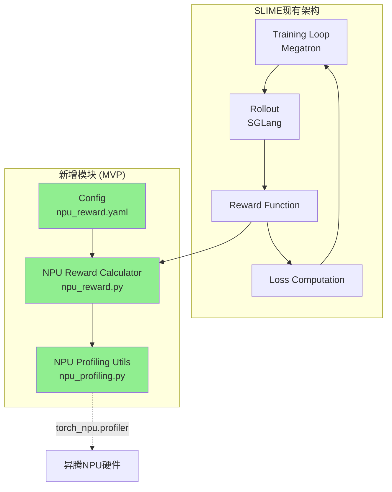
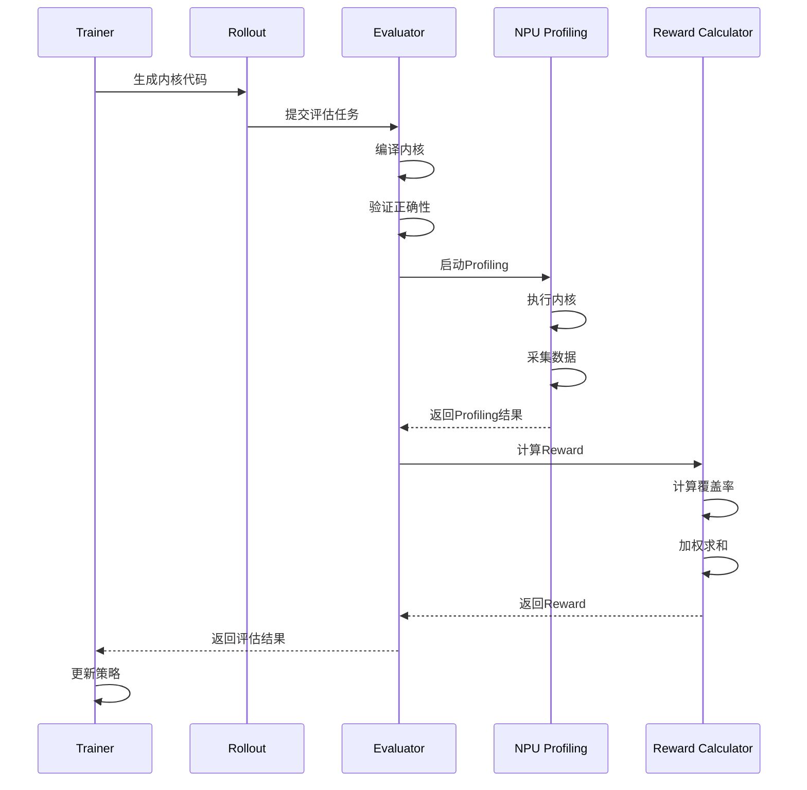
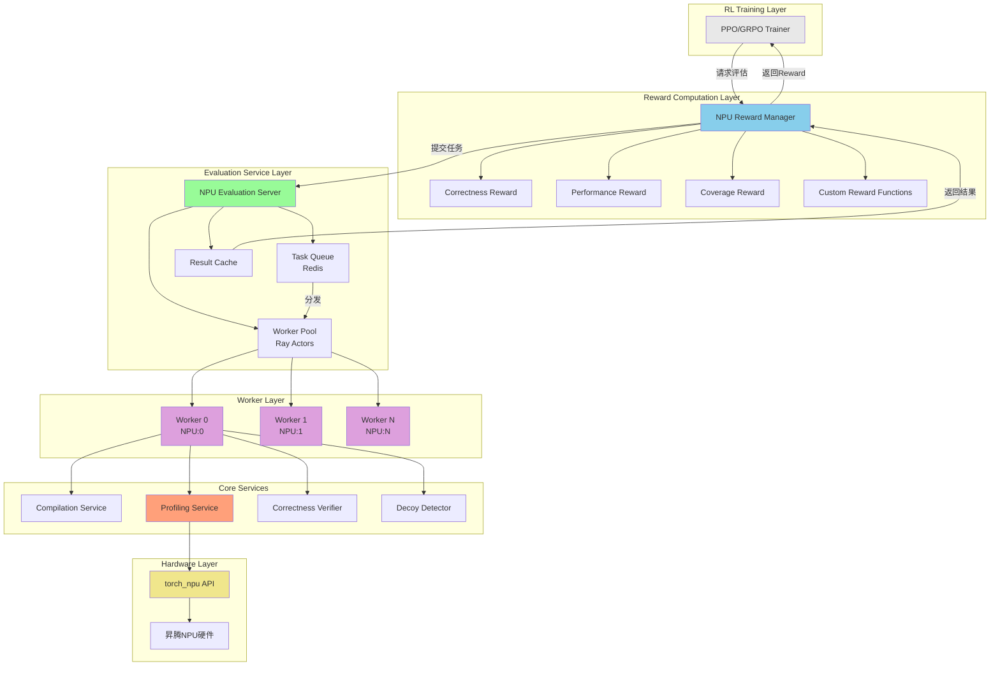
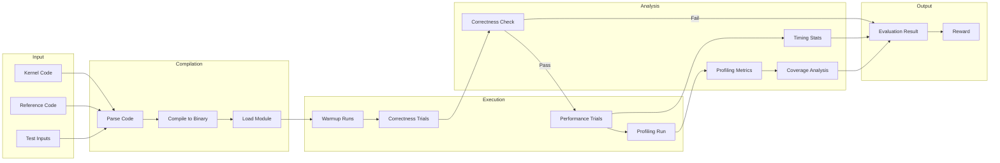
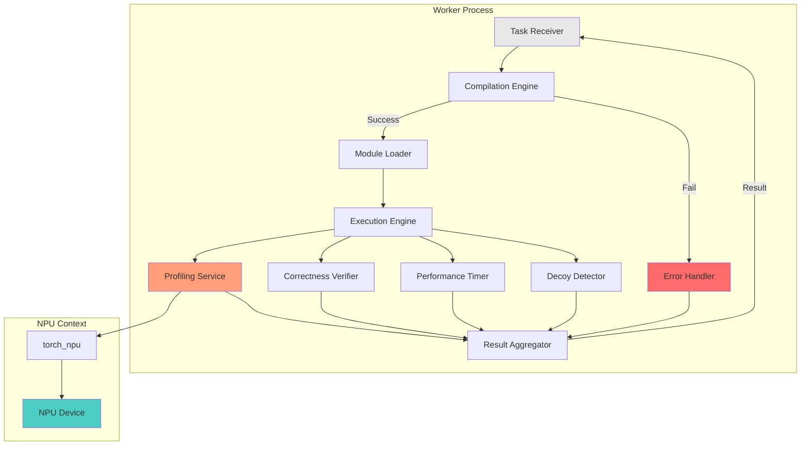
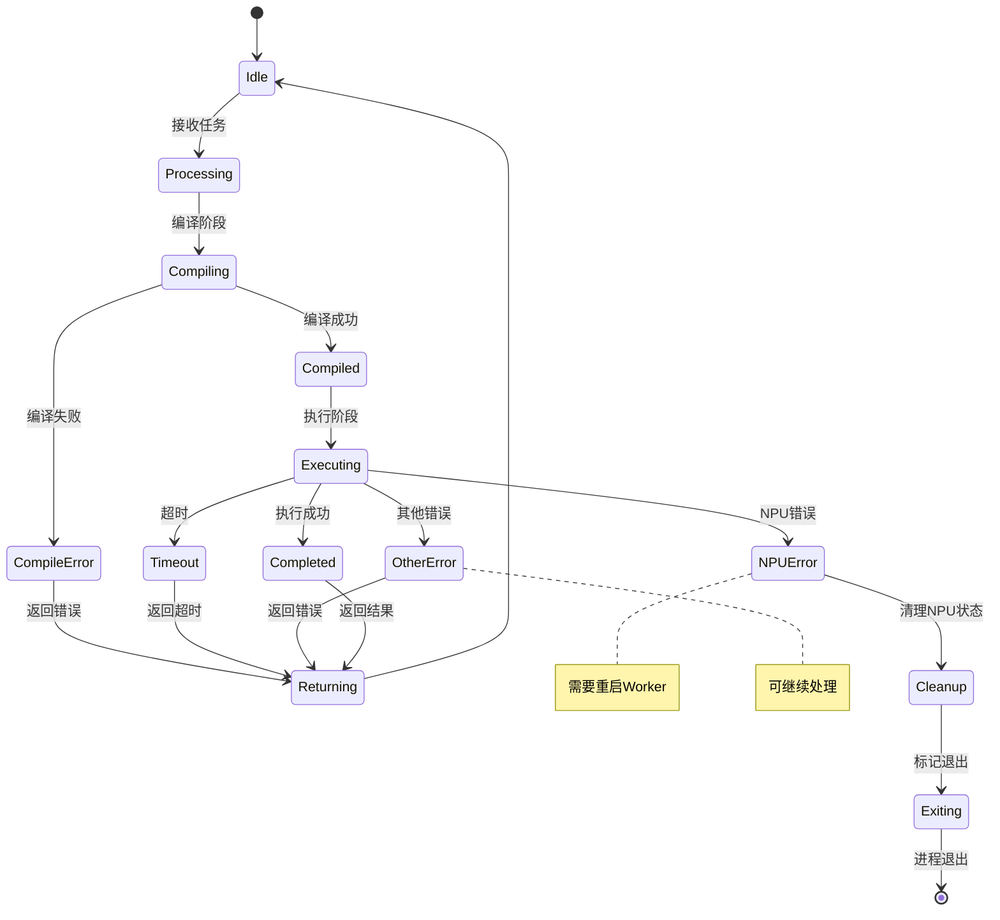
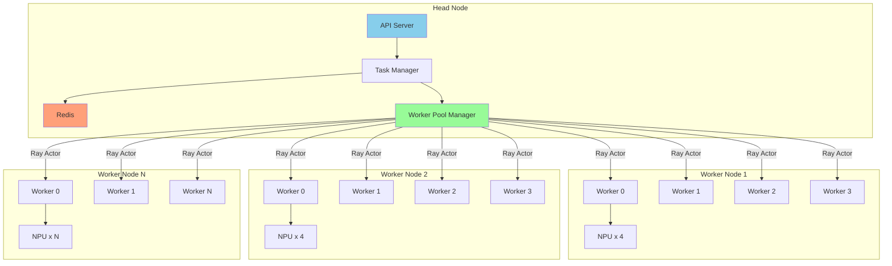

# SLIME框架集成Profiling Reward实现方案

## 目录

1. [方案一：最小可行方案（MVP）](#1-方案一最小可行方案mvp)
2. [方案二：完善方案（类Dr.Kernel架构）](#2-方案二完善方案类drkernel架构)

---

## 1. 方案一：最小可行方案（MVP）

### 1.1 设计目标

- **最小改动**：在现有SLIME框架基础上，仅新增必要的profiling reward功能
- **快速验证**：能够快速验证profiling作为reward的可行性
- **易于集成**：不破坏现有SLIME架构，作为扩展模块添加

### 1.2 核心改动点

```
SLIME框架改动清单（MVP）:
├── 新增文件 (3个)
│   ├── slime/utils/npu_profiling.py      # NPU profiling工具
│   ├── slime/utils/npu_reward.py         # NPU reward计算
│   └── configs/npu_reward.yaml           # 配置文件
│
└── 修改文件 (2个)
    ├── slime/utils/arguments.py          # 添加参数
    └── slime/backends/megatron_utils/loss.py  # 集成reward钩子
```

### 1.3 MVP架构图



### 1.4 MVP模块设计

#### 1.4.1 NPU Profiling Utils

```python
# 文件: slime/utils/npu_profiling.py

"""
最小化NPU Profiling实现
仅实现核心功能：采集内核执行数据、计算覆盖率
"""

from contextlib import contextmanager
from typing import Dict, Any, List, Optional
import torch

@contextmanager
def npu_profiling_context(enabled: bool = True):
    """简单的NPU profiling上下文"""
    if not enabled:
        yield None
        return
    
    try:
        import torch_npu
        from torch_npu import profiler
        
        prof = profiler.profile(
            activities=[profiler.ProfilerActivity.CPU, profiler.ProfilerActivity.NPU],
            record_shapes=True,
            profile_memory=True,
        )
        prof.__enter__()
        try:
            yield prof
        finally:
            prof.__exit__(None, None, None)
    except ImportError:
        yield None


def extract_npu_metrics(prof) -> Dict[str, Any]:
    """提取NPU性能指标"""
    if prof is None:
        return {}
    
    events = prof.key_averages()
    kernels = []
    total_npu_time = 0.0
    
    for evt in events:
        npu_time = getattr(evt, 'device_time_total', 0) or 0
        if npu_time > 0:
            kernels.append({
                'name': getattr(evt, 'key', 'unknown'),
                'npu_time_us': npu_time,
                'cpu_time_us': getattr(evt, 'cpu_time_total', 0) or 0,
            })
            total_npu_time += npu_time
    
    return {
        'kernels': kernels,
        'total_npu_time_us': total_npu_time,
        'kernel_count': len(kernels),
    }


def compute_coverage(
    profiling_result: Dict[str, Any],
    custom_kernel_names: List[str]
) -> Dict[str, float]:
    """计算自定义内核覆盖率"""
    kernels = profiling_result.get('kernels', [])
    total_time = profiling_result.get('total_npu_time_us', 0)
    
    if not kernels or total_time == 0:
        return {'time_coverage': 0.0, 'number_coverage': 0.0}
    
    # 匹配自定义内核
    custom_time = 0.0
    custom_count = 0
    
    for kernel in kernels:
        name = kernel['name'].lower()
        # 简单匹配：检查内核名是否包含自定义标识
        for custom_name in custom_kernel_names:
            if custom_name.lower() in name:
                custom_time += kernel['npu_time_us']
                custom_count += 1
                break
    
    return {
        'time_coverage': custom_time / total_time if total_time > 0 else 0.0,
        'number_coverage': custom_count / len(kernels) if kernels else 0.0,
        'custom_kernel_time_us': custom_time,
        'custom_kernel_count': custom_count,
    }
```

#### 1.4.2 NPU Reward Calculator

```python
# 文件: slime/utils/npu_reward.py

"""
NPU Reward计算器
整合正确性、性能、覆盖率奖励
"""

from dataclasses import dataclass
from typing import Dict, Any, List, Optional
from .npu_profiling import compute_coverage


@dataclass
class NPURewardConfig:
    """奖励配置"""
    correctness_weight: float = 0.5
    performance_weight: float = 0.3
    coverage_weight: float = 0.2
    coverage_type: str = 'time_coverage'  # or 'number_coverage'
    
    # 惩罚值
    compilation_fail_penalty: float = -0.5
    correctness_fail_penalty: float = -0.3
    perf_degrade_penalty: float = -0.1
    
    # 加速比阈值
    speedup_thresholds: Dict[float, float] = None
    
    def __post_init__(self):
        if self.speedup_thresholds is None:
            self.speedup_thresholds = {
                3.0: 1.0,
                2.0: 0.8,
                1.5: 0.6,
                1.2: 0.4,
                1.0: 0.2,
            }


class NPURewardCalculator:
    """NPU奖励计算器"""
    
    def __init__(self, config: NPURewardConfig = None):
        self.config = config or NPURewardConfig()
    
    def compute_reward(
        self,
        compiled: bool,
        correctness: bool,
        speedup: float,
        profiling_result: Dict[str, Any] = None,
        custom_kernel_names: List[str] = None,
    ) -> Dict[str, Any]:
        """
        计算综合奖励
        
        Returns:
            包含reward和详细分量的字典
        """
        # 编译失败
        if not compiled:
            return {
                'reward': self.config.compilation_fail_penalty,
                'correctness_reward': 0.0,
                'performance_reward': 0.0,
                'coverage_reward': 0.0,
                'compiled': False,
                'correctness': False,
            }
        
        # 正确性失败
        if not correctness:
            return {
                'reward': self.config.correctness_fail_penalty,
                'correctness_reward': 0.0,
                'performance_reward': 0.0,
                'coverage_reward': 0.0,
                'compiled': True,
                'correctness': False,
            }
        
        # 计算各分量
        correctness_reward = self.config.correctness_weight
        
        # 性能奖励
        performance_reward = self._compute_performance_reward(speedup)
        
        # 覆盖率奖励
        coverage_reward = 0.0
        coverage = 0.0
        if profiling_result and custom_kernel_names:
            coverage_result = compute_coverage(profiling_result, custom_kernel_names)
            coverage = coverage_result.get(self.config.coverage_type, 0.0)
            coverage_reward = self.config.coverage_weight * coverage
        
        # 总奖励
        total_reward = correctness_reward + performance_reward + coverage_reward
        
        return {
            'reward': total_reward,
            'correctness_reward': correctness_reward,
            'performance_reward': performance_reward,
            'coverage_reward': coverage_reward,
            'coverage': coverage,
            'compiled': True,
            'correctness': True,
            'speedup': speedup,
        }
    
    def _compute_performance_reward(self, speedup: float) -> float:
        """根据加速比计算性能奖励"""
        for threshold, reward in sorted(
            self.config.speedup_thresholds.items(), 
            reverse=True
        ):
            if speedup >= threshold:
                return self.config.performance_weight * reward
        
        return self.config.perf_degrade_penalty
```

#### 1.4.3 配置文件

```yaml
# 文件: configs/npu_reward.yaml

npu_reward:
  # 权重配置
  correctness_weight: 0.5
  performance_weight: 0.3
  coverage_weight: 0.2
  
  # 覆盖率类型: time_coverage | number_coverage
  coverage_type: time_coverage
  
  # 惩罚值
  penalties:
    compilation_fail: -0.5
    correctness_fail: -0.3
    perf_degrade: -0.1
  
  # 加速比阈值映射
  speedup_thresholds:
    3.0: 1.0
    2.0: 0.8
    1.5: 0.6
    1.2: 0.4
    1.0: 0.2
  
  # Profiling配置
  profiling:
    enabled: true
    activities: [CPU, NPU]
    record_shapes: true
    profile_memory: true
```

#### 1.4.4 参数扩展

```python
# 文件: slime/utils/arguments.py (修改)

def add_npu_reward_args(parser):
    """添加NPU reward参数"""
    group = parser.add_argument_group('NPU Reward')
    
    group.add_argument('--enable-npu-profiling', action='store_true', default=False,
                       help='Enable NPU profiling for reward computation')
    
    group.add_argument('--npu-correctness-weight', type=float, default=0.5,
                       help='Weight for correctness reward')
    
    group.add_argument('--npu-performance-weight', type=float, default=0.3,
                       help='Weight for performance reward')
    
    group.add_argument('--npu-coverage-weight', type=float, default=0.2,
                       help='Weight for coverage reward')
    
    group.add_argument('--npu-coverage-type', type=str, default='time_coverage',
                       choices=['time_coverage', 'number_coverage'],
                       help='Type of coverage metric')
    
    return parser
```

### 1.5 MVP使用示例

```python
from slime.utils.npu_profiling import npu_profiling_context, extract_npu_metrics
from slime.utils.npu_reward import NPURewardCalculator, NPURewardConfig

# 1. 初始化
config = NPURewardConfig(
    correctness_weight=0.5,
    performance_weight=0.3,
    coverage_weight=0.2,
)
calculator = NPURewardCalculator(config)

# 2. 执行内核并采集profiling
with npu_profiling_context(enabled=True) as prof:
    output = model(input_data)
    torch.npu.synchronize()

# 3. 提取指标
profiling_result = extract_npu_metrics(prof)

# 4. 计算奖励
result = calculator.compute_reward(
    compiled=True,
    correctness=True,
    speedup=2.5,
    profiling_result=profiling_result,
    custom_kernel_names=['custom_op', 'fused_kernel'],
)

print(f"Total Reward: {result['reward']}")
print(f"Coverage: {result['coverage']}")
```

### 1.6 MVP集成到训练流程



---

## 2. 方案二：完善方案（类Dr.Kernel架构）

### 2.1 设计目标

- **完整功能**：实现Dr.Kernel级别的完整profiling reward系统
- **分布式支持**：支持多NPU分布式评估
- **错误隔离**：子进程隔离，NPU错误自动恢复
- **高性能**：异步任务处理，高吞吐量

### 2.2 完善方案架构图



### 2.3 完善方案详细架构

```mermaid
flowchart TB
    subgraph "Client Side"
        A[RL Trainer<br/>PPO/GRPO]
        A1[Rollout Generator]
        A2[Reward Client]
    end
    
    subgraph "API Gateway"
        B[FastAPI Server]
        B1[/evaluate]
        B2[/evaluate/batch]
        B3[/status/:id]
        B4[/results/:id]
        B --> B1
        B --> B2
        B --> B3
        B --> B4
    end
    
    subgraph "Task Management"
        C[Task Manager]
        C1[Redis Queue<br/>Priority Queue]
        C2[Task Scheduler]
        C3[Result Store]
    end
    
    subgraph "Worker Pool"
        D[Worker Pool Manager]
        D1[Worker Process 0]
        D2[Worker Process 1]
        D3[Worker Process N]
        
        subgraph "Worker Internal"
            E1[Compilation Engine]
            E2[NPU Profiler]
            E3[Correctness Checker]
            E4[Performance Timer]
            E5[Decoy Detector]
        end
    end
    
    subgraph "NPU Hardware"
        F0[NPU:0]
        F1[NPU:1]
        Fn[NPU:N]
    end
    
    A --> A1
    A1 --> A2
    A2 -->|HTTP| B
    
    B --> C
    C --> C1
    C1 --> C2
    C2 --> D
    
    D --> D1
    D --> D2
    D --> D3
    
    D1 --> E1
    D1 --> E2
    D1 --> E3
    D1 --> E4
    D1 --> E5
    
    E2 --> F0
    D2 --> F1
    D3 --> Fn
    
    C3 -->|结果| B
    B -->|响应| A2
    A2 --> A
    
    style A fill:#E8E8E8
    style B fill:#87CEEB
    style C fill:#98FB98
    style D fill:#DDA0DD
    style E2 fill:#FFA07A
```

### 2.4 核心模块设计

#### 2.4.1 模块清单

| 模块 | 文件路径 | 功能 |
|------|----------|------|
| **NPU Reward Client** | `npu_reward/client.py` | 客户端SDK，与评估服务通信 |
| **NPU Reward Server** | `npu_reward/server.py` | FastAPI服务，任务调度 |
| **NPU Task Manager** | `npu_reward/task_manager.py` | Redis任务队列管理 |
| **NPU Worker Pool** | `npu_reward/worker_pool.py` | 分布式Worker管理 |
| **NPU Worker** | `npu_reward/worker.py` | 单Worker评估逻辑 |
| **NPU Profiling Service** | `npu_reward/profiling.py` | Profiling采集服务 |
| **NPU Compilation Service** | `npu_reward/compilation.py` | 内核编译服务 |
| **NPU Correctness Verifier** | `npu_reward/correctness.py` | 正确性验证 |
| **NPU Reward Calculator** | `npu_reward/reward.py` | 奖励计算 |
| **NPU Error Handler** | `npu_reward/error_handler.py` | 错误处理与恢复 |

#### 2.4.2 目录结构

```
npu_reward/
├── __init__.py
├── client.py                 # 客户端SDK
├── server.py                 # FastAPI服务
├── task_manager.py           # 任务管理
├── worker_pool.py            # Worker池管理
├── worker.py                 # Worker实现
├── profiling.py              # Profiling服务
├── compilation.py            # 编译服务
├── correctness.py            # 正确性验证
├── reward.py                 # 奖励计算
├── error_handler.py          # 错误处理
├── models/
│   ├── __init__.py
│   ├── task.py               # 任务数据模型
│   ├── result.py             # 结果数据模型
│   └── config.py             # 配置模型
├── utils/
│   ├── __init__.py
│   ├── npu_utils.py          # NPU工具函数
│   ├── coverage.py           # 覆盖率计算
│   └── decoy_detector.py     # 诱饵内核检测
└── configs/
    ├── default.yaml          # 默认配置
    ├── profiling.yaml        # Profiling配置
    └── reward.yaml           # 奖励配置
```

### 2.5 数据流架构



### 2.6 Worker内部架构



### 2.7 错误隔离机制



### 2.8 Reward计算流程

```mermaid
flowchart TB
    A[Evaluation Result] --> B{Compiled?}
    B -->|No| C[Compilation Fail Penalty]
    B -->|Yes| D{Correctness?}
    D -->|No| E[Correctness Fail Penalty]
    D -->|Yes| F[Compute Base Reward]
    
    F --> G[Correctness Reward<br/>w_c * 1.0]
    F --> H[Performance Reward<br/>w_p * f(speedup)]
    F --> I[Coverage Reward<br/>w_v * coverage]
    
    G --> J[Total Reward]
    H --> J
    I --> J
    
    subgraph "Coverage Computation"
        K[Profiling Result] --> L[Extract Kernels]
        L --> M[Match Custom Kernels]
        M --> N[Compute Time Coverage]
        M --> O[Compute Number Coverage]
        N --> P[Select Coverage Type]
        O --> P
    end
    
    I --> K
    
    style J fill:#90EE90
    style C fill:#FF6B6B
    style E fill:#FF6B6B
```

### 2.9 分布式部署架构



### 2.10 完善方案接口定义

#### 2.10.1 客户端接口

```python
# npu_reward/client.py

class NPURewardClient:
    """NPU Reward客户端"""
    
    def __init__(self, server_url: str, config: Dict = None):
        self.server_url = server_url
        self.config = config or {}
    
    async def evaluate(
        self,
        reference_code: str,
        kernel_code: str,
        entry_point: str,
        **kwargs
    ) -> EvaluationResult:
        """单任务评估"""
        pass
    
    async def evaluate_batch(
        self,
        tasks: List[EvaluationTask],
        **kwargs
    ) -> List[EvaluationResult]:
        """批量评估"""
        pass
    
    async def compute_reward(
        self,
        result: EvaluationResult
    ) -> RewardResult:
        """计算奖励"""
        pass
```

#### 2.10.2 服务端接口

```python
# npu_reward/server.py

from fastapi import FastAPI

app = FastAPI()

@app.post("/evaluate")
async def evaluate(request: EvaluationRequest) -> EvaluationResponse:
    """同步评估"""
    pass

@app.post("/evaluate/async")
async def evaluate_async(request: EvaluationRequest) -> TaskSubmitResponse:
    """异步评估提交"""
    pass

@app.get("/status/{task_id}")
async def get_status(task_id: str) -> TaskStatusResponse:
    """查询任务状态"""
    pass

@app.get("/results/{task_id}")
async def get_results(task_id: str) -> EvaluationResponse:
    """获取评估结果"""
    pass

@app.post("/evaluate/batch")
async def evaluate_batch(request: BatchEvaluationRequest) -> BatchEvaluationResponse:
    """批量评估"""
    pass
```

#### 2.10.3 Worker接口

```python
# npu_reward/worker.py

class NPUWorker:
    """NPU评估Worker"""
    
    def __init__(self, device_id: int, config: WorkerConfig):
        self.device_id = device_id
        self.config = config
        self._init_npu_context()
    
    def evaluate(self, task: EvaluationTask) -> EvaluationResult:
        """执行评估任务"""
        try:
            # 1. 编译
            compile_result = self._compile(task.kernel_code)
            if not compile_result.success:
                return self._create_error_result("compilation_failed")
            
            # 2. 加载
            module = self._load(compile_result.artifact)
            
            # 3. 正确性验证
            correctness = self._verify_correctness(module, task)
            if not correctness.passed:
                return self._create_error_result("correctness_failed")
            
            # 4. 性能测量
            timing = self._measure_performance(module, task)
            
            # 5. Profiling
            profiling = self._profile(module, task)
            
            # 6. 覆盖率计算
            coverage = self._compute_coverage(profiling, task.custom_kernel_names)
            
            return EvaluationResult(
                compiled=True,
                correctness=True,
                speedup=timing.speedup,
                profiling=profiling,
                coverage=coverage,
            )
            
        except NPUError as e:
            # NPU错误需要重启Worker
            self._mark_exiting()
            raise
        except Exception as e:
            return self._create_error_result(str(e))
```

### 2.11 配置示例

```yaml
# npu_reward/configs/default.yaml

server:
  host: "0.0.0.0"
  port: 10907
  workers: 4

redis:
  host: "localhost"
  port: 6379
  db: 0

worker_pool:
  num_workers: 8
  devices: [0, 1, 2, 3, 4, 5, 6, 7]
  max_tasks_per_worker: 100
  restart_on_error: true

evaluation:
  compilation:
    timeout: 60
    backend: "torch_npu"
  
  correctness:
    num_trials: 5
    rtol: 1e-3
    atol: 1e-3
  
  performance:
    num_warmup: 3
    num_trials: 100
  
  profiling:
    enabled: true
    activities: [CPU, NPU]
    record_shapes: true
    profile_memory: true
    ai_core_metrics: [MAC_FP16, MEMORY_BANDWIDTH]

reward:
  correctness_weight: 0.5
  performance_weight: 0.3
  coverage_weight: 0.2
  coverage_type: "time_coverage"
  
  penalties:
    compilation_fail: -0.5
    correctness_fail: -0.3
    perf_degrade: -0.1
    decoy_kernel: -1.0
  
  speedup_thresholds:
    3.0: 1.0
    2.0: 0.8
    1.5: 0.6
    1.2: 0.4
    1.0: 0.2
```

---

## 3. 方案对比

| 维度 | MVP方案 | 完善方案 |
|------|---------|----------|
| **开发周期** | 1-2周 | 4-6周 |
| **代码量** | ~500行 | ~5000行 |
| **功能完整度** | 基础功能 | 完整功能 |
| **分布式支持** | 无 | 完整支持 |
| **错误隔离** | 无 | 子进程隔离 |
| **性能** | 同步处理 | 异步高吞吐 |
| **适用场景** | 快速验证 | 生产环境 |

---

## 4. 实施建议

### 4.1 推荐路径

```
Phase 1 (Week 1-2): MVP实现
├── 实现npu_profiling.py
├── 实现npu_reward.py
├── 添加配置支持
└── 集成到SLIME训练流程

Phase 2 (Week 3-4): 功能增强
├── 添加诱饵内核检测
├── 优化覆盖率计算
├── 添加更多奖励函数
└── 性能优化

Phase 3 (Week 5-6): 分布式支持
├── 实现Worker Pool
├── 实现Task Queue
├── 实现API Server
└── 错误隔离机制
```

### 4.2 技术选型建议

| 组件 | MVP方案 | 完善方案 |
|------|---------|----------|
| **Profiling** | torch_npu.profiler | torch_npu.profiler + 自定义计数器 |
| **任务队列** | 无 | Redis |
| **Worker管理** | 无 | Ray Actors |
| **API框架** | 无 | FastAPI |
| **错误处理** | 简单try-catch | 分类+恢复策略 |
