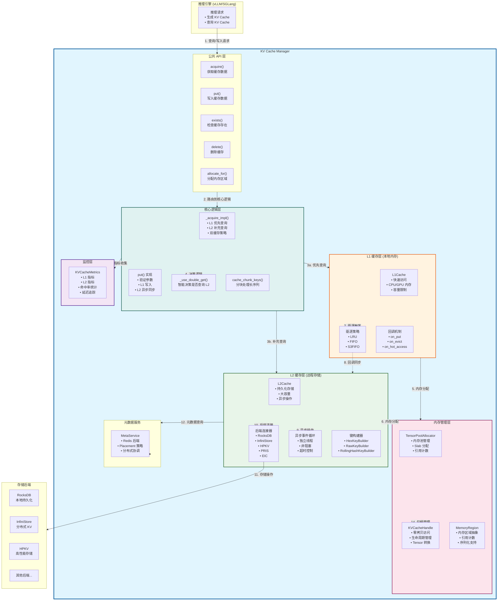
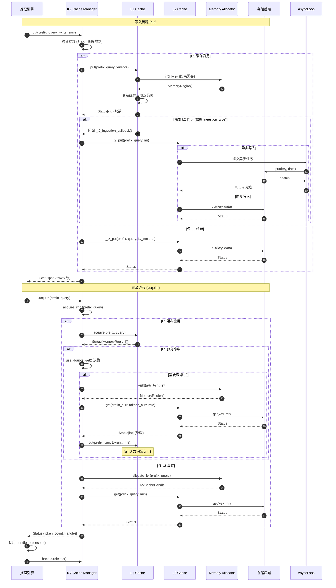
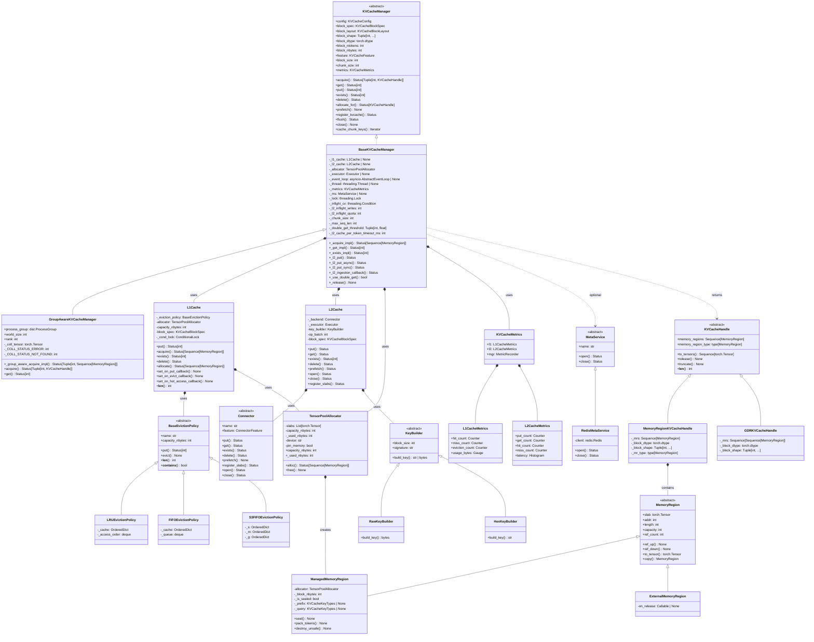
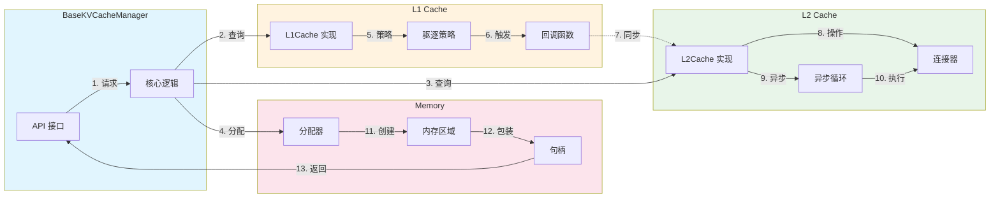
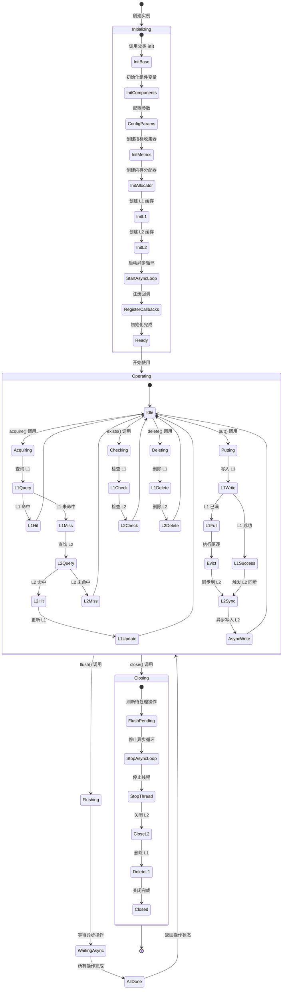
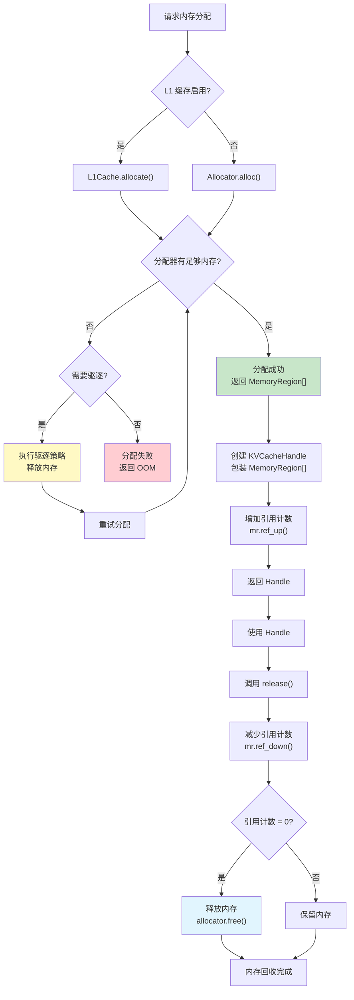
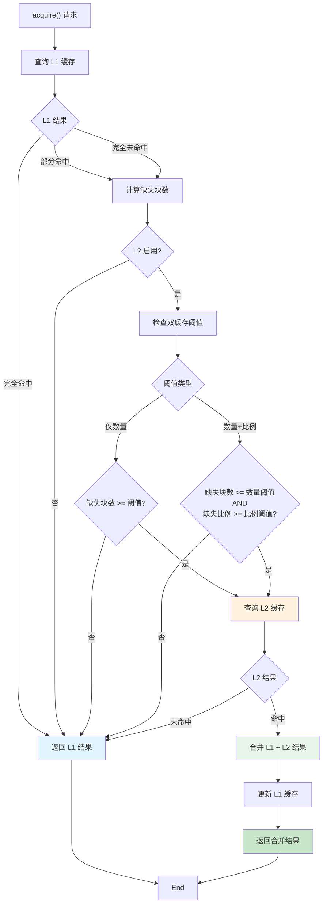
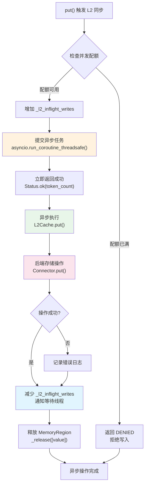

# KV Cache Manager 架构图和类图

## 1. 整体架构图

---

## 2. 数据流图

---

## 3. 类图

---

## 4. 组件交互图

---

## 5. 状态转换图

---

## 6. 内存管理流程图

---

## 7. 双缓存查询决策流程图

---

## 8. L2 异步写入流程图

---

这些图表全面展示了 KV Cache Manager 的架构、类关系、数据流、状态转换和关键流程。

