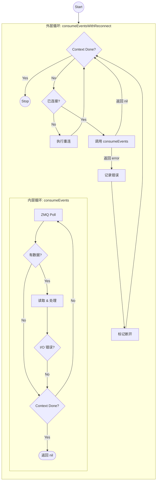
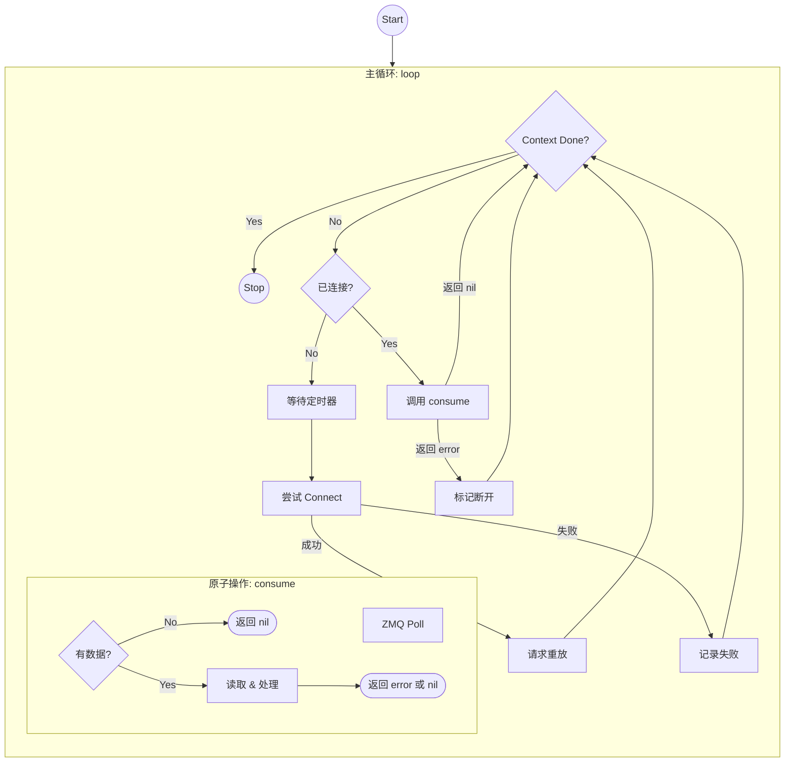

# 单循环 vs 嵌套循环执行流深度对比

本文档通过 Mermaid 流程图，直观对比 `StaticZMQClient.loop` (静态版) 和 `ZMQClient.consumeEventsWithReconnect` (原版) 的执行逻辑，揭示为何单循环结构更具优势。

---

## 1. 原版：嵌套循环 (Nested Loops)

原版结构是典型的 **"责任分层，各自为政"**。外层管连接，内层管数据。

### 🔴 为什么不合适 (Anti-Patterns)

1.  **控制权黑洞**：一旦进入 `InnerLoop`，外层循环就失去了控制权。假设你想在外层加一个逻辑：“每 5 分钟强制检查一次 Token 是否过期”，你做不到，因为程序困在内层出不来。
2.  **逻辑重复**：`InnerCtx` 和 `CheckCtx` 其实是重复的退出检查。代码里到处都要写 `select { case <-ctx.Done(): ... }`。
3.  **僵死风险**：如果 Socket 没断，但一直没数据（`HasData` 为 No），内层循环就在 `Poll` -> `InnerCtx` -> `Poll` 之间死循环。外层完全不知道里面发生了什么。

---

## 2. 静态版：单一主循环 (Single Main Loop)

静态版采用 **"状态机 + 原子操作"** 模式。主循环是唯一的大脑，`consume` 只是一个听话的手脚。

### 🟢 为什么更合适 (Best Practices)

1.  **控制权回收**：无论 `consume` 是否读到数据，它都会立即返回。主循环 `MainLoop` 每执行一次原子操作，都会重新拿回控制权。
2.  **扩展性强**：如果你想加一个“心跳检测”或者“强制重连”，直接在 `MainLoop` 的开头加几行代码即可，不需要深入修改 I/O 逻辑。
3.  **逻辑线性化**：代码读起来就是一条直线：检查状态 -> 执行动作 -> 循环。没有深层嵌套，大脑负担小。
4.  **统一退出点**：只有 `CheckStop` 这一处负责检查退出信号，代码更干净。

---

## 3. 总结

*   **原版 (两层 For)**：适合逻辑极其复杂、内层需要独立维护复杂状态（如滑动窗口、事务事务）的场景。但在简单的消息消费场景下，显臃肿。
*   **静态版 (一层 For)**：适合**事件驱动**或**状态驱动**的系统。它将“做什么”（I/O）和“什么时候做”（调度）完美分离，是编写长运行后台任务（Daemon）的标准范式。

