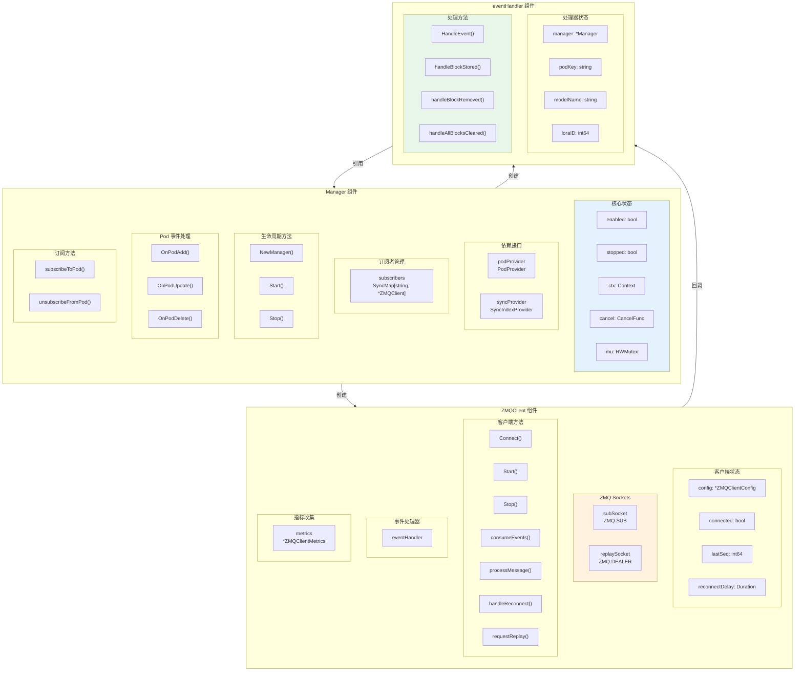
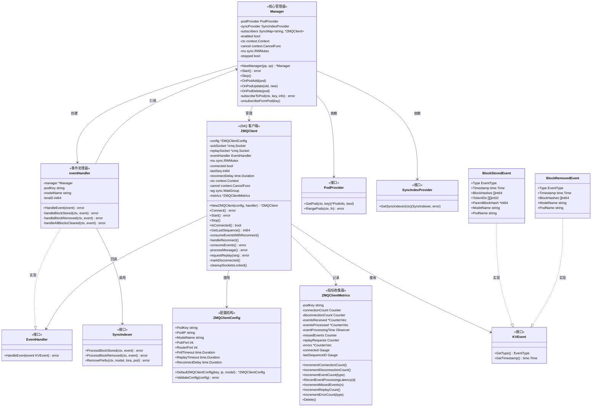
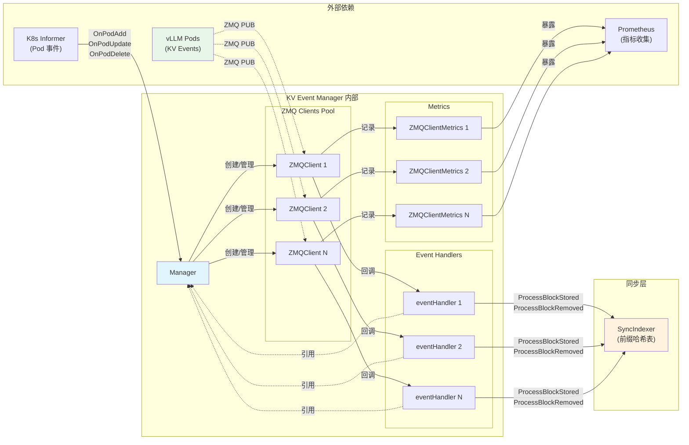

# KV Event Manager 功能分析

## 📋 功能概览

KV Event Manager 共有 **10 个核心功能**，每个功能由一个或多个函数实现：

| 功能编号 | 功能名称 | 对应函数数量 | 所在文件 |
|----------|----------|--------------|----------|
| 1 | 生命周期管理 | 3 | `manager.go` |
| 2 | Pod 事件监听 | 3 | `manager.go` |
| 3 | 订阅管理 | 2 | `manager.go` |
| 4 | 事件处理 | 4 | `handler.go` |
| 5 | ZMQ 通信 | 5 | `zmq_client.go` |
| 6 | 自动重连 | 2 | `zmq_client.go` |
| 7 | 事件重放 | 1 | `zmq_client.go` |
| 8 | 配置与验证 | 4 | `manager.go`, `types.go` |
| 9 | 数据编解码 | 4 | `handler.go`, `msgpack_decoder.go` |
| 10 | 指标收集 | 10+ | `metrics.go` |

---

## 功能 1：生命周期管理

**描述**：管理 KV Event Manager 的创建、启动和停止。

### 函数列表

| 函数名 | 签名 | 作用 |
|--------|------|------|
| `NewManager` | `func NewManager(podProvider PodProvider, syncProvider SyncIndexProvider) *Manager` | 构造函数，创建 Manager 实例 |
| `Start` | `func (m *Manager) Start() error` | 启动 Manager，初始化连接 |
| `Stop` | `func (m *Manager) Stop()` | 停止 Manager，释放资源 |

### 函数详解

#### 1.1 `NewManager()` - 构造函数

```go
func NewManager(podProvider PodProvider, syncProvider SyncIndexProvider) *Manager {
    ctx, cancel := context.WithCancel(context.Background())
    enabled := validateConfiguration()

    return &Manager{
        podProvider:  podProvider,    // Pod 信息提供者
        syncProvider: syncProvider,   // Sync Indexer 提供者
        enabled:      enabled,        // 功能启用状态
        ctx:          ctx,            // 生命周期上下文
        cancel:       cancel,         // 取消函数
    }
}
```

**作用**：
- 创建可取消的上下文用于生命周期控制
- 验证配置决定功能是否启用
- 注入依赖（PodProvider、SyncIndexProvider）
- 返回初始化的 Manager 实例

---

#### 1.2 `Start()` - 启动函数

```go
func (m *Manager) Start() error
```

**作用**：
- 检查功能是否启用
- 等待 Sync Indexer 就绪（30 秒超时，1 秒轮询）
- 遍历现有 Pod，对满足条件的 Pod 建立订阅
- 启动事件消费

**执行流程**：
```
Start() 
  ├── 检查 enabled 标志
  ├── 创建 30s 超时上下文
  ├── 轮询等待 SyncIndexer 就绪
  │     └── 每 1s 调用 GetSyncIndexer()
  ├── 遍历所有 Pod (RangePods)
  │     ├── 检查 canSubscribeToPod()
  │     └── 调用 subscribeToPod()
  └── 返回结果
```

---

#### 1.3 `Stop()` - 停止函数

```go
func (m *Manager) Stop()
```

**作用**：
- 使用双重检查锁确保只执行一次
- 取消上下文通知所有 goroutine 退出
- 遍历所有订阅者调用 `client.Stop()`
- 清理资源

**执行流程**：
```
Stop()
  ├── 加锁检查 stopped 标志
  ├── 设置 stopped = true
  ├── 解锁
  ├── 调用 cancel() 取消上下文
  ├── 遍历 subscribers
  │     └── 调用 client.Stop()
  └── 日志记录
```

---

## 功能 2：Pod 事件监听

**描述**：响应 Kubernetes Pod 的生命周期事件，动态管理订阅。

### 函数列表

| 函数名 | 签名 | 作用 |
|--------|------|------|
| `OnPodAdd` | `func (m *Manager) OnPodAdd(pod *v1.Pod)` | 处理 Pod 添加事件 |
| `OnPodUpdate` | `func (m *Manager) OnPodUpdate(oldPod, newPod *v1.Pod)` | 处理 Pod 更新事件 |
| `OnPodDelete` | `func (m *Manager) OnPodDelete(pod *v1.Pod)` | 处理 Pod 删除事件 |

### 函数详解

#### 2.1 `OnPodAdd()` - Pod 添加处理

```go
func (m *Manager) OnPodAdd(pod *v1.Pod)
```

**作用**：
- 当新 Pod 被创建且满足订阅条件时建立 ZMQ 订阅

**执行流程**：
```
OnPodAdd(pod)
  ├── 检查 enabled && isPodSubscribable(pod)
  ├── 检查 Manager 未停止
  ├── 创建 5s 超时上下文
  ├── 生成 podKey (namespace/name)
  ├── 从 podProvider 获取 PodInfo
  └── 调用 subscribeToPod()
```

**订阅条件** (`isPodSubscribable`):
- `kv-events-enabled` 标签为 `"true"`
- Pod 状态为 `Running`
- Pod 有 IP 地址
- Pod 有模型名称标签

---

#### 2.2 `OnPodUpdate()` - Pod 更新处理

```go
func (m *Manager) OnPodUpdate(oldPod, newPod *v1.Pod)
```

**作用**：
- 当 Pod 状态变化时重新评估订阅

**触发重订阅的条件**：
1. Pod IP 发生变化（`!isSamePod()`）
2. 订阅状态变化（从可订阅→不可订阅，或反之）

**执行流程**：
```
OnPodUpdate(oldPod, newPod)
  ├── 检查 enabled
  ├── 计算 oldSubscribable 和 newSubscribable
  ├── 如果状态变化或 Pod 变化
  │     ├── 如果旧 Pod 可订阅 → unsubscribeFromPod()
  │     └── 如果新 Pod 可订阅 → OnPodAdd(newPod)
  └── 否则无操作
```

---

#### 2.3 `OnPodDelete()` - Pod 删除处理

```go
func (m *Manager) OnPodDelete(pod *v1.Pod)
```

**作用**：
- 取消订阅并清理 Sync Indexer 中该 Pod 的数据

**执行流程**：
```
OnPodDelete(pod)
  ├── 检查 enabled
  ├── 调用 unsubscribeFromPod(podKey)
  ├── 检查 Manager 未停止
  ├── 获取 SyncIndexer
  └── 调用 syncIndexer.RemovePrefix(modelName, loraID, podKey)
```

---

## 功能 3：订阅管理

**描述**：管理与 vLLM Pod 的 ZMQ 订阅连接。

### 函数列表

| 函数名 | 签名 | 作用 |
|--------|------|------|
| `subscribeToPod` | `func (m *Manager) subscribeToPod(ctx context.Context, podKey string, podInfo *PodInfo) error` | 建立订阅 |
| `unsubscribeFromPod` | `func (m *Manager) unsubscribeFromPod(podKey string)` | 取消订阅 |

### 函数详解

#### 3.1 `subscribeToPod()` - 建立订阅

```go
func (m *Manager) subscribeToPod(ctx context.Context, podKey string, podInfo *PodInfo) error
```

**作用**：
- 为指定 Pod 创建 ZMQ 客户端并开始事件消费

**执行流程**：
```
subscribeToPod(ctx, podKey, podInfo)
  ├── 幂等检查：是否已订阅
  ├── 创建 eventHandler
  │     ├── manager 引用
  │     ├── podKey
  │     ├── modelName
  │     └── loraID
  ├── 创建 ZMQClientConfig
  ├── 创建 ZMQClient
  ├── 调用 client.Start()
  ├── 存入 subscribers Map
  └── 日志记录
```

**创建的对象关系**：
```
Manager
  └── subscribers[podKey] = ZMQClient
                              └── eventHandler
                                    └── manager (回引)
```

---

#### 3.2 `unsubscribeFromPod()` - 取消订阅

```go
func (m *Manager) unsubscribeFromPod(podKey string)
```

**作用**：
- 停止指定 Pod 的 ZMQ 客户端并从 Map 中移除

**执行流程**：
```
unsubscribeFromPod(podKey)
  ├── 从 subscribers LoadAndDelete
  ├── 如果存在
  │     └── 调用 client.Stop()
  └── 日志记录
```

---

## 功能 4：事件处理

**描述**：处理从 vLLM 接收的 KV Cache 事件。

### 函数列表

| 函数名 | 签名 | 作用 |
|--------|------|------|
| `HandleEvent` | `func (h *eventHandler) HandleEvent(event kvcache.KVEvent) error` | 事件分发入口 |
| `handleBlockStored` | `func (h *eventHandler) handleBlockStored(ctx context.Context, event *kvcache.BlockStoredEvent) error` | 处理 Block 存储事件 |
| `handleBlockRemoved` | `func (h *eventHandler) handleBlockRemoved(ctx context.Context, event *kvcache.BlockRemovedEvent) error` | 处理 Block 移除事件 |
| `handleAllBlocksCleared` | `func (h *eventHandler) handleAllBlocksCleared(ctx context.Context, event *kvcache.AllBlocksClearedEvent) error` | 处理全部清除事件 |

### 函数详解

#### 4.1 `HandleEvent()` - 事件分发入口

```go
func (h *eventHandler) HandleEvent(event kvcache.KVEvent) error
```

**作用**：
- 事件类型判断和分发

**执行流程**：
```
HandleEvent(event)
  ├── 检查 Manager 停止状态
  ├── 创建 10s 超时上下文
  └── 根据事件类型分发
        ├── BlockStoredEvent → handleBlockStored()
        ├── BlockRemovedEvent → handleBlockRemoved()
        └── AllBlocksClearedEvent → handleAllBlocksCleared()
```

---

#### 4.2 `handleBlockStored()` - Block 存储事件处理

```go
func (h *eventHandler) handleBlockStored(ctx context.Context, event *kvcache.BlockStoredEvent) error
```

**作用**：
- 将 Block 存储事件同步到 Sync Indexer

**执行流程**：
```
handleBlockStored(ctx, event)
  ├── 获取 SyncIndexer（容忍临时错误）
  ├── 构建 syncEvent
  │     ├── BlockHashes
  │     ├── ModelName (从 handler)
  │     ├── LoraID (从 handler)
  │     ├── SourcePod (podKey)
  │     ├── ParentBlockHash
  │     └── Tokens (convertTokenIDs)
  ├── 调用 syncIndexer.ProcessBlockStored()
  └── 日志记录
```

---

#### 4.3 `handleBlockRemoved()` - Block 移除事件处理

```go
func (h *eventHandler) handleBlockRemoved(ctx context.Context, event *kvcache.BlockRemovedEvent) error
```

**作用**：
- 从 Sync Indexer 中移除对应的 Block 记录

**执行流程**：
```
handleBlockRemoved(ctx, event)
  ├── 获取 SyncIndexer
  ├── 构建 syncEvent
  │     ├── BlockHashes
  │     ├── ModelName
  │     ├── LoraID
  │     └── SourcePod
  ├── 调用 syncIndexer.ProcessBlockRemoved()
  └── 日志记录
```

---

#### 4.4 `handleAllBlocksCleared()` - 全部清除事件处理

```go
func (h *eventHandler) handleAllBlocksCleared(ctx context.Context, event *kvcache.AllBlocksClearedEvent) error
```

**作用**：
- 当前为空实现（仅记录日志）
- 注释说明：此事件是 Pod 本地优化，不需要跨 Pod 同步

---

## 功能 5：ZMQ 通信

**描述**：管理与 vLLM Pod 的 ZMQ 连接和消息收发。

### 函数列表

| 函数名 | 签名 | 作用 |
|--------|------|------|
| `NewZMQClient` | `func NewZMQClient(config *ZMQClientConfig, handler EventHandler) *ZMQClient` | 创建客户端 |
| `Connect` | `func (c *ZMQClient) Connect() error` | 建立连接 |
| `Start` | `func (c *ZMQClient) Start() error` | 启动消费 |
| `Stop` | `func (c *ZMQClient) Stop()` | 停止客户端 |
| `processMessage` | `func (c *ZMQClient) processMessage() error` | 处理单条消息 |

### 函数详解

#### 5.1 `NewZMQClient()` - 创建客户端

```go
func NewZMQClient(config *ZMQClientConfig, handler EventHandler) *ZMQClient
```

**作用**：
- 创建 ZMQ 客户端实例，初始化状态

**初始化内容**：
- 配置信息
- 事件处理器引用
- lastSeq = -1（无历史）
- 初始重连延迟
- 可取消上下文
- 指标收集器

---

#### 5.2 `Connect()` - 建立连接

```go
func (c *ZMQClient) Connect() error
```

**作用**：
- 建立 ZMQ SUB 和 DEALER Socket 连接

**执行流程**：
```
Connect()
  ├── 加锁
  ├── 检查已连接则返回
  ├── 清理现有 Socket
  ├── 创建 SUB Socket
  │     ├── SetIpv6(true) 启用双栈
  │     ├── Connect(pod:5557)
  │     └── SetSubscribe("") 订阅全部
  ├── 创建 DEALER Socket
  │     ├── SetIpv6(true)
  │     └── Connect(pod:5558)
  ├── 设置 connected = true
  ├── 重置重连延迟
  └── 更新指标
```

---

#### 5.3 `Start()` - 启动消费

```go
func (c *ZMQClient) Start() error
```

**作用**：
- 启动连接和事件消费 goroutine

**执行流程**：
```
Start()
  ├── 调用 Connect()
  ├── 调用 requestReplay(0) 请求全量重放
  ├── 启动 goroutine: consumeEventsWithReconnect()
  └── 返回
```

---

#### 5.4 `Stop()` - 停止客户端

```go
func (c *ZMQClient) Stop()
```

**作用**：
- 优雅关闭客户端

**执行流程**：
```
Stop()
  ├── 调用 cancel() 取消上下文
  ├── wg.Wait() 等待 goroutine 结束
  ├── 清理 Socket
  └── 删除指标
```

---

#### 5.5 `processMessage()` - 处理单条消息

```go
func (c *ZMQClient) processMessage() error
```

**作用**：
- 接收并处理 ZMQ 消息

**消息格式**：
```
[topic, sequence(8 bytes), payload(MessagePack)]
```

**执行流程**：
```
processMessage()
  ├── RecvBytes(topic)
  ├── RecvBytes(seqBytes)
  ├── RecvBytes(payload)
  ├── 解析序列号 (BigEndian)
  ├── 检测丢失事件
  │     └── if seq > lastSeq + 1 → 记录丢失数
  ├── DecodeEventBatch(payload)
  ├── 遍历事件
  │     ├── 设置 PodName
  │     ├── 调用 eventHandler.HandleEvent()
  │     └── 记录指标
  └── 更新 lastSeq
```

---

## 功能 6：自动重连

**描述**：连接断开时自动重连，使用指数退避策略。

### 函数列表

| 函数名 | 签名 | 作用 |
|--------|------|------|
| `consumeEventsWithReconnect` | `func (c *ZMQClient) consumeEventsWithReconnect()` | 带重连的事件消费主循环 |
| `handleReconnect` | `func (c *ZMQClient) handleReconnect()` | 执行重连逻辑 |

### 函数详解

#### 6.1 `consumeEventsWithReconnect()` - 主循环

```go
func (c *ZMQClient) consumeEventsWithReconnect()
```

**作用**：
- 事件消费主循环，处理连接断开和重连

**执行流程**：
```
consumeEventsWithReconnect() [goroutine]
  └── for {
        ├── 检查 ctx.Done() → 退出
        ├── 检查 IsConnected()
        │     ├── false → handleReconnect()
        │     └── true → consumeEvents()
        └── 如果 consumeEvents 失败
              ├── markDisconnected()
              └── 记录错误指标
      }
```

---

#### 6.2 `handleReconnect()` - 重连处理

```go
func (c *ZMQClient) handleReconnect()
```

**作用**：
- 执行指数退避重连

**退避策略**：
- 初始延迟：1 秒
- 退避因子：2.0
- 最大延迟：30 秒

**执行流程**：
```
handleReconnect()
  ├── 等待 reconnectDelay
  ├── 调用 Connect()
  ├── 如果失败
  │     └── reconnectDelay *= 2 (最大 30s)
  ├── 如果成功
  │     ├── 获取 lastSeq
  │     └── requestReplay(lastSeq + 1)
  └── 返回
```

---

## 功能 7：事件重放

**描述**：请求历史事件重放，用于启动和重连后补齐丢失事件。

### 函数列表

| 函数名 | 签名 | 作用 |
|--------|------|------|
| `requestReplay` | `func (c *ZMQClient) requestReplay(fromSeq int64) error` | 请求事件重放 |

### 函数详解

#### 7.1 `requestReplay()` - 请求重放

```go
func (c *ZMQClient) requestReplay(fromSeq int64) error
```

**作用**：
- 通过 DEALER Socket 请求从指定序列号开始的事件重放

**执行流程**：
```
requestReplay(fromSeq)
  ├── 获取 replaySocket
  ├── 构造请求数据 (8 bytes BigEndian)
  ├── SendBytes(reqData)
  ├── SetRcvtimeo(5s)
  ├── RecvBytes() 接收响应
  ├── 记录指标
  └── 返回
```

**使用场景**：
- 启动时：`requestReplay(0)` 全量重放
- 重连后：`requestReplay(lastSeq + 1)` 增量重放

---

## 功能 8：配置与验证

**描述**：配置管理和 Pod 订阅条件验证。

### 函数列表

| 函数名 | 签名 | 作用 |
|--------|------|------|
| `validateConfiguration` | `func validateConfiguration() bool` | 验证全局配置 |
| `isPodSubscribable` | `func isPodSubscribable(pod *v1.Pod) bool` | 检查 Pod 是否可订阅 |
| `canSubscribeToPod` | `func canSubscribeToPod(podInfo *PodInfo) bool` | 检查 PodInfo 是否可订阅 |
| `DefaultZMQClientConfig` | `func DefaultZMQClientConfig(podKey, podIP, modelName string) *ZMQClientConfig` | 创建默认配置 |

### 函数详解

#### 8.1 `validateConfiguration()` - 全局配置验证

```go
func validateConfiguration() bool
```

**作用**：
- 验证 KV Event Sync 功能是否应该启用

**验证规则**：
```
AIBRIX_PREFIX_CACHE_KV_EVENT_SYNC_ENABLED = true
  AND
AIBRIX_PREFIX_CACHE_USE_REMOTE_TOKENIZER = true
  → enabled = true
```

**原因**：KV Event Sync 依赖远程 Tokenizer 来正确计算前缀哈希。

---

#### 8.2 `isPodSubscribable()` - Pod 订阅条件检查

```go
func isPodSubscribable(pod *v1.Pod) bool
```

**作用**：
- 检查 Kubernetes Pod 对象是否满足订阅条件

**条件**：
```go
return IsKVEventsEnabled(pod.Labels) &&      // kv-events-enabled=true
       pod.Status.Phase == v1.PodRunning &&  // Pod 正在运行
       pod.Status.PodIP != "" &&             // 有 IP 地址
       pod.Labels[ModelLabelName] != ""      // 有模型名称
```

---

#### 8.3 `canSubscribeToPod()` - PodInfo 订阅条件检查

```go
func canSubscribeToPod(podInfo *PodInfo) bool
```

**作用**：
- 检查 PodInfo 结构是否满足订阅条件

**条件**：
```go
return podInfo.Labels[KVEventsEnabledLabel] == "true" &&
       podInfo.PodIP != "" &&
       podInfo.ModelName != ""
```

---

#### 8.4 `DefaultZMQClientConfig()` - 默认配置创建

```go
func DefaultZMQClientConfig(podKey, podIP, modelName string) *ZMQClientConfig
```

**作用**：
- 创建带有默认值的 ZMQ 客户端配置

**默认值**：
| 配置项 | 默认值 |
|--------|--------|
| PubPort | 5557 |
| RouterPort | 5558 |
| PollTimeout | 100ms |
| ReplayTimeout | 5s |
| ReconnectDelay | 1s |

---

## 功能 9：数据编解码

**描述**：处理 Token ID 转换和 MessagePack 消息解码。

### 函数列表

| 函数名 | 签名 | 作用 |
|--------|------|------|
| `convertTokenIDs` | `func convertTokenIDs(tokenIDs [][]int32) [][]byte` | 转换 Token ID 数组 |
| `tokenIDsToBytes` | `func tokenIDsToBytes(tokenIDs []int32) []byte` | 转换单个 Token ID 列表 |
| `DecodeEventBatch` | `func DecodeEventBatch(data []byte) (*EventBatch, error)` | 解码事件批次 |
| `parseEvent` | `func parseEvent(raw interface{}) (KVEvent, error)` | 解析单个事件 |

### 函数详解

#### 9.1 `convertTokenIDs()` - Token ID 数组转换

```go
func convertTokenIDs(tokenIDs [][]int32) [][]byte
```

**作用**：
- 将二维 int32 数组转换为二维 byte 数组

**示例**：
```
输入: [][]int32{{1, 2}, {3, 4}}
输出: [][]byte{
  {0,0,0,1, 0,0,0,2},
  {0,0,0,3, 0,0,0,4}
}
```

---

#### 9.2 `tokenIDsToBytes()` - 单个 Token 列表转换

```go
func tokenIDsToBytes(tokenIDs []int32) []byte
```

**作用**：
- 将 int32 数组转换为 BigEndian 字节数组

**算法**：
```go
bytes := make([]byte, len(tokenIDs)*4)
for i, id := range tokenIDs {
    binary.BigEndian.PutUint32(bytes[i*4:], uint32(id))
}
return bytes
```

---

#### 9.3 `DecodeEventBatch()` - 事件批次解码

```go
func DecodeEventBatch(data []byte) (*EventBatch, error)
```

**作用**：
- 解码 MessagePack 格式的事件批次

**输入格式**：
```json
{
  "events": [
    {"type": "BLOCK_STORED", ...},
    {"type": "BLOCK_REMOVED", ...}
  ]
}
```

---

#### 9.4 `parseEvent()` - 单个事件解析

```go
func parseEvent(raw interface{}) (KVEvent, error)
```

**作用**：
- 根据事件类型解析为具体事件结构

**事件类型映射**：
```go
switch EventType(eventType) {
case EventTypeBlockStored:
    return parseBlockStoredEvent(eventMap)
case EventTypeBlockRemoved:
    return parseBlockRemovedEvent(eventMap)
case EventTypeAllCleared:
    return parseAllBlocksClearedEvent(eventMap)
}
```

---

## 功能 10：指标收集

**描述**：通过 Prometheus 收集运行时指标。

### 函数列表

| 函数名 | 作用 |
|--------|------|
| `NewZMQClientMetrics` | 创建指标收集器 |
| `IncrementConnectionCount` | 增加连接计数 |
| `IncrementDisconnectionCount` | 增加断连计数 |
| `IncrementReconnectAttempts` | 增加重连尝试计数 |
| `IncrementEventCount` | 增加事件计数 |
| `RecordEventProcessingLatency` | 记录处理延迟 |
| `IncrementMissedEvents` | 增加丢失事件计数 |
| `IncrementReplayCount` | 增加重放请求计数 |
| `IncrementErrorCount` | 增加错误计数 |
| `UpdateLastSequenceID` | 更新最后序列号 |
| `Delete` | 删除所有指标 |

### 指标列表

| 指标名称 | 类型 | 标签 | 描述 |
|----------|------|------|------|
| `kvcache_zmq_connections_total` | Counter | pod_key | 连接建立总数 |
| `kvcache_zmq_disconnections_total` | Counter | pod_key | 断连总数 |
| `kvcache_zmq_reconnect_attempts_total` | Counter | pod_key | 重连尝试总数 |
| `kvcache_zmq_events_received_total` | Counter | pod_key, event_type | 接收事件总数 |
| `kvcache_zmq_events_processed_total` | Counter | pod_key, event_type | 处理事件总数 |
| `kvcache_zmq_event_processing_duration_seconds` | Histogram | pod_key | 处理延迟分布 |
| `kvcache_zmq_missed_events_total` | Counter | pod_key | 丢失事件总数 |
| `kvcache_zmq_replay_requests_total` | Counter | pod_key | 重放请求总数 |
| `kvcache_zmq_errors_total` | Counter | pod_key, error_type | 错误总数 |
| `kvcache_zmq_connection_status` | Gauge | pod_key | 连接状态 (0/1) |
| `kvcache_zmq_last_sequence_id` | Gauge | pod_key | 最后序列号 |

---

## 内部组件架构图



---

## 内部组件类图



---

## 组件交互关系图



---

## 功能与函数对照表

| 功能编号 | 功能名称 | 函数名 | 文件 | 行号 |
|----------|----------|--------|------|------|
| 1.1 | 生命周期-构造 | `NewManager` | `manager.go` | 56-69 |
| 1.2 | 生命周期-启动 | `Start` | `manager.go` | 72-131 |
| 1.3 | 生命周期-停止 | `Stop` | `manager.go` | 134-157 |
| 2.1 | Pod事件-添加 | `OnPodAdd` | `manager.go` | 160-189 |
| 2.2 | Pod事件-更新 | `OnPodUpdate` | `manager.go` | 192-213 |
| 2.3 | Pod事件-删除 | `OnPodDelete` | `manager.go` | 216-257 |
| 3.1 | 订阅-建立 | `subscribeToPod` | `manager.go` | 280-310 |
| 3.2 | 订阅-取消 | `unsubscribeFromPod` | `manager.go` | 312-320 |
| 4.1 | 事件-分发 | `HandleEvent` | `handler.go` | 40-67 |
| 4.2 | 事件-存储 | `handleBlockStored` | `handler.go` | 69-100 |
| 4.3 | 事件-移除 | `handleBlockRemoved` | `handler.go` | 102-131 |
| 4.4 | 事件-清除 | `handleAllBlocksCleared` | `handler.go` | 133-140 |
| 5.1 | ZMQ-创建 | `NewZMQClient` | `zmq_client.go` | 58-70 |
| 5.2 | ZMQ-连接 | `Connect` | `zmq_client.go` | 73-140 |
| 5.3 | ZMQ-启动 | `Start` | `zmq_client.go` | 143-160 |
| 5.4 | ZMQ-停止 | `Stop` | `zmq_client.go` | 163-181 |
| 5.5 | ZMQ-处理消息 | `processMessage` | `zmq_client.go` | 295-386 |
| 6.1 | 重连-主循环 | `consumeEventsWithReconnect` | `zmq_client.go` | 198-220 |
| 6.2 | 重连-执行 | `handleReconnect` | `zmq_client.go` | 223-255 |
| 7.1 | 重放-请求 | `requestReplay` | `zmq_client.go` | 389-421 |
| 8.1 | 配置-验证 | `validateConfiguration` | `manager.go` | 322-335 |
| 8.2 | 配置-Pod检查 | `isPodSubscribable` | `manager.go` | 268-273 |
| 8.3 | 配置-Info检查 | `canSubscribeToPod` | `manager.go` | 261-265 |
| 8.4 | 配置-默认值 | `DefaultZMQClientConfig` | `types.go` | 58-69 |
| 9.1 | 编解码-Token数组 | `convertTokenIDs` | `handler.go` | 143-149 |
| 9.2 | 编解码-Token字节 | `tokenIDsToBytes` | `handler.go` | 152-158 |
| 9.3 | 编解码-批次 | `DecodeEventBatch` | `msgpack_decoder.go` | 25-50 |
| 9.4 | 编解码-单事件 | `parseEvent` | `msgpack_decoder.go` | 53-89 |
| 10.x | 指标-各方法 | `Increment*`, `Record*` | `metrics.go` | 302-425 |

