# KV Event Manager 架构图和类图

## 1. 整体架构图

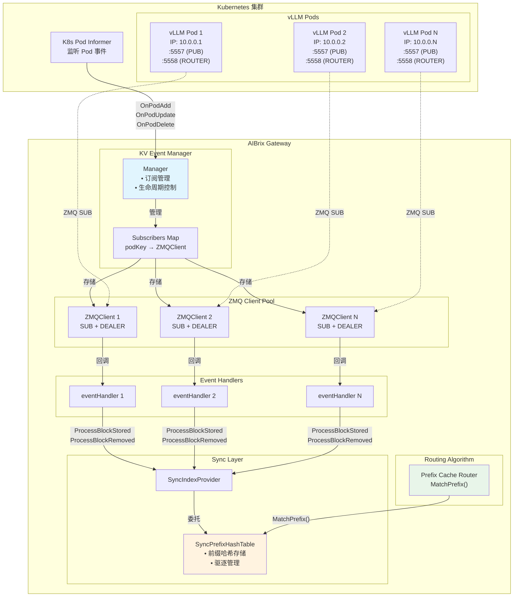

---

## 2. 数据流图

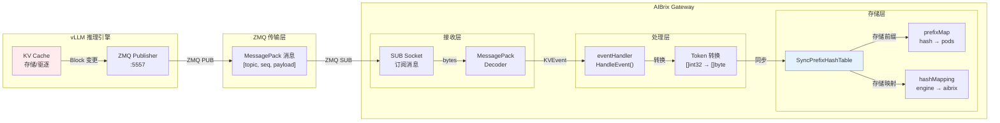

---

## 3. 类图

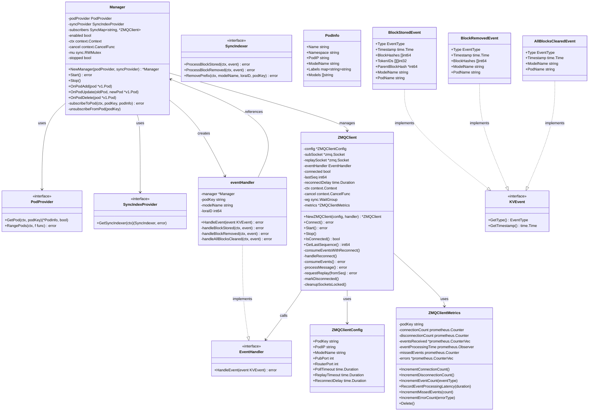

---

## 4. 组件交互时序图

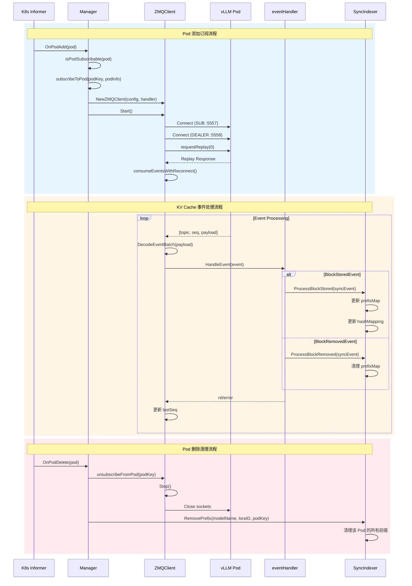

---

## 5. ZMQ 连接状态机

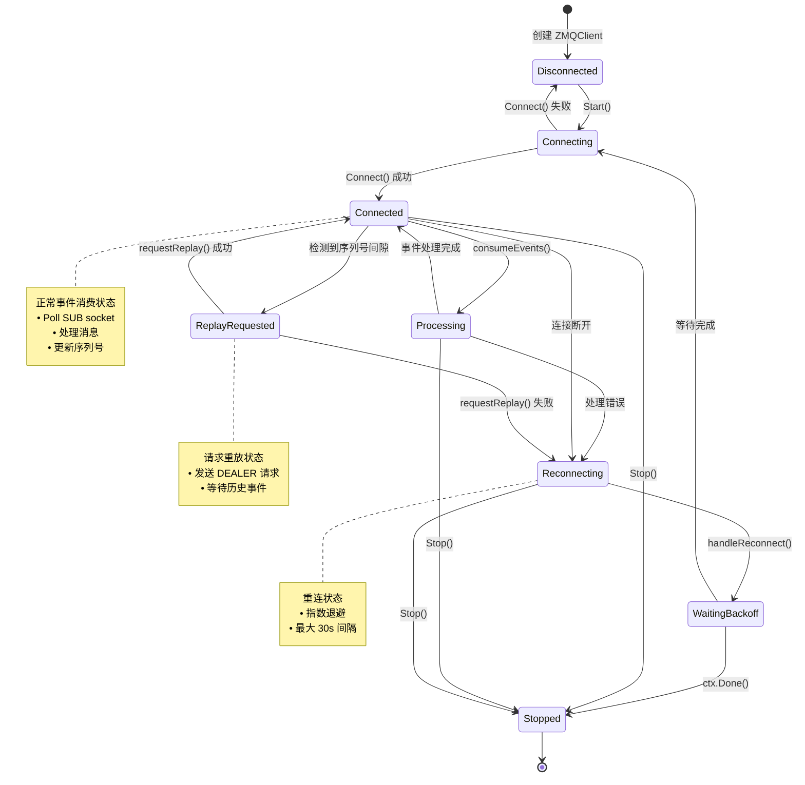

---

## 6. 事件处理流程图

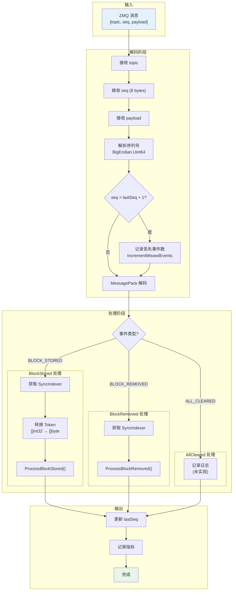

---

## 7. SyncPrefixHashTable 数据结构

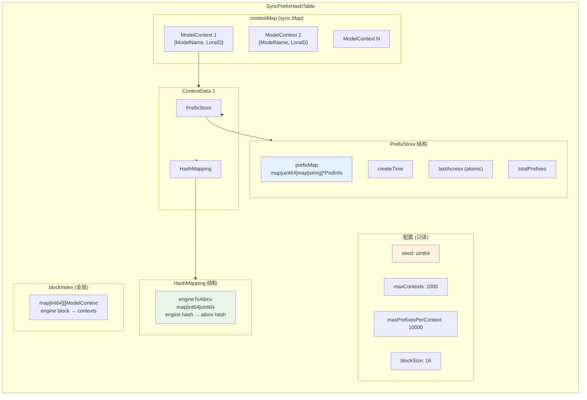

---

## 8. 前缀匹配流程

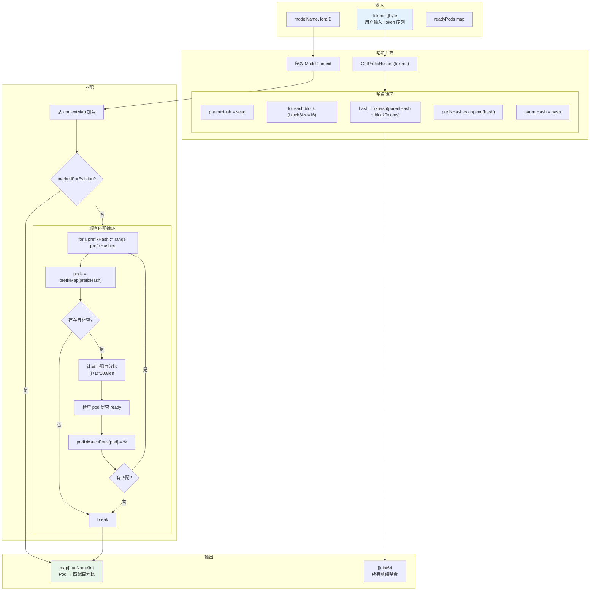

---

## 9. 重连与重放机制

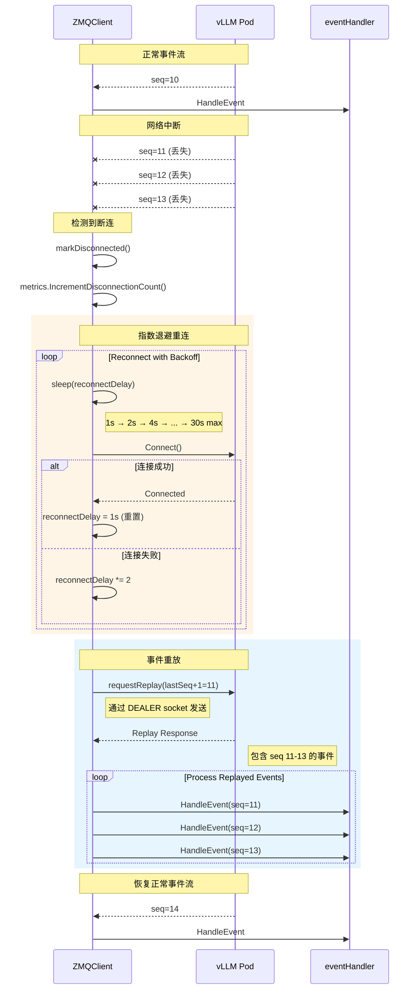

---

## 10. 指标监控架构

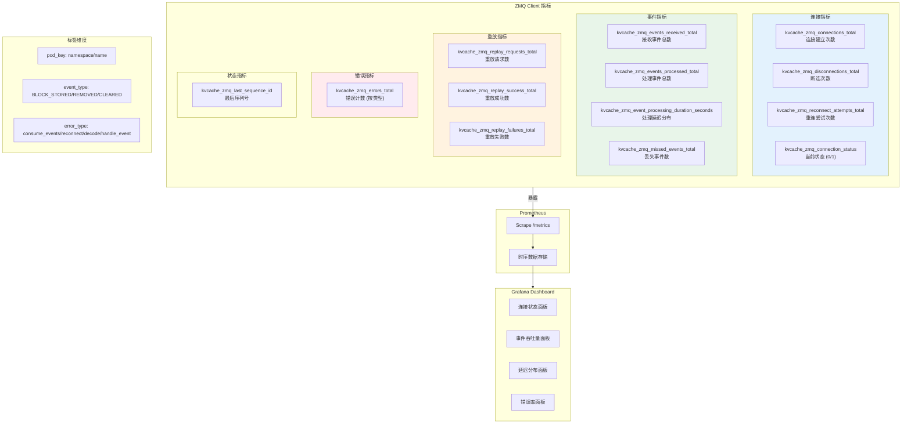

---

## 总结图示

### 系统角色定位

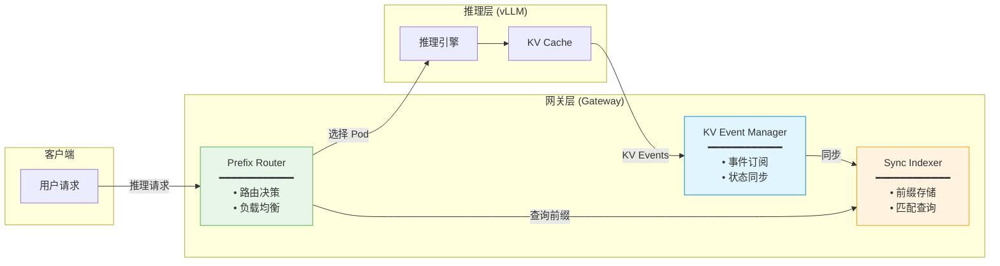

