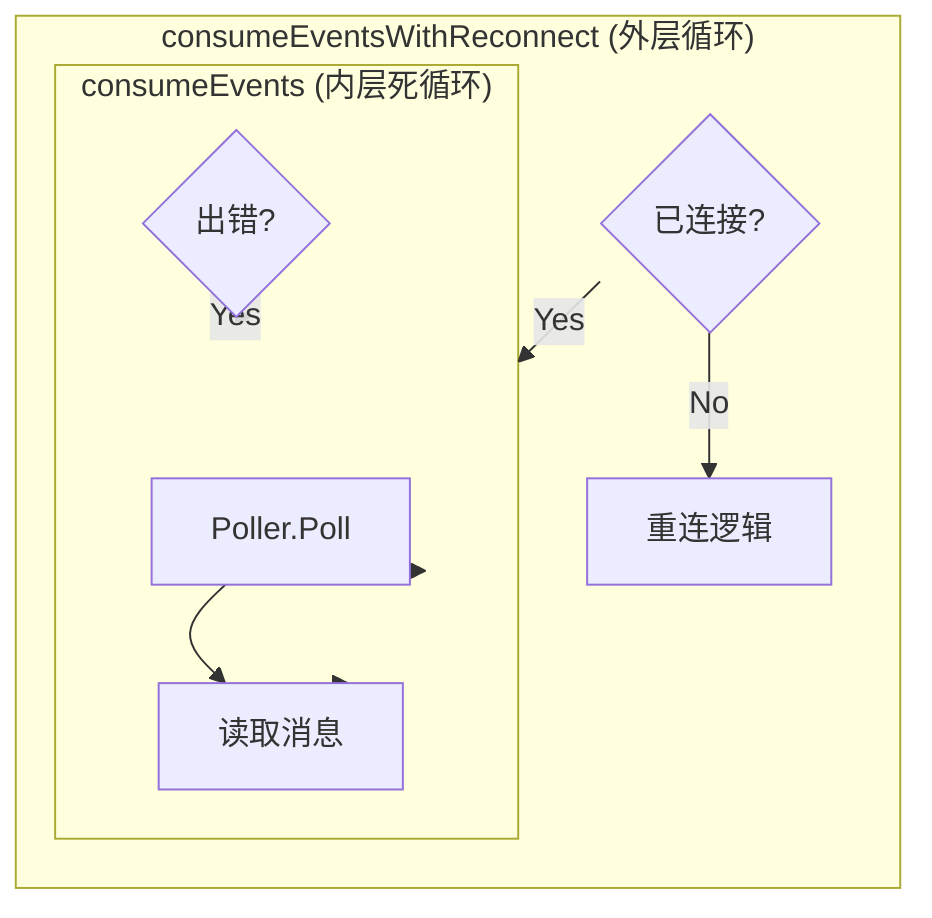
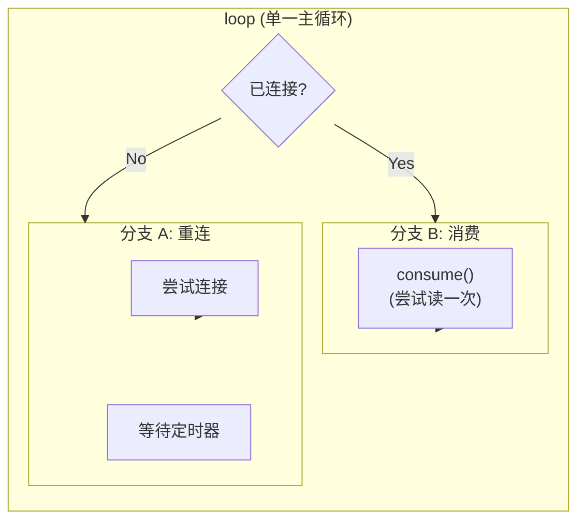

# 循环结构扁平化重构分析

本文档详细解答：**为什么静态版 `consume` 移除了原版 `consumeEvents` 中的死循环是合理的？**

## 1. 结构对比图解

### 原版：嵌套循环 (Nested Loops)

原版采用的是经典的“分层职责”设计。



*   **特点**：一旦进入内层 `consumeEvents`，程序就在那里打转。只有当发生网络错误返回 `error` 时，才会跳出内层循环，回到外层进行重连。
*   **逻辑**：外层管连接，内层管数据。

### 静态版：扁平单循环 (Flattened Loop)

静态版采用了“状态机”设计思路。



*   **特点**：`consume` 函数不再拥有循环控制权。它只是一个原子操作：“试着读一次，有就处理，没有就拉倒”。
*   **逻辑**：每次循环开始时重新评估状态。

## 2. 为什么去掉内层循环是合理的？

### 理由一：响应性更好 (Context Cancellation)

*   **原版**：如果在内层循环中（`consumeEvents`），要退出程序，必须依靠内层循环自己去监听 `ctx.Done()`。这意味着代码里到处都要写 `select { case <-ctx.Done(): ... }`。
*   **静态版**：因为 `consume` 只执行一次就会返回（哪怕没读到数据），主循环 `loop` 会立即开始下一次迭代。主循环的开头就是检查 `ctx.Done()`。
    *   **结果**：我们将“检查退出信号”的责任统一收归到了主循环，`consume` 只需要关注 I/O，代码职责更单一。

### 理由二：消除“幽灵状态”

在嵌套循环中，很容易出现**内层循环卡死**的情况。例如：
*   Socket 没断，但是一直没数据。
*   内层循环一直在 `Poller.Poll` -> `Timeout` -> `Continue` 之间空转。
*   此时如果外层想要介入（例如强制重置连接），是做不到的，因为控制流在内层出不来。

在静态版单循环中：
*   每次 `consume` 返回后，控制流都回到了主循环。
*   我们可以在主循环里轻松插入逻辑，比如：“虽然没断开，但如果 5 分钟没收到数据，强制重连一下”。这种逻辑在嵌套循环里很难实现。

### 理由三：代码可读性

*   **原版**：阅读 `consumeEventsWithReconnect` 时，你看到调用了 `consumeEvents`，你得跳转到那个函数里，发现“哦，原来这里面是个死循环”。你需要同时在大脑里维护两层栈的上下文。
*   **静态版**：阅读 `loop` 时，逻辑是线性的：
    ```go
    for {
        if !connected { 重连(); continue }
        consume() // 读一次
    }
    ```
    这更符合人类直觉的“流程图”模式。

## 3. 结论

移除 `consume` 中的循环**不仅合理，而且是优秀的重构**。

它将**控制流 (Control Flow)** 从底层 I/O 函数中剥离出来，上交给了顶层的编排函数 (`loop`)。
*   `consume` 变成了纯粹的**动作 (Action)**：执行 I/O。
*   `loop` 变成了纯粹的**决策者 (Decision Maker)**：决定何时重连、何时消费、何时退出。

这种**关注点分离 (Separation of Concerns)** 使得静态版代码在逻辑上比原版更加健壮和易于维护。

