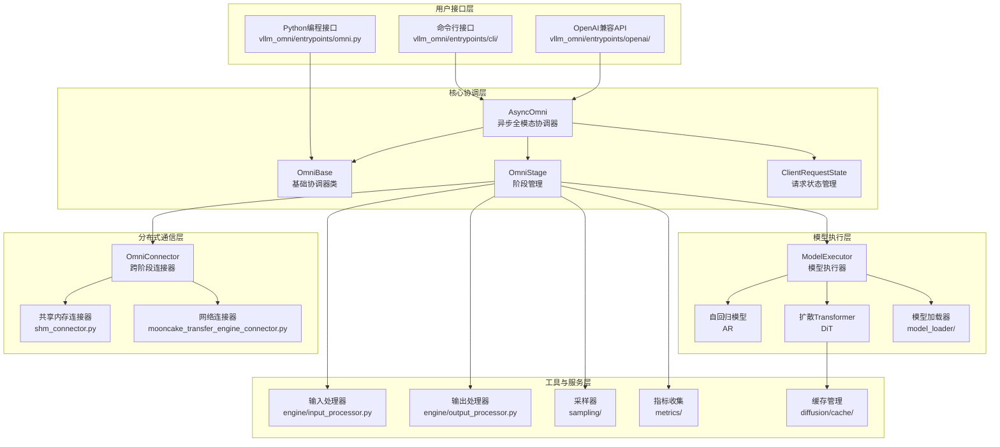
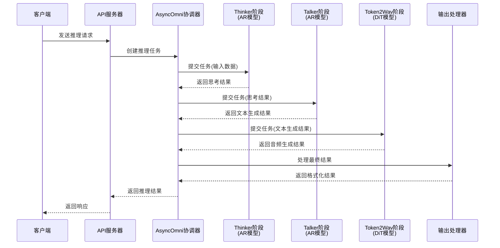
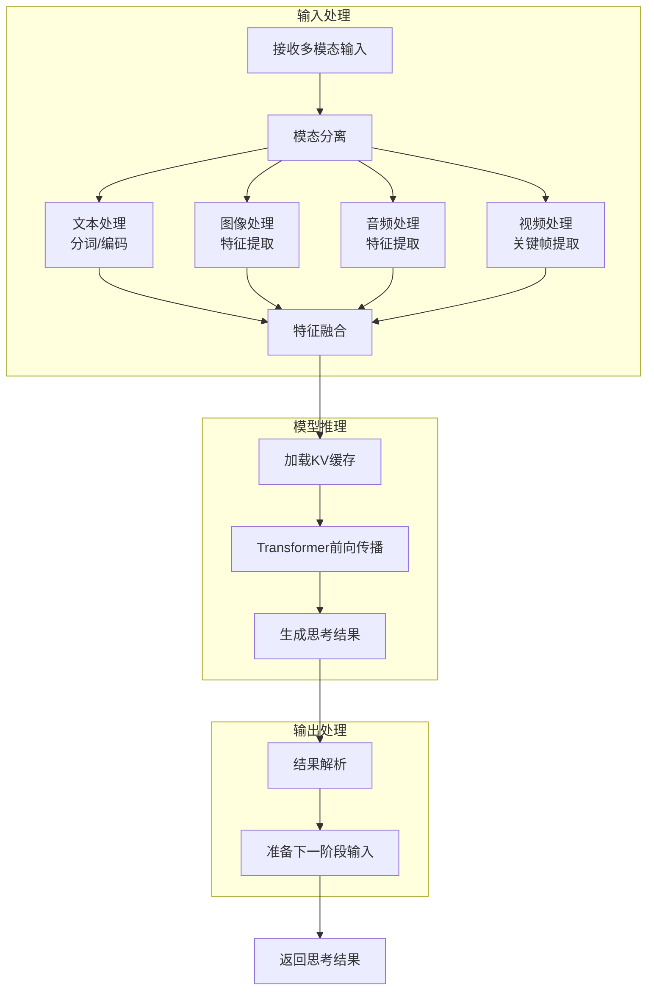
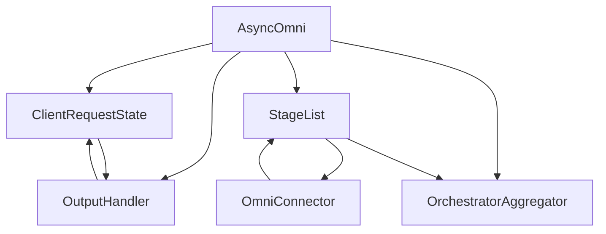
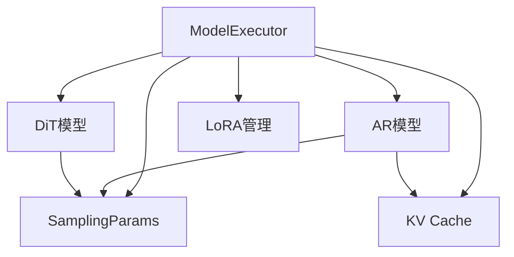
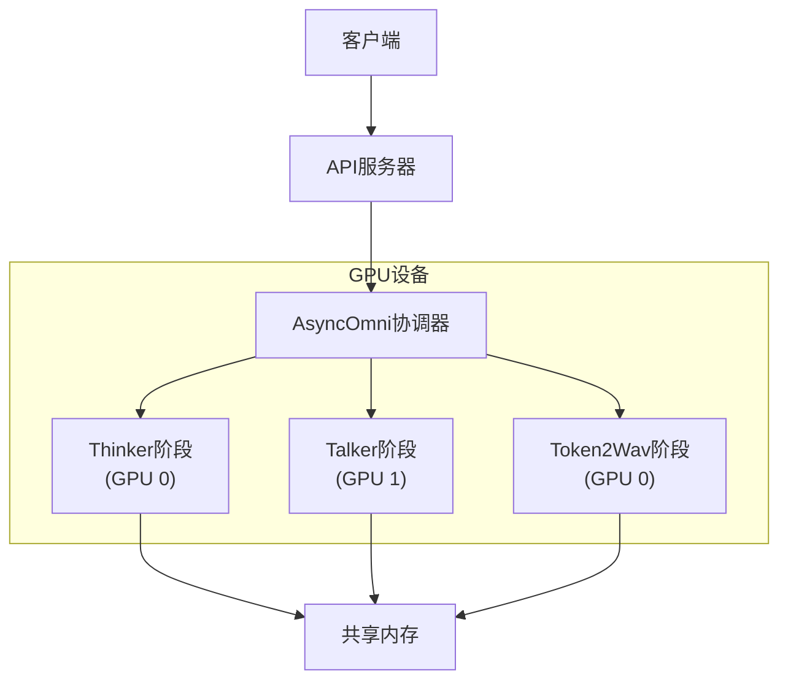
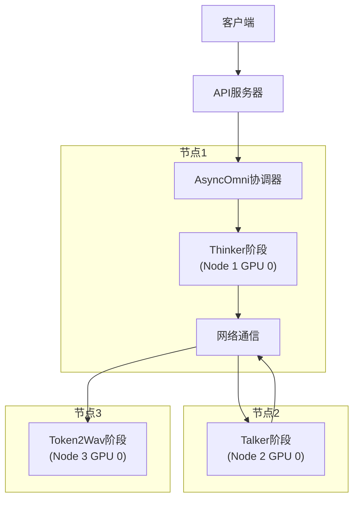
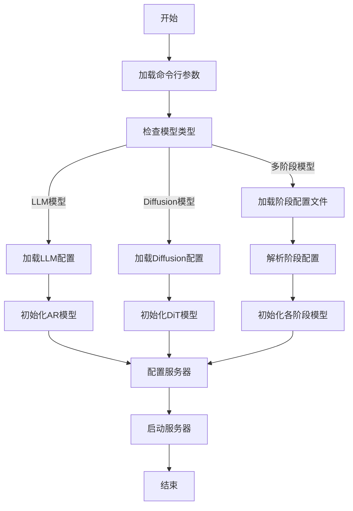
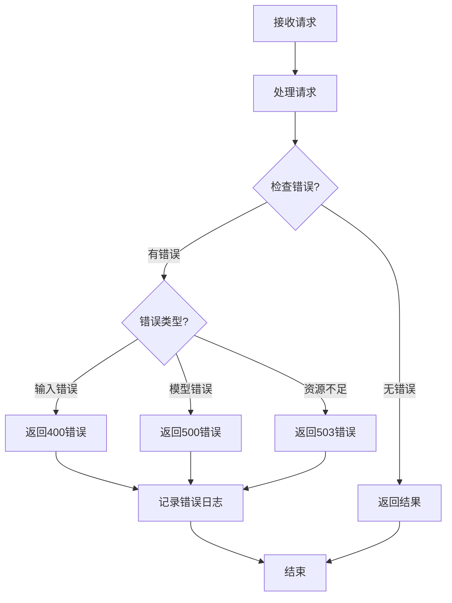

# vLLM-Omni 代码设计架构图与推理流程图

## 1. 代码设计架构图



### 架构图说明

vLLM-Omni 采用分层架构设计，各层职责明确：

1. **用户接口层**
   - 提供多种访问方式：命令行、API和Python编程接口
   - 处理用户输入和格式化输出

2. **核心协调层**
   - AsyncOmni：异步全模态协调器，管理多阶段推理流程
   - OmniStage：阶段管理器，处理单个模型阶段的执行
   - ClientState：管理请求的生命周期和状态

3. **模型执行层**
   - ModelExecutor：模型执行器，负责实际的模型推理
   - 支持AR（自回归）和DiT（扩散Transformer）两种主要模型类型
   - ModelLoader：负责模型权重的加载和初始化

4. **分布式通信层**
   - OmniConnector：跨阶段连接器，支持不同阶段间的数据传输
   - 提供多种传输方式：共享内存、网络等

5. **工具与服务层**
   - 提供输入处理、输出处理、采样、指标收集和缓存管理等通用服务
   - 支持模型推理的各个环节

## 2. 推理流程图

### 2.1 整体推理流程



### 2.2 单阶段详细推理流程（以Thinker为例）



### 2.3 多阶段通信流程

```mermaid
flowchart LR
    subgraph Stage1[阶段1 - Thinker]
        S1_Input[输入处理] --> S1_Model[模型推理]
        S1_Model --> S1_Output[输出处理]
        S1_Output --> S1_Connector[OmniConnector]
    end

    subgraph Communication[通信层]
        S1_Connector --> Transport[数据传输<br>(共享内存/网络)]
        Transport --> S2_Connector[OmniConnector]
    end

    subgraph Stage2[阶段2 - Talker]
        S2_Connector --> S2_Input[输入处理]
        S2_Input --> S2_Model[模型推理]
        S2_Model --> S2_Output[输出处理]
        S2_Output --> S2_Connector2[OmniConnector]
    end

    subgraph Stage3[阶段3 - Token2Wav]
        S2_Connector2 --> S3_Input[输入处理]
        S3_Input --> S3_Model[模型推理]
        S3_Model --> S3_Output[输出处理]
        S3_Output --> Result[最终结果]
    end
```

## 3. 关键组件交互图

### 3.1 AsyncOmni 组件交互



### 3.2 模型执行器组件交互



## 4. 部署架构图

### 4.1 单节点部署



### 4.2 多节点部署



## 5. 配置流程图



## 6. 异常处理流程图



## 7. 总结

vLLM-Omni 框架采用了模块化、分层的架构设计，通过 AsyncOmni 协调器管理多阶段模型推理流程。推理过程涉及多个阶段的协同工作，包括 Thinker（多模态理解）、Talker（文本生成）和 Token2Wav（音频生成）等。框架支持单节点和多节点部署，通过 OmniConnector 实现不同阶段之间的高效通信。

这些图表清晰地展示了 vLLM-Omni 的代码结构、推理流程、组件交互和部署架构，帮助开发者更好地理解和使用这个全模态模型推理框架。