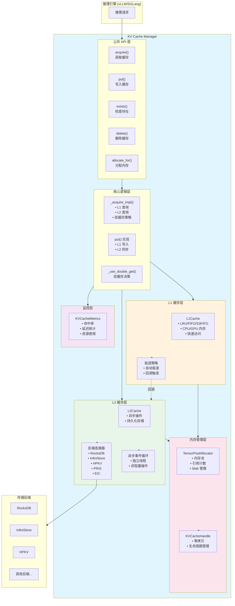
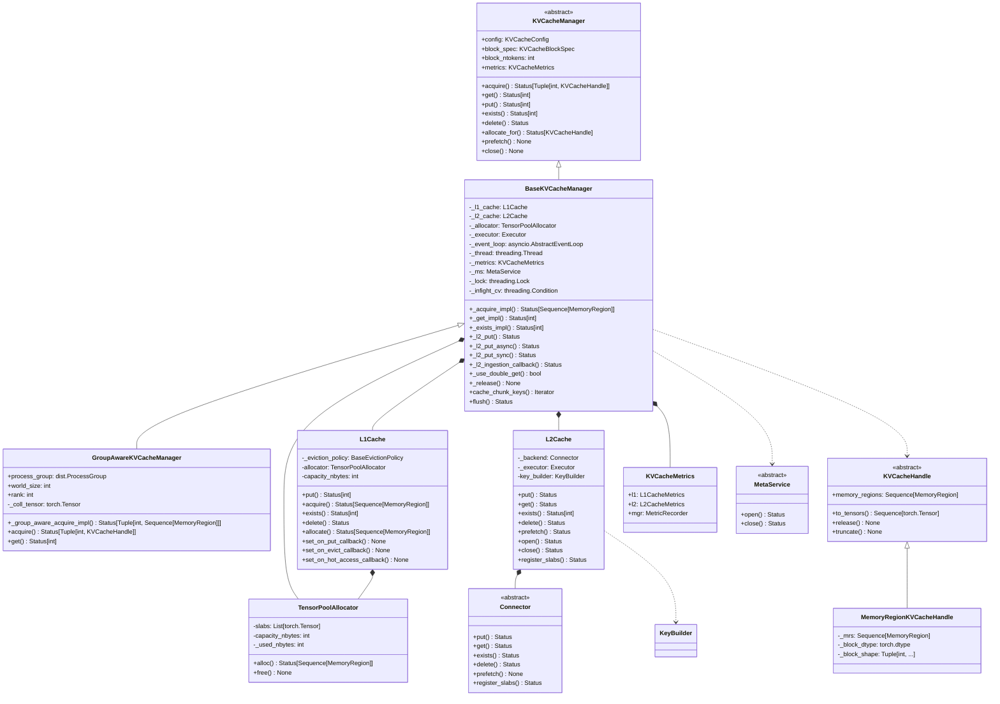

# KV Cache Manager 详细分析文档

## 📋 目录

1. [概述](#概述)
2. [主函数实现详解](#主函数实现详解)
3. [核心组件详解](#核心组件详解)
4. [关键函数详解](#关键函数详解)
5. [架构图](#架构图)
6. [类图](#类图)
7. [总结](#总结)

---

## 概述

**KV Cache Manager** 是 AIBrix KV Cache Offloading Framework 的核心组件，负责管理 KV 缓存的存储、检索、分配和卸载操作。它采用**两级缓存架构**（L1 本地缓存 + L2 远程缓存），支持多种后端存储和驱逐策略。

---

## 主函数实现详解

### 1. `BaseKVCacheManager.__init__()` - 初始化函数

这是 KV Cache Manager 的核心初始化函数，负责设置所有组件。

```python
def __init__(self, config: KVCacheConfig) -> None:
```

#### 逐行代码解释

**第 599 行：调用父类初始化**
```python
KVCacheManager.__init__(self, config)
```
- 调用抽象基类 `KVCacheManager` 的初始化
- 设置基础的 block 规格信息（block_spec, block_shape, block_dtype 等）

**第 601-610 行：初始化核心组件变量**
```python
self._l1_cache: L1Cache | None = None
self._l2_cache: L2Cache | None = None
self._executor: Executor | None = None
self._event_loop: asyncio.AbstractEventLoop | None = None
self._thread: threading.Thread | None = None
self._l2_inflight_writes: int = 0
self._l2_inflight_quota: int = 0
self._allocator: TensorPoolAllocator | None = None
self._metrics: KVCacheMetrics | None = None
self._ms: MetaService | None = None
```
- `_l1_cache`: L1 本地缓存（CPU/GPU 内存）
- `_l2_cache`: L2 远程缓存（RocksDB/InfiniStore 等）
- `_executor`: 线程池执行器，用于异步 L2 操作
- `_event_loop`: 异步事件循环，处理 L2 缓存的异步操作
- `_thread`: 运行事件循环的线程
- `_l2_inflight_writes`: 当前正在进行的 L2 写入数量
- `_l2_inflight_quota`: L2 写入的最大并发配额
- `_allocator`: 张量池分配器，管理内存分配
- `_metrics`: 性能指标收集器
- `_ms`: 元数据服务（用于分布式场景）

**第 612-613 行：初始化同步原语**
```python
self._lock = threading.Lock()
self._infight_cv = threading.Condition(self._lock)
```
- `_lock`: 保护共享状态的互斥锁
- `_infight_cv`: 条件变量，用于等待 L2 写入完成

**第 615-620 行：配置阈值参数**
```python
self._double_get_threshold: Tuple[int, float] = (
    envs.AIBRIX_KV_CACHE_OL_DOUBLE_GET_THRESHOLD
)
self._l2_cache_per_token_timeout_ms: int = (
    envs.AIBRIX_KV_CACHE_OL_L2_CACHE_PER_TOKEN_TIMEOUT_MS
)
```
- `_double_get_threshold`: 决定是否同时查询 L1 和 L2 的阈值（块数量或比例）
- `_l2_cache_per_token_timeout_ms`: L2 缓存每个 token 的超时时间（毫秒）

**第 622-658 行：配置 chunk_size 和 max_seq_len**
```python
self._chunk_size: int = envs.AIBRIX_KV_CACHE_OL_CHUNK_SIZE
self._max_seq_len: int = envs.AIBRIX_KV_CACHE_OL_MAX_SEQ_LEN
if self._max_seq_len > 0:
    max_seq_len = round_up(self._max_seq_len, self.block_ntokens)
    # ... 对齐到 block_ntokens 的倍数
    self._max_seq_len = max_seq_len

if self._chunk_size % self.block_ntokens != 0:
    # 对齐到 block_ntokens 的倍数
    self._chunk_size = (
        self._chunk_size - self._chunk_size % self.block_ntokens
    )

if self._chunk_size < 4 * self.block_ntokens:
    # 确保 chunk_size 至少是 4 个 block
    self._chunk_size = 4 * self.block_ntokens
```
- `_chunk_size`: 缓存操作的分块大小，必须是 block_ntokens 的倍数
- `_max_seq_len`: 最大序列长度限制，用于防止过长的序列占用过多缓存

**第 660-664 行：配置设备类型和内存固定**
```python
device: str = envs.AIBRIX_KV_CACHE_OL_DEVICE
pin_memory: bool = False
if not TESTING_DISABLE_PIN_MEMORY:
    pin_memory = device == "cpu"
```
- `device`: 缓存存储设备（"cpu" 或 "cuda"）
- `pin_memory`: 是否固定内存（CPU 设备时启用，加速 GPU 传输）

**第 666-671 行：检查缓存配置**
```python
enable_l1: bool = envs.AIBRIX_KV_CACHE_OL_L1_CACHE_ENABLED
enable_l2: bool = len(envs.AIBRIX_KV_CACHE_OL_L2_CACHE_BACKEND) > 0

assert enable_l1 or enable_l2, (
    "At least one cache service must be enabled."
)
```
- 至少需要启用 L1 或 L2 中的一个缓存层

**第 673-689 行：初始化指标收集器**
```python
capacity_nbytes: int = int(
    envs.AIBRIX_KV_CACHE_OL_L1_CACHE_CAPACITY_GB * 1024**3
)
enable_time_measurement = (
    envs.AIBRIX_KV_CACHE_OL_TIME_MEASUREMENT_ENABLED
)
enable_breakdown_measurement = (
    envs.AIBRIX_KV_CACHE_OL_BREAKDOWN_MEASUREMENT_ENABLED
)
self._metrics = KVCacheMetrics(
    block_ntokens=self.block_ntokens,
    capacity_nbytes=capacity_nbytes,
    enable_l1=enable_l1,
    enable_l2=enable_l2,
    enable_time_measurement=enable_time_measurement,
    enable_breakdown_measurement=enable_breakdown_measurement,
)
```
- 创建性能指标收集器，用于监控缓存命中率、延迟等

**第 691-696 行：初始化元数据服务**
```python
ms_backend: str = envs.AIBRIX_KV_CACHE_OL_META_SERVICE_BACKEND
if len(ms_backend) > 0:
    self._ms = MetaService.create(ms_backend)
    status = self._ms.open()
    status.raise_if_not_ok()
    logger.info(f"Using meta service backend: {self._ms.name}")
```
- 如果配置了元数据服务后端（如 Redis），则初始化并打开连接

**第 698-700 行：初始化 MeasurableBase**
```python
assert self._metrics is not None
MeasurableBase.__init__(self, self._metrics.mgr)
```
- 初始化可测量基类，用于性能追踪

**第 702-749 行：初始化内存分配器**
```python
allocator_capacity_nbytes: int = 0

if enable_l1:
    allocator_capacity_nbytes += capacity_nbytes

if enable_l2:
    self._l2_inflight_quota = (
        envs.AIBRIX_KV_CACHE_OL_L2_CACHE_INGESTION_MAX_INFLIGHT_TOKENS
        // self.block_ntokens
    )
    # ... 计算 L2 缓存所需的内存容量
    allocator_capacity_nbytes += more_capacity_nbytes

self._allocator = TensorPoolAllocator.create(
    capacity_nbytes=allocator_capacity_nbytes,
    device=device,
    pin_memory=pin_memory,
)
```
- 计算分配器总容量：L1 容量 + L2 异步操作所需容量
- 创建张量池分配器，统一管理内存分配

**第 751-764 行：初始化 L1 缓存**
```python
if enable_l1:
    eviction_policy: str = (
        envs.AIBRIX_KV_CACHE_OL_L1_CACHE_EVICTION_POLICY
    )

    self._l1_cache = L1Cache(
        eviction_policy,
        capacity_nbytes,
        self._allocator,
        self.block_spec,
        metrics=self._metrics.l1,
        multi_threaded=self.config.multi_threaded,
    )
```
- 创建 L1 缓存实例，支持 LRU/FIFO/S3FIFO 等驱逐策略

**第 766-798 行：初始化 L2 缓存**
```python
if enable_l2:
    backend_name: str = envs.AIBRIX_KV_CACHE_OL_L2_CACHE_BACKEND
    namespace: str = envs.AIBRIX_KV_CACHE_OL_L2_CACHE_NAMESPACE
    ingestion_type: str = (
        envs.AIBRIX_KV_CACHE_OL_L2_CACHE_INGESTION_TYPE
    )
    op_batch: int = envs.AIBRIX_KV_CACHE_OL_L2_CACHE_OP_BATCH
    self._executor = ThreadPoolExecutor(
        envs.AIBRIX_KV_CACHE_OL_L2_CACHE_NUM_ASYNC_WORKERS,
        thread_name_prefix="l2_cache_",
    )

    placement_policy = envs.AIBRIX_KV_CACHE_OL_L2_CACHE_PLACEMENT_POLICY
    refresh_interval_s = (
        envs.AIBRIX_KV_CACHE_OL_META_SERVICE_REFRESH_INTERVAL_S
    )
    key_builder = KeyBuilder.create(
        envs.AIBRIX_KV_CACHE_OL_L2_CACHE_KEY_BUILDER,
        block_size=self.block_ntokens,
    )
    self._l2_cache = L2Cache(
        backend_name=backend_name,
        placement_policy=placement_policy,
        namespace=namespace,
        block_spec=self.block_spec,
        executor=self._executor,
        refresh_interval_s=refresh_interval_s,
        op_batch=op_batch,
        metrics=self._metrics.l2,
        meta_service=self._ms,
        key_builder=key_builder,
    )
```
- 创建线程池执行器
- 创建键构建器（用于生成缓存键）
- 创建 L2 缓存实例，连接到后端存储（RocksDB/InfiniStore 等）

**第 800-805 行：启动异步事件循环**
```python
self._event_loop = asyncio.new_event_loop()
self._thread = threading.Thread(
    target=self._event_loop.run_forever, daemon=True
)
self._thread.start()
```
- 创建独立的异步事件循环
- 在后台线程中运行，处理 L2 缓存的异步操作

**第 807-821 行：打开 L2 缓存并注册内存块**
```python
status = self._l2_cache.open()
status.raise_if_not_ok()

if self._l2_cache._backend.feature.rdma:
    reg_status = self._l2_cache.register_slabs(
        self._allocator.slabs
    )
    # ... 错误处理
```
- 打开 L2 缓存连接
- 如果后端支持 RDMA，注册内存块以启用零拷贝

**第 823-836 行：注册 L1 到 L2 的回调函数**
```python
if self._l1_cache is not None:
    if ingestion_type == "HOT":
        self._l1_cache.set_on_hot_access_callback(
            self._l2_ingestion_callback
        )
    elif ingestion_type == "ALL":
        self._l1_cache.set_on_put_callback(
            self._l2_ingestion_callback
        )
    else:
        self._l1_cache.set_on_evict_callback(
            self._l2_ingestion_callback
        )
```
- 根据 `ingestion_type` 配置，设置 L1 到 L2 的数据同步策略：
  - `HOT`: 只有热数据（频繁访问）才同步到 L2
  - `ALL`: 所有数据都同步到 L2
  - 其他（默认）: 只有被驱逐的数据才同步到 L2

**第 838-842 行：最终验证**
```python
assert self._l1_cache is not None or self._l2_cache is not None, (
    "At least one cache service must be enabled."
)

logger.info("%s is initialized", self)
```
- 确保至少有一个缓存层已启用
- 记录初始化完成日志

---

### 2. `acquire()` - 获取缓存数据

这是获取 KV 缓存的核心方法。

```python
@nvtx_range("acquire", "KVCacheManager")
@MeasurableBase.measure(MetricRecorder.OP.ACQUIRE)
def acquire(self, *args, **kwargs) -> Status[Tuple[int, KVCacheHandle]]:
```

#### 逐行代码解释

**第 1076 行：解析参数**
```python
prefix, query, _ = parse_kvcache_api_args(*args, **kwargs)
```
- 解析输入参数，提取 prefix（前缀 tokens）和 query（查询 tokens）

**第 1078-1082 行：验证 block 大小兼容性**
```python
if not isinstance(query, TokenListView):
    assert self.block_ntokens % query.block_ntokens == 0, (
        f"kvcache's block size ({self.block_ntokens}) must be multiple "
        f"of cache key's block_ntokens ({query.block_ntokens})"
    )
```
- 如果使用 BlockHashes 而不是 TokenListView，确保 block 大小兼容

**第 1084-1086 行：调用内部实现**
```python
status = self._acquire_impl(prefix, query)
if not status.is_ok():
    return Status(status)
```
- 调用内部实现方法获取缓存数据
- 如果失败，直接返回错误状态

**第 1088-1098 行：构造返回结果**
```python
value = status.get()
return Status.ok(
    (
        len(value) * self.block_ntokens,
        MemoryRegionKVCacheHandle(
            self.block_dtype,
            self.block_shape,
            value,  # type: ignore
        ),
    )
)
```
- 计算获取到的 token 数量（块数 × 每块 token 数）
- 创建 `MemoryRegionKVCacheHandle` 包装内存区域
- 返回 (token_count, handle) 元组

---

### 3. `_acquire_impl()` - 内部获取实现

这是实际执行缓存获取的逻辑。

```python
def _acquire_impl(
    self,
    prefix: KVCacheKeyTypes | None,
    query: KVCacheKeyTypes,
    output_mrs: Sequence[MemoryRegion] | None = None,
) -> Status[Sequence[MemoryRegion]]:
```

#### 关键逻辑流程

**步骤 1：验证前缀对齐（第 1254-1255 行）**
```python
if prefix is not None and len(prefix) % self.block_ntokens != 0:
    return Status(StatusCodes.INVALID)
```
- 确保前缀长度是 block 大小的倍数

**步骤 2：计算需要的块数（第 1257-1262 行）**
```python
if output_mrs is not None:
    num_blocks = len(output_mrs)
    ntokens_to_get = num_blocks * self.block_ntokens
    query = query[:ntokens_to_get]
else:
    num_blocks = len(query) // self.block_ntokens
```
- 如果提供了输出内存区域，使用其数量
- 否则根据 query 长度计算块数

**步骤 3：尝试从 L1 缓存获取（第 1274-1295 行）**
```python
if self._l1_cache is not None:
    l1_status = self._l1_cache.acquire(prefix, query)
    fetched_mrs = list(l1_status.get()) if l1_status.is_ok() else []
    num_fetched_blocks = len(fetched_mrs)
    num_missing_blocks = num_blocks - num_fetched_blocks

    if num_missing_blocks == 0 or not self._use_double_get(
        num_missing_blocks, num_blocks
    ):
        # L1 完全命中，或不需要查询 L2，直接返回
        if not l1_status.is_ok():
            return l1_status
        # ... 处理输出内存区域
        return l1_status
```
- 首先尝试从 L1 缓存获取
- 如果完全命中或不需要查询 L2，直接返回

**步骤 4：从 L2 缓存获取缺失的数据（第 1297-1335 行）**
```python
assert self._l2_cache is not None
# 计算当前前缀（包含已获取的部分）
if prefix is not None:
    prefix_curr = (
        prefix + query[: num_fetched_blocks * self.block_ntokens]
    )
else:
    prefix_curr = query[: num_fetched_blocks * self.block_ntokens]
tokens_curr = query[num_fetched_blocks * self.block_ntokens :]

# 计算超时时间
timeout_s = (
    num_missing_blocks
    * self.block_ntokens
    * self._l2_cache_per_token_timeout_ms
) / 1000

# 分配或使用提供的内存区域
if output_mrs is None:
    status = self.allocate_for(prefix_curr, tokens_curr)
    # ...
    mrs: List[MemoryRegion] = list(status.get().memory_regions)
else:
    mrs: List[MemoryRegion] = list(output_mrs[num_fetched_blocks:])

# 异步从 L2 获取
future = asyncio.run_coroutine_threadsafe(
    self._l2_cache.get(prefix_curr, tokens_curr, mrs), self._event_loop
)
get_status = future.result(timeout=timeout_s)
```
- 计算当前前缀（包含已从 L1 获取的部分）
- 分配内存区域或使用提供的区域
- 异步从 L2 缓存获取数据，带超时控制

**步骤 5：将 L2 数据写入 L1 缓存（第 1337-1360 行）**
```python
if self._l1_cache is not None:
    put_tokens_curr = tokens_curr[
        : len(l2_fetched_mrs) * self.block_ntokens
    ]
    # 将获取的数据放入 L1 缓存，以便下次快速访问
    put_status = self._l1_cache.put(
        prefix_curr, put_tokens_curr, l2_fetched_mrs
    )
```
- 将从 L2 获取的数据写入 L1 缓存，提高后续访问速度

**步骤 6：错误处理和资源释放（第 1366-1391 行）**
```python
except asyncio.CancelledError:
    # 取消操作
    return Status(StatusCodes.CANCELLED)
except asyncio.TimeoutError:
    # 超时
    return Status(StatusCodes.TIMEOUT)
except Exception as e:
    # 其他错误
    return Status(StatusCodes.ERROR, e)
finally:
    if output_mrs is None:
        self._release(mrs)  # 释放未使用的内存区域
    if not future.done():
        future.cancel()  # 取消未完成的异步操作
```
- 处理各种异常情况
- 确保资源正确释放

---

### 4. `put()` - 写入缓存数据

这是写入 KV 缓存的核心方法。

```python
@nvtx_range("put", "KVCacheManager")
@MeasurableBase.measure(MetricRecorder.OP.PUT)
def put(self, *args, **kwargs) -> Status[int]:
```

#### 逐行代码解释

**第 1469 行：解析参数**
```python
prefix, query, kv_tensors = parse_kvcache_api_args(*args, **kwargs)
```

**第 1471-1475 行：验证 block 大小**
```python
if not isinstance(query, TokenListView):
    assert self.block_ntokens % query.block_ntokens == 0, (
        f"kvcache's block size ({self.block_ntokens}) must be multiple "
        f"of cache key's block_ntokens ({query.block_ntokens})"
    )
```

**第 1477-1486 行：验证前缀对齐**
```python
pref_len = len(prefix) if prefix is not None else 0
if pref_len % self.block_ntokens != 0:
    kv_tensors.release()
    return Status(
        StatusCodes.INVALID,
        (
            f"Prefix length {pref_len} is not aligned to block size "
            f"{self.block_ntokens}."
        ),
    )
```
- 前缀长度必须是 block 大小的倍数
- 如果不满足，释放资源并返回错误

**第 1488-1503 行：序列长度限制**
```python
if self._max_seq_len > 0:
    if pref_len >= self._max_seq_len:
        kv_tensors.release()
        return Status(StatusCodes.DENIED, "Sequence too long")
    elif pref_len + len(query) > self._max_seq_len:
        token_len = round_down(
            self._max_seq_len - pref_len,
            self.block_ntokens,
        )
        if token_len == 0:
            kv_tensors.release()
            return Status.ok(0)
        # 截断 query 和 kv_tensors
        query = query[:token_len]
        kv_tensors.truncate(token_len // self.block_ntokens)
```
- 如果设置了最大序列长度限制，检查并截断超长序列

**第 1505-1506 行：GDR 支持检查**
```python
if isinstance(kv_tensors, GDRKVCacheHandle):
    assert self.feature.gdr_put, "Does not support GDR put"
```
- 如果使用 GPU Direct Read，确保后端支持

**第 1511-1527 行：写入 L1 缓存**
```python
if self._l1_cache is not None:
    if kv_tensors.memory_region_type is ManagedMemoryRegion:
        mrs = kv_tensors.memory_regions
        status = self._l1_cache.put(prefix, query, mrs)
        # 释放未成功写入的 MRs
        self._release(mrs[status.get() :])
    else:
        # 对于 ExternalMemoryRegions，转换为 tensors
        tensors = kv_tensors.to_tensors()
        status = self._l1_cache.put(prefix, query, tensors)
        kv_tensors.release()

    if not status.is_ok():
        return status
    return Status.ok(status.get() * self.block_ntokens)
```
- 优先写入 L1 缓存
- L1 缓存的驱逐策略会自动触发 L2 同步（通过回调）

**第 1528-1529 行：直接写入 L2（如果 L1 未启用）**
```python
else:
    return self._l2_put(prefix, query, kv_tensors)
```
- 如果 L1 未启用，直接写入 L2

---

### 5. `_l2_put_async()` - 异步写入 L2

这是异步写入 L2 缓存的实现。

```python
def _l2_put_async(
    self,
    prefix: KVCacheKeyTypes | None,
    query: KVCacheKeyTypes,
    value: (MemoryRegion | KVCacheHandle),
) -> Status:
```

#### 逐行代码解释

**第 971-993 行：检查并发配额**
```python
with self._lock:
    log_every_n_seconds(
        logger,
        logging.INFO,
        "l2_cache infight writes %d/quota %d",
        3,
        self._l2_inflight_writes,
        self._l2_inflight_quota,
    )
    if self._l2_inflight_quota <= self._l2_inflight_writes:
        # 配额已满，拒绝写入
        log_every_n_seconds(...)
        return Status(StatusCodes.DENIED)
    self._l2_inflight_writes += 1
```
- 检查当前正在进行的写入数量
- 如果超过配额，拒绝写入（防止内存溢出）

**第 995-1011 行：定义完成回调**
```python
def _done_callback(
    future: asyncio.Future,
    value: (MemoryRegion | KVCacheHandle),
) -> None:
    self._release([value])  # 释放内存区域

    with self._infight_cv:
        self._l2_inflight_writes -= 1
        self._infight_cv.notify_all()  # 通知等待的线程
    if not future.result().is_ok():
        log_every_n_seconds(
            logger,
            logging.WARNING,
            "Failed to write to l2_cache, error: %s",
            10,
            future.result().value,
        )
```
- 写入完成时释放资源
- 减少并发计数并通知等待的线程
- 记录错误日志

**第 1013-1019 行：提交异步写入任务**
```python
assert self._event_loop is not None
future = asyncio.run_coroutine_threadsafe(
    self._l2_cache.put(prefix, query, value), self._event_loop
)
future.add_done_callback(functools.partial(_done_callback, value=value))
return Status.ok(len(query))
```
- 在事件循环中提交异步写入任务
- 添加完成回调
- 立即返回成功（实际写入是异步的）

---

## 核心组件详解

### 1. L1Cache - 本地缓存层

**位置**: `python/aibrix_kvcache/aibrix_kvcache/l1/l1_cache.py`

**功能**:
- 提供快速的本地内存缓存（CPU 或 GPU）
- 实现多种驱逐策略（LRU、FIFO、S3FIFO）
- 支持回调机制，用于同步到 L2

**关键方法**:
- `put()`: 写入缓存，触发驱逐策略
- `acquire()`: 获取缓存数据
- `exists()`: 检查缓存是否存在
- `allocate()`: 分配内存区域

**驱逐策略**:
- **LRU**: 最近最少使用，适合大多数场景
- **FIFO**: 先进先出，简单高效
- **S3FIFO**: 三队列 FIFO，平衡性能和复杂度

---

### 2. L2Cache - 远程缓存层

**位置**: `python/aibrix_kvcache/aibrix_kvcache/l2/l2_cache.py`

**功能**:
- 提供持久化的远程缓存存储
- 支持多种后端（RocksDB、InfiniStore、HPKV、PRIS、EIC）
- 异步操作，不阻塞主线程

**关键方法**:
- `put()`: 异步写入缓存
- `get()`: 异步读取缓存
- `exists()`: 异步检查存在性
- `prefetch()`: 预取数据（如果后端支持）

**后端连接器**:
- **RocksDB**: 本地持久化存储
- **InfiniStore**: 分布式 KV 存储
- **HPKV**: 高性能 KV 存储
- **PRIS**: PRIS 缓存服务
- **EIC**: 嵌入式推理缓存

---

### 3. TensorPoolAllocator - 内存分配器

**位置**: `python/aibrix_kvcache/aibrix_kvcache/memory/allocator.py`

**功能**:
- 统一管理内存分配和释放
- 使用内存池减少分配开销
- 支持 CPU 和 GPU 内存

**关键方法**:
- `alloc()`: 分配内存区域
- `free()`: 释放内存区域
- `capacity_nbytes`: 总容量
- `_used_nbytes`: 已使用容量

**内存布局**:
- **Slab**: 大块连续内存
- **MemoryRegion**: 从 slab 中分配的区域
- **引用计数**: 自动管理内存生命周期

---

### 4. KVCacheHandle - 缓存句柄

**位置**: `python/aibrix_kvcache/aibrix_kvcache/cache_handle.py`

**功能**:
- 提供零拷贝的缓存访问接口
- 封装内存区域，支持引用计数
- 支持转换为 PyTorch Tensor

**类型**:
- `MemoryRegionKVCacheHandle`: 基于内存区域的句柄
- `GDRKVCacheHandle`: GPU Direct Read 句柄（零拷贝）

**关键方法**:
- `to_tensors()`: 转换为 PyTorch Tensor
- `release()`: 释放资源
- `truncate()`: 截断到指定长度

---

### 5. Cache Hashable - 缓存键

**位置**: `python/aibrix_kvcache/aibrix_kvcache/cache_hashable.py`

**功能**:
- 提供可哈希的缓存键类型
- 支持 Token IDs 和 Block Hashes 两种键类型

**类型**:
- `TokenListView`: Token ID 列表视图
- `BlockHashes`: Block 哈希列表
- `KVCacheKey`: 包含 prefix 和 query 的完整键

---

### 6. MetaService - 元数据服务

**位置**: `python/aibrix_kvcache/aibrix_kvcache/meta_service/`

**功能**:
- 在分布式场景中提供元数据管理
- 支持 Redis 后端
- 用于 L2 缓存的 placement 策略

---

## 关键函数详解

### 1. `_use_double_get()` - 双缓存查询决策

```python
def _use_double_get(
    self, num_missing_blocks: int, num_total_blocks: int
) -> bool:
```

**功能**: 决定是否同时查询 L1 和 L2 缓存

**逻辑**:
- 如果 L2 未启用，返回 False
- 如果只设置了数量阈值，检查缺失块数是否 >= 阈值
- 如果同时设置了数量和比例阈值，两者都要满足

**优化目的**: 避免在 L1 命中率很高时，仍然查询 L2 造成的性能损失

---

### 2. `_l2_ingestion_callback()` - L2 同步回调

```python
def _l2_ingestion_callback(
    self,
    key: KVCacheKey,
    mr: MemoryRegion,
) -> Status:
```

**功能**: L1 缓存触发时，将数据同步到 L2

**触发时机**:
- `HOT`: 数据变为热数据时
- `ALL`: 每次写入 L1 时
- `EVICT`: L1 驱逐数据时

---

### 3. `cache_chunk_keys()` - 分块键生成器

```python
def cache_chunk_keys(
    self, prefix: KVCacheKeyTypes | None, query: KVCacheKeyTypes
) -> Iterator[Tuple[...]]:
```

**功能**: 将长序列分割成多个 chunk，每个 chunk 大小为 `_chunk_size`

**返回**: 迭代器，每次返回 (chunk_prefix, chunk_tokens, next_tokens, all_tokens)

**用途**: 
- 支持分块处理长序列
- 支持预取下一个 chunk

---

### 4. `flush()` - 刷新缓存

```python
def flush(self) -> Status:
```

**功能**: 等待所有异步 L2 写入完成

**实现**:
- 使用条件变量等待 `_l2_inflight_writes` 降为 0
- 超时时间 60 秒

**用途**: 在关闭前确保所有数据已持久化

---

### 5. `close()` - 关闭管理器

```python
def close(self) -> None:
```

**功能**: 优雅关闭所有组件

**步骤**:
1. 调用 `flush()` 等待异步操作完成
2. 停止事件循环
3. 等待线程结束
4. 关闭线程池执行器
5. 删除 L1 和 L2 缓存

---

## 架构图



---

## 类图



---

## 总结

### 作用和功能

**KV Cache Manager** 是 AIBrix KV Cache Offloading Framework 的核心组件，主要功能包括：

1. **两级缓存管理**
   - **L1 缓存**: 快速本地内存缓存（CPU/GPU），提供毫秒级访问
   - **L2 缓存**: 持久化远程缓存（RocksDB/InfiniStore 等），提供大容量存储

2. **智能缓存策略**
   - **选择性卸载**: 根据配置（HOT/ALL/EVICT）决定哪些数据同步到 L2
   - **双缓存查询**: 根据阈值智能决定是否同时查询 L1 和 L2
   - **自动预取**: 支持预取下一个 chunk 的数据

3. **内存管理**
   - **统一分配器**: 使用 TensorPoolAllocator 统一管理内存
   - **引用计数**: 自动管理内存生命周期
   - **零拷贝**: 支持 GPU Direct Read，减少数据拷贝

4. **性能优化**
   - **异步操作**: L2 操作完全异步，不阻塞主线程
   - **并发控制**: 限制 L2 写入并发数，防止内存溢出
   - **分块处理**: 支持长序列的分块处理

### 在系统中的角色

1. **推理引擎集成层**
   - 作为 vLLM、SGLang 等推理引擎的 KV 缓存后端
   - 提供统一的缓存接口，隐藏底层实现细节

2. **缓存卸载服务**
   - 将 GPU 内存中的 KV 缓存卸载到 CPU 内存或远程存储
   - 支持跨引擎的 KV 缓存复用

3. **性能优化组件**
   - 通过缓存命中减少重复计算
   - 通过选择性卸载优化网络带宽使用

### 代码设计特点

1. **分层架构**
   - **抽象层**: `KVCacheManager` 定义统一接口
   - **实现层**: `BaseKVCacheManager` 提供基础实现
   - **扩展层**: `GroupAwareKVCacheManager` 支持分布式场景

2. **组件化设计**
   - L1 和 L2 缓存独立实现，可单独启用
   - 后端连接器可插拔，支持多种存储后端
   - 驱逐策略可配置，支持多种算法

3. **异步编程模型**
   - 使用 asyncio 处理 L2 缓存的异步操作
   - 独立事件循环线程，避免阻塞主线程
   - 使用 Future 和回调处理异步结果

4. **资源管理**
   - RAII 模式：通过 `__init__` 和 `close()` 管理资源
   - 引用计数：自动管理内存区域生命周期
   - 条件变量：协调异步操作的完成

5. **可观测性**
   - 完整的性能指标收集（命中率、延迟、资源使用）
   - NVTX 范围标记，支持性能分析工具
   - 详细的日志记录

6. **错误处理**
   - 使用 `Status` 类型统一错误处理
   - 超时控制防止长时间阻塞
   - 优雅降级：L2 失败时仍可使用 L1

### 设计模式

1. **策略模式**: 驱逐策略、placement 策略、键构建策略
2. **工厂模式**: Connector.create(), KeyBuilder.create()
3. **观察者模式**: L1 到 L2 的回调机制
4. **适配器模式**: 不同后端连接器的统一接口

### 性能考虑

1. **减少内存拷贝**: 使用 MemoryRegion 和引用计数
2. **异步操作**: L2 操作不阻塞主线程
3. **智能查询**: 双缓存策略避免不必要的 L2 查询
4. **批量操作**: 支持批量 get/put 操作
5. **预取机制**: 支持预取下一个 chunk

---

## 关键配置参数

| 参数 | 说明 | 默认值 |
|------|------|--------|
| `AIBRIX_KV_CACHE_OL_L1_CACHE_ENABLED` | 启用 L1 缓存 | true |
| `AIBRIX_KV_CACHE_OL_L1_CACHE_CAPACITY_GB` | L1 缓存容量（GB） | - |
| `AIBRIX_KV_CACHE_OL_L1_CACHE_EVICTION_POLICY` | L1 驱逐策略 | LRU |
| `AIBRIX_KV_CACHE_OL_L2_CACHE_BACKEND` | L2 后端名称 | "" |
| `AIBRIX_KV_CACHE_OL_L2_CACHE_INGESTION_TYPE` | L2 同步策略 | EVICT |
| `AIBRIX_KV_CACHE_OL_CHUNK_SIZE` | 分块大小 | - |
| `AIBRIX_KV_CACHE_OL_DOUBLE_GET_THRESHOLD` | 双缓存查询阈值 | - |
| `AIBRIX_KV_CACHE_OL_DEVICE` | 存储设备 | cpu |

---

## 使用示例

```python
from aibrix_kvcache import KVCacheManager, KVCacheConfig
from aibrix_kvcache.spec import KVCacheBlockSpec, ModelSpec

# 创建配置
config = KVCacheConfig(
    block_spec=KVCacheBlockSpec(...),
    model_spec=ModelSpec(...),
    multi_threaded=True
)

# 创建管理器
manager = BaseKVCacheManager(config)

# 写入缓存
prefix = TokenListView([1, 2, 3])
query = TokenListView([4, 5, 6, 7])
kv_tensors = allocate_for(prefix, query)
status = manager.put(prefix, query, kv_tensors)

# 获取缓存
status, handle = manager.acquire(prefix, query)
if status.is_ok():
    tokens_count, cache_handle = status.get()
    tensors = cache_handle.to_tensors()
    # 使用 tensors...
    cache_handle.release()

# 关闭
manager.close()
```

---

## 总结

**KV Cache Manager** 是一个设计精良、功能完善的缓存管理系统，它通过两级缓存架构、智能策略和异步操作，为推理引擎提供了高效的 KV 缓存卸载能力。其模块化设计和丰富的配置选项，使其能够适应各种部署场景和性能需求。

