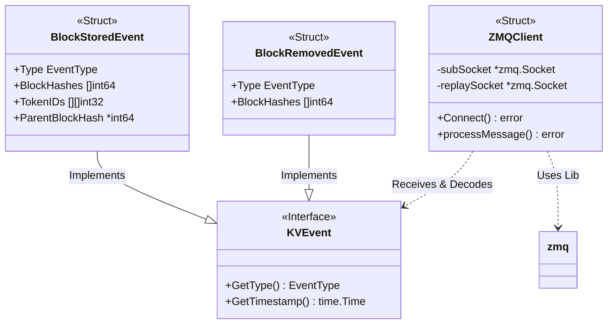

# ZMQ 订阅与消息处理深度分析

本文档详细解析 AIBrix KV Event Manager 中关于 ZMQ 订阅、连接管理及消息结构定义的代码。内容面向 Go 语言初学者，包含详细的语法解释和架构说明。

---

## 1. 代码架构与设计

KV Event Manager 使用 **发布-订阅 (Pub-Sub)** 模式与 vLLM 通信。

### 1.1 类图架构



### 1.2 关键组件

1.  **Message Structures (`event_types.go`)**: 定义了从 vLLM 接收的数据格式。
2.  **ZMQ Client (`zmq_client.go`)**: 负责建立网络连接、接收原始字节流。
3.  **Decoder (`msgpack_decoder.go`)**: 负责将 MessagePack 格式的字节流解析为 Go 结构体。

---

## 2. 订阅的消息类型 (Message Definitions)

vLLM 通过 ZMQ 发布三种核心事件。在 Go 中，这些消息被定义为 `struct`（结构体）。

**文件**: `pkg/cache/kvcache/event_types.go`

### 2.1 基础接口定义

```go
// KVEvent is the base interface for all KV cache events
type KVEvent interface {
    GetType() EventType
    GetTimestamp() time.Time
}
```
*   **`interface`**: Go 语言中的接口，定义了一组行为（方法）。任何实现了 `GetType` 和 `GetTimestamp` 的结构体都被视为 `KVEvent`。这实现了多态。

### 2.2 Block 存储事件 (BlockStoredEvent)

这是最复杂也是最重要的消息，表示 vLLM 生成了新的 KV Cache Block。

```go
type BlockStoredEvent struct {
    // 结构体标签 (Tag)：`msgpack:"type"` 告诉解码器，
    // 对应 MessagePack 数据中的 "type" 字段应赋值给此变量。
    Type            EventType `msgpack:"type"`
    
    Timestamp       time.Time `msgpack:"timestamp"`
    
    // []int64: 64位整数的切片(动态数组)。
    // 存储生成的 Block 的哈希值。
    BlockHashes     []int64   `msgpack:"block_hashes"`
    
    // [][]int32: 二维切片。外层对应 Block，内层对应 Block 内的 Token ID。
    // vLLM 使用 int32 存储 Token ID。
    TokenIDs        [][]int32 `msgpack:"token_ids"`
    
    // *int64: 指向 int64 的指针。
    // 使用指针是因为该字段可能为 nil (即没有父 Block，是首个 Block)。
    // 如果直接用 int64，无法区分 0 和 "不存在"。
    ParentBlockHash *int64    `msgpack:"parent_block_hash,omitempty"`
    
    ModelName       string    `msgpack:"model_name"`
    
    // `msgpack:"-"`: 这里的 "-" 表示该字段不从 MessagePack 中解析，
    // 而是由我们在代码中后续手动填充（记录是哪个 Pod 发来的）。
    PodName         string    `msgpack:"-"`
}
```

### 2.3 Block 移除事件 (BlockRemovedEvent)

当 vLLM 因为显存不足驱逐 Block 时发送此消息。

```go
type BlockRemovedEvent struct {
    Type        EventType `msgpack:"type"`
    Timestamp   time.Time `msgpack:"timestamp"`
    
    // 被移除的 Block 哈希列表
    BlockHashes []int64   `msgpack:"block_hashes"`
    
    ModelName   string    `msgpack:"model_name"`
    PodName     string    `msgpack:"-"`
}
```

---

## 3. ZMQ 连接与订阅实现 (Connection Logic)

这部分代码负责建立与 vLLM 的 TCP 连接。

**文件**: `pkg/cache/kvcache/zmq_client.go`

### 3.1 连接函数详解 (`Connect`)

```go
// (c *ZMQClient) 表示这是一个方法，绑定到 ZMQClient 结构体指针上。
func (c *ZMQClient) Connect() error {
    // c.mu.Lock(): 加锁，防止并发调用导致状态不一致
    c.mu.Lock()
    // defer: 延迟执行。在函数返回前一定会执行 Unlock，防止死锁。
    defer c.mu.Unlock()

    // 检查是否已连接，避免重复操作
    if c.connected {
        return nil
    }

    // ... 清理旧 socket 代码 ...

    // 1. 创建 SUB Socket
    // zmq.SUB: 订阅者模式。只接收数据，不发送数据。
    subSocket, err := zmq.NewSocket(zmq.SUB)
    if err != nil {
        // fmt.Errorf: 格式化错误信息，%w 用于包装原始错误
        return fmt.Errorf("failed to create SUB socket: %w", err)
    }

    // 2. 启用 IPv6
    // 现代 K8s 集群可能使用 IPv6，必须显式开启
    if err := subSocket.SetIpv6(true); err != nil {
        _ = subSocket.Close() // 忽略关闭时的错误
        return fmt.Errorf("failed to enable IPv6 on SUB socket: %w", err)
    }

    // 3. 连接到 vLLM Pod
    // formatZMQTCPEndpoint 辅助函数生成 "tcp://10.0.0.1:5557" 格式的字符串
    subEndpoint := formatZMQTCPEndpoint(c.config.PodIP, c.config.PubPort)
    if err := subSocket.Connect(subEndpoint); err != nil {
        _ = subSocket.Close()
        return fmt.Errorf("failed to connect to %s: %w", subEndpoint, err)
    }

    // 4. 核心订阅逻辑：订阅所有消息
    // SetSubscribe(""): 空字符串表示订阅所有 Topic。
    // ZMQ 默认不订阅任何内容，这行代码至关重要。
    if err := subSocket.SetSubscribe(""); err != nil {
        _ = subSocket.Close()
        return fmt.Errorf("failed to subscribe: %w", err)
    }

    // ... DEALER Socket 连接逻辑 (用于重放) ...

    // 保存 socket 引用
    c.subSocket = subSocket
    c.connected = true

    return nil
}
```

---

## 4. 消息接收与处理 (Processing Logic)

这部分代码在后台循环运行，不断从 Socket 读取数据并解析。

**文件**: `pkg/cache/kvcache/zmq_client.go`

### 4.1 消息处理函数详解 (`processMessage`)

ZMQ 消息通常是 **Multipart (多帧)** 的。vLLM 发送的消息格式如下：
*   **Frame 1**: Topic (主题)
*   **Frame 2**: Sequence Number (序列号，用于检测丢包)
*   **Frame 3**: Payload (MessagePack 编码的实际数据)

```go
func (c *ZMQClient) processMessage() error {
    // 加读锁 (RLock)，允许多个读，但写时互斥
    c.mu.RLock()
    socket := c.subSocket
    c.mu.RUnlock()

    if socket == nil {
        return fmt.Errorf("socket is nil")
    }

    // 1. 读取第一帧: Topic
    // RecvBytes(0): 0 表示阻塞模式，直到收到数据
    topic, err := socket.RecvBytes(0)
    if err != nil {
        return fmt.Errorf("failed to receive topic: %w", err)
    }

    // 2. 读取第二帧: Sequence Number (8字节)
    seqBytes, err := socket.RecvBytes(0)
    if err != nil {
        return fmt.Errorf("failed to receive sequence: %w", err)
    }

    // 3. 读取第三帧: Payload (实际数据)
    payload, err := socket.RecvBytes(0)
    if err != nil {
        return fmt.Errorf("failed to receive payload: %w", err)
    }

    // 4. 解析序列号
    // K8s 网络可能不稳定，序列号用于检测是否丢失了消息
    if len(seqBytes) != 8 {
        return fmt.Errorf("invalid sequence bytes length: %d", len(seqBytes))
    }
    // binary.BigEndian.Uint64: 将8个字节转换为 uint64 整数
    seq := int64(binary.BigEndian.Uint64(seqBytes))

    // ... 序列号检查逻辑 (检测是否丢包) ...

    // 5. 解码 Payload
    // Payload 是 MessagePack 格式，需要反序列化为 Go 结构体
    batch, err := DecodeEventBatch(payload)
    if err != nil {
        c.metrics.IncrementErrorCount("decode")
        return fmt.Errorf("failed to decode event batch: %w", err)
    }

    // 6. 处理事件列表
    // batch.Events 是一个切片 (Slice)，包含多个 KVEvent
    for _, event := range batch.Events {
        // 类型断言 (Type Assertion) + switch
        // 根据具体类型填充额外信息 (PodName)
        switch e := event.(type) {
        case *BlockStoredEvent:
            e.PodName = c.config.PodKey
        case *BlockRemovedEvent:
            e.PodName = c.config.PodKey
        }

        // 调用外部传入的 Handler 处理业务逻辑
        if err := c.eventHandler.HandleEvent(event); err != nil {
            klog.Errorf("Failed to handle event: %v", err)
        }
    }

    return nil
}
```

### 4.2 解码器逻辑 (`DecodeEventBatch`)

**文件**: `pkg/cache/kvcache/msgpack_decoder.go`

```go
func DecodeEventBatch(data []byte) (*EventBatch, error) {
    // map[string]interface{}: 类似 Python 的 dict 或 JSON 对象
    // interface{} 表示值可以是任何类型
    var raw map[string]interface{}
    
    // msgpack.Unmarshal: 将二进制数据解析到 raw map 中
    if err := msgpack.Unmarshal(data, &raw); err != nil {
        return nil, err
    }

    // 类型断言: 尝试将 "events" 字段转换为 interface{} 切片
    eventsRaw, ok := raw["events"].([]interface{})
    if !ok {
        return nil, fmt.Errorf("missing or invalid events field")
    }

    // 创建结果结构体
    batch := &EventBatch{
        // make: 初始化切片，指定初始长度为0，容量为 len(eventsRaw)
        Events: make([]KVEvent, 0, len(eventsRaw)),
    }

    // 遍历原始数据，逐个解析
    for _, eventRaw := range eventsRaw {
        // parseEvent 是一个辅助函数，根据 type 字段决定创建哪个结构体
        event, err := parseEvent(eventRaw)
        if err != nil {
            return nil, err
        }
        // append: 向切片追加元素
        batch.Events = append(batch.Events, event)
    }

    return batch, nil
}
```

## 总结

1.  **订阅内容**：AIBrix 订阅了 `BlockStored` (新增缓存块) 和 `BlockRemoved` (移除缓存块) 两类核心消息。
2.  **订阅方式**：使用 ZMQ 的 `SUB` 模式，连接到 Pod 的发布端口，并订阅所有 Topic (`SetSubscribe("")`)。
3.  **处理流程**：
    *   `RecvBytes` 读取多帧数据。
    *   解析序列号以确保数据连续性。
    *   使用 `msgpack` 反序列化二进制负载。
    *   将 Go 结构体传递给 `EventHandler` 进行前缀树同步。

